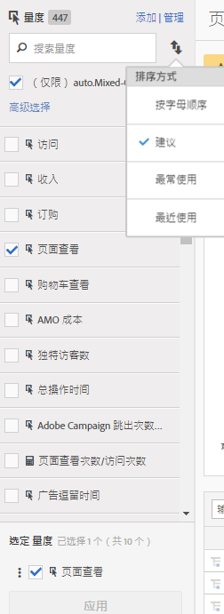

# 计算量度和高级计算（派生）量度

计算量度和高级计算（或派生）量度是指您可以从现有量度创建的自定义量度。

>[!IMPORTANT]
>
>In July 2018, Adobe introduced [Attribution IQ](https://marketing.adobe.com/resources/help/en_US/analytics/analysis-workspace/attribution.html), which revised the way allocation models in calculated metrics are evaluated. 作为此更改的一部分，使用非默认分配模型的计算量度已迁移至改进的新归因模型。
>
>* “营销渠道上一次接触”和“营销渠道首次接触”分配模型分别迁移到新的“Touch Touch”和“First Touch”归因模型(注意：“营销渠道”尚未弃用-只有计算指标中出现的两个分配模型。
>* 此外，我们还纠正了线性分配的计算方式。对于通过“线性”分配模型使用计算量度的客户，报表可能会稍有变化，以反映修正后的新归因模型。This change to calculated metrics is reflected in [!UICONTROL Analysis Workspace], [!UICONTROL Reports &amp; Analytics], the Reporting API, Report Builder, and Ad Hoc Analysis. 有关详细信息，请参阅[线性分配将如何工作（自 2018 年 7 月 19 日起）](../../components/c-calcmetrics/c-workflow/cm-workflow/c-build-metrics/m-metric-type-alloc.md#section_EDBB2E14A6C248C5A79C0913C02D7CA1)。

我们的计算量度工具提供了一种高度灵活的方式，可用于生成、管理和组织量度。They allow you as marketers, product managers and analysts to ask questions of the data without having to change your [!DNL Analytics] implementation. [!DNL Analytics] 每个包中提供的自定义指标有：

* Adobe [!DNL Analytics] Foundation: Calculated
* [Adobe Analytics Select](https://www.adobe.com/data-analytics-cloud/analytics/select.html)：计算+高级计算
* [Adobe Analytics Prime](https://www.adobe.com/data-analytics-cloud/analytics/prime.html)：计算量度 + 高级计算量度
* [Adobe Analytics Ultimate](https://www.adobe.com/data-analytics-cloud/analytics/ultimate.html)：计算量度 + 高级计算量度

以下是计算量度和高级计算量度功能的比较：

| Builder 选项 | 计算量度 | 高级计算（派生）量度 |
|---|---|---|
| [格式类型（小数、时间、百分比、货币）](../../components/c-calcmetrics/c-workflow/cm-workflow/c-build-metrics/cm-build-metrics.md#concept_5EC82A91EB9C44FC870326C85F9D0B18) | 是 | 是 |
| [归因更改（默认、线性、参与率等）](../../components/c-calcmetrics/c-workflow/cm-workflow/c-build-metrics/m-metric-type-alloc.md#concept_B7A1FCFEFA9D4C4883208ACE8C9C8E5E) | 是 | 是 |
| [量度类型（标准、总数）](../../components/c-calcmetrics/c-workflow/cm-workflow/c-build-metrics/m-metric-type-alloc.md#concept_B7A1FCFEFA9D4C4883208ACE8C9C8E5E) | 是 | 是 |
| 基本运算符（加、减、乘、除） | 是 | 是 |
| [应用区段](../../components/c-calcmetrics/c-workflow/cm-workflow/c-build-metrics/metrics-with-segments.md#concept_21C77BD86E7E45E79AF030D8ED54DB3E) | 否 | 是 |
| [基本函数（计数、绝对值、平均值等）](../../components/c-calcmetrics/cm-reference/cm-functions.md#concept_E3022D5EEEE145B69A23438BAF7016B2) | 否 | 是 |
| [高级函数（回归、if/then、t 分数等）](../../components/c-calcmetrics/cm-reference/cm-adv-functions.md#concept_A5FB9127D70F4E1AA02D1ACBF4F54174) | 否 | 是 |

## 功能 {#section_A0A5C275B68A4D628950BBB0B1EE631F}

您可以

* Create metrics across [!UICONTROL Analysis Workspace], [!UICONTROL Reports &amp; Analytics], [!UICONTROL Ad Hoc Analysis], [!UICONTROL Report Builder], [!UICONTROL Anomaly Detection], and [!UICONTROL Contribution Analysis].
* 创建在报表运行时派生的分段量度，而[不必更改实施](https://youtu.be/CuQTm9RaUpY)。这些量度可以在历史记录中查看，因为它们是基于区段的。
* 在报表包之间共享量度。这表示所有新创建的量度都适用于同一登录公司中的所有报表包。
* （仅限高级计算量度）量度上的区段。例如，您可以为“新访客”创建一个量度，其中包含首次进行会话的人员计数。
* （仅限高级计算量度）包含统计函数，以帮助您更好地描述数据。例如，您可以对报表中的项目数量进行计数，或为每个项目加入标准偏差数。
* Utilize metrics created in [!UICONTROL Ad Hoc Analysis] in the other [!DNL Analytics] tools and vice versa.

   >[!NOTE]
   >
   >您可以继续在临时分析中创建指标。它的计算量度生成器用户界面现在类似于新量度生成器。

## 限制 {#section_CB878B02451541D68A68B508D4DBD19A}

Some [!DNL Analytics] features let you use events but not calculated metrics:

* Reports &amp; Analytics 中的漏斗
* Analysis Workspace 中的流失
* [!UICONTROL Analysis Workspace 中的队列分析]
* [!UICONTROL Data Warehouse]
* [!UICONTROL 区段]
* [!UICONTROL 实时报表]
* [!UICONTROL 当前数据报表]
* [!DNL Analytics] for [!DNL Target]

## 工具{#section_D65E9C067E9C45E1A50DD30F50561BB2}

Here is a short overview of the [!UICONTROL Calculated Metrics] tools:

<table id="table_520AFE97DB514958ABE23FD3C9CE0ABD"> 
 <thead> 
  <tr> 
   <th colname="col1" class="entry"> 工具 </th> 
   <th colname="col2" class="entry"> 功能 </th> 
  </tr>
 </thead>
 <tbody> 
  <tr> 
   <td colname="col1"><a href="../../components/c-calcmetrics/c-workflow/cm-workflow/c-build-metrics/cm-build-metrics.md#concept_5EC82A91EB9C44FC870326C85F9D0B18" format="dita" scope="local"> 计算量度生成器</a> </td> 
   <td colname="col2"> 
    <ul id="ul_E6F02AB9DF204C2F9A0AC92A31594B3E"> 
     <li id="li_A4A6E716374243A190C539A3F4A41C0C">使用高级分配模型创建计算度量和高级计算度量。 </li> 
     <li id="li_C8C97BA4E227463E98077ABA5818FFC6">将内联区段添加到量度公式中。 </li> 
     <li id="li_8503D9E06A3C46569B5CDB4B90F72446">比较同一报表中的区段。例如，比较本地访客与国际访客。 </li> 
     <li id="li_4B528FDE1F96400DBA0D3276408FF919">使用统计函数。 </li> 
     <li id="li_C1162B1EA6784B8189A8A87E2B0DA79A">提供详细的量度描述（显示其用途，以及何处可以使用，何处不可以使用）。 </li> 
     <li id="li_DEA13F5E8BF94AF1B311C467FE6E2A74">将定义复制到新量度中。 </li> 
     <li id="li_8C21F55015D44910904202D2BF74221C">提供内联量度预览。 </li> 
     <li id="li_3704F66C321C477F9D4F52E068C231BD">设置量度极性，以指示当给定的自定义事件（量度）上升时是有利还是不利。 </li> 
     <li id="li_9D45319FA965476FB1C90DE8AA72BBD7">标记量度。 </li> 
    </ul> </td> 
  </tr> 
  <tr> 
   <td colname="col1"><a href="../../components/c-calcmetrics/c-workflow/cm-workflow/cm-manager.md#concept_BA6815CB06D842D5825766396B691653" format="dita" scope="local"> 计算量度管理器</a> </td> 
   <td colname="col2"> 
    <ul id="ul_E4D20D5DD3904CC6A85785B5BD4C1B1E"> 
     <li id="li_E0B216BA1478406EB6212263DF71D85B">与他人共享量度。 </li> 
     <li id="li_96EB16FAF3454211AAEF78EA5B08927F">批准和管理量度。 </li> 
     <li id="li_3ADBD2428EAC4B0AA61222D87C3AF2B7">组织（标记）量度，以方便用户查找。 </li> 
     <li id="li_726F3C3390744E49BA63606FE196880E">删除量度。 </li> 
     <li id="li_F306BA4FA8AF4A6E987BA62634659A2F">重命名量度。 </li> 
    </ul> </td> 
  </tr> 
  <tr> 
   <td colname="col1"> 量度选择器边栏 </td> 
   <td colname="col2"> 
Replaces the  Show Metrics popup in [!UICONTROL Reports &amp; Analytics]. 
 
它允许您搜索量度，并将量度添加到/应用于报表。您还可以更改<a href="../../components/c-calcmetrics/c-workflow/cm-workflow/cm-finding.md#concept_A09845053A934CB7B755391D76E76C08" format="dita" scope="local">排序</a>（选项包括：“按字母顺序”、“推荐”、“经常使用”、“最近使用”。）此外，您还可以对报表包进行过滤，以便仅显示在特定报表包中创建的量度。 
 
要访问此“量度选择器”，请单击报表左侧的“量度”图标 。量度选择器具有如下外观： 
 
 
 </td> 
  </tr> 
  <tr> 
   <td colname="col1"><a href="https://www.adobe.io/apis/experiencecloud/analytics/docs.html#!AdobeDocs/analytics-2.0-apis/master/README.md" format="https" scope="external"> 适用于计算量度的 API</a> </td> 
   <td colname="col2"> 
Adobe Analytics2.0API集的一部分。 
 </td> 
  </tr> 
 </tbody> 
</table>

