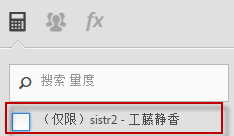

# 常见问题解答

These changes to the way calculated metrics work in [!DNL Analytics] may impact you.

[如何访问计算量度生成器？](../../components/c-calcmetrics/cm-transition.md#section_D9AE9A0ACF824BACB5D05F0C2F7E9CA1)

[如何访问计算量度管理器？](../../components/c-calcmetrics/cm-transition.md#section_DD0BD13E9EC940268EBE8BC88241A152)

[为什么我会看到这么多具有相同名称的计算量度？](../../components/c-calcmetrics/cm-transition.md#section_E15C5B6CCC58498CAEC3FBDA8988F0A1)

[我的全局计算量度发生了什么情况？](../../components/c-calcmetrics/cm-transition.md#section_7351D4C7361F4ABAA1B43F8E89AAD211)

[在登录公司之间共享的全局计算量度发生了什么情况？](../../components/c-calcmetrics/cm-transition.md#section_59E5CD948ED643AE9AD3D2E4277647F8)

[具有数值或数值 2 分类的计算量度发生了什么情况？](../../components/c-calcmetrics/cm-transition.md#section_71AFE6C4A7CD4AA19AB3A9D3C41D115B)

[存留期量度发生了什么情况？](../../components/c-calcmetrics/cm-transition.md#section_AEDB02EF24584DAD8731BED9DDCE4F48)

[有关基于每日/每周/每月/每季/每年独特访客量度的计算量度，我需要了解什么？](../../components/c-calcmetrics/cm-transition.md#section_E9A77EBB41CE4881B196CC1C282B2DF3)

[通过旧报表包 API 方法创建或管理的计算量度怎么样了？](../../components/c-calcmetrics/cm-transition.md#section_13ED1BAD02634674BDAEB479B060A4B6)

[“当前数据”支持所有类型的计算量度吗？](../../components/c-calcmetrics/cm-transition.md#section_1DAA718BB8DB4413BAF8AD4B4FAAFFA2)

[随迁移的计算量度出现的“未提供名称”是什么意思？](../../components/c-calcmetrics/cm-transition.md#section_C90CBB72A67644F38D583301981F8D03)

[如果用户被删除，那么该用户的计算量度会发生什么情况？](../../components/c-calcmetrics/cm-transition.md#section_42ED4C15830540879C4A161423690E5A)

[我为什么看到“未知”计算量度对于其他报表包“无效”，即使可以创建这些量度并将其应用于这些报表包？](../../components/c-calcmetrics/cm-transition.md#section_6772818EFDED46E9B7095D64C3B77211)

[为什么没有保存我对旧计算量度所做的更改？](../../components/c-calcmetrics/cm-transition.md#section_81CDEFCA1FD542579AF183DA1494EAF0)

[为什么我的计算量度没有显示在营销渠道报表中？](../../components/c-calcmetrics/cm-transition.md#section_FC350359A775433AB5F43C7CAB304D62)

[为什么某些计算量度显示的公式没有我添加的圆括号？](../../components/c-calcmetrics/cm-transition.md#section_AC0D1E9714AD487F9A1C73359F518B5E)

[（仅限 Ad Hoc Analysis）具有嵌套或内联区段定义的计算量度仍然受支持吗？](../../components/c-calcmetrics/cm-transition.md#section_B25C924A282F49388AB604E3D826F44C)

[（仅限 Report Builder）为什么计算量度从我的请求中消失了？](../../components/c-calcmetrics/cm-transition.md#section_DA4792FE5D7945218CD5E6328DE08E82)

[“计算量度合计”是如何计算的？](../../components/c-calcmetrics/cm-transition.md#section_57BA3A299C7948ABB82B0392A9B0F33E)

## 如何访问计算量度生成器？{#section_D9AE9A0ACF824BACB5D05F0C2F7E9CA1}

* 单击计算量度管理器顶部的 **[!UICONTROL + 添加]，或者**
* In any Analytics report, click the Metrics icon   to the left of a report to bring up the Metrics rail, then click **[!UICONTROL Add]**.

## 如何访问计算量度管理器？{#section_DD0BD13E9EC940268EBE8BC88241A152}

* Go to  **[!UICONTROL Analytics]** &gt; **[!UICONTROL Components]** in the left navigation. Then click **[!UICONTROL Calculated Metrics]**.

* In any [!DNL Analytics] report, click the Metrics icon   to the left of a report to bring up the Metrics rail, then click **[!UICONTROL Manage]**.

## Why do I see so many Calculated Metrics with the same name? {#section_E15C5B6CCC58498CAEC3FBDA8988F0A1}

（以前，全局计算量度不为任何特定的管理员用户所有，并且对该报表包的所有用户均可见。量度由报表包分隔。如果一个报表包中的量度与另一个报表包中的量度具有相同的名称，则在用户切换报表包时，他们看到的只是相同的量度。）

现在，量度不再由报表包分隔。如果一个报表包中的量度与另一个报表包中的量度具有相同的名称，则它们均会在计算量度生成器及量度选择器中可见，并可能显示为重复的量度，且无论它们是否具有相同的定义，均是如此。

You would see a number of calculated metrics with the same name (but created in different report suites) only if you unchecked the (Only `<report suite>`) checkbox as shown here:

**您需要如何操作**

考虑统一具有相似名称和定义的计算量度，但应务必谨慎操作。您可以在计算量度管理器中检查计算量度的报表包，以验证其原始报表包。您还应当在删除可能的重复量度时检查量度的定义，以确保正确统一量度。

> [!NOTE] 即使计算量度不再绑定到特定报表包，也可在登录公司可见的任何报表包中使用，因此计算量度创建或上次保存的报表包仍会在计算量度管理器中可见。

> [!NOTE] 即使已删除计算量度，引用该量度的任何书签或仪表板报告仍将正常工作。

## 我的全局计算量度发生了什么情况？{#section_7351D4C7361F4ABAA1B43F8E89AAD211}

（以前，管理员可以通过管理工具在报表包中创建计算量度，称为“全局计算量度”或“报表包计算量度”。

现在，全局计算量度为登录公司管理员用户列表中的首个管理员用户所有。它们在默认情况下将与“所有人”共享。此模式遵循与区段相同的共享模型和迁移计划。

**您需要如何操作**

无需做任何事情。但是，新管理员所有者应当谨慎修改或删除这些计算量度，因为它们可能用在多个书签报表和功能板中。

> [!NOTE] 即使已删除计算量度，引用该量度的任何书签或仪表板报告仍将正常工作。

## 在登录公司之间共享的全局计算量度发生了什么情况？{#section_59E5CD948ED643AE9AD3D2E4277647F8}

（以前，管理员可以通过管理工具在报表包中创建计算量度，称为“全局计算量度”或“报表包计算量度”。随后，可以通过将报表包添加到多个登录公司，在登录公司之间“共享”这些量度。）

全局计算量度不再能够在登录公司之间共享。它们不再绑定或捆绑到特定的报表包，而是会绑定到特定的登录公司。在登录公司之间共享的计算量度

* 迁移到所有访问该报告套件的登录公司。
* 默认为“与所有人共享”。
* 将成为与所有其他登录公司无关的副本。

>[!NOTE]
>
>如果在书签、仪表板、警报或计划报告中使用了计算量度，则编辑新的副本不会影响旧的持久性计算量度。

## 具有数值或数值 2 分类的计算量度发生了什么情况？{#section_71AFE6C4A7CD4AA19AB3A9D3C41D115B}

(Previously, calculated metrics with a Numeric or Numeric2 classification were only visible in [!UICONTROL Reports &amp; Analytics], [!UICONTROL Report Builder], and the APIs.)

Now, calculated metrics with a Numeric or Numeric2 classification will continue to be visible in [!UICONTROL Reports &amp; Analytics], [!UICONTROL Report Builder], and the APIs. 但是，任何应用了区段的报表将不支持这些量度。

In addition, calculated metrics with a Numeric or Numeric2 classification will not be supported in the following components: [!UICONTROL Ad Hoc Analysis], [!UICONTROL Analysis Workspace], [!UICONTROL Real-Time] reports, [!UICONTROL Anomaly Detection], and [!UICONTROL Contribution Analysis]. 在您创建或编辑具有数值或数值 2 分类的计算量度时，您将看到一则兼容性警告，指出计算量度与产品的某些部分不兼容。

**您需要如何操作**

如果打算将量度用于区段或任何不兼容的组件，请避免创建具有数值或数值 2 分类的计算量度。

## 存留期量度发生了什么情况？{#section_AEDB02EF24584DAD8731BED9DDCE4F48}

Life-Time metrics (a.k.a. all-time metrics) are no longer supported and no longer visible in the [!UICONTROL Reports &amp; Analytics] UI or any other UI. 它们无法由报表 API 查询。

任何包含全时量度的书签、功能板、计划报表或警报在没有该量度时将继续运行，前提是报表中至少还包含一个其他有效量度。如果书签、功能板、计划报表或警报中的唯一量度是一个全时量度，则报表将不再运行。

## 有关基于每日/每周/每月/每季/每年独特访客量度的计算量度，我需要了解什么？{#section_E9A77EBB41CE4881B196CC1C282B2DF3}

Calculated metrics based on Unique Visitor metrics will be visible in the following [!DNL Analytics] components: [!UICONTROL Reports &amp; Analytics], [!UICONTROL Report Builder], and Reporting API.

However, these metrics will not be supported in the following components: [!UICONTROL Segments], [!UICONTROL Analysis Workspace], [!UICONTROL Real-Time] reports, [!UICONTROL Anomaly Detection], and [!UICONTROL Contribution Analysis]. 在创建或编辑基于独特访客量度的计算量度时，您将看到一则兼容性警告，指出该量度与产品的某些部分不兼容。

您可以在包含区段的报表中使用基本独特访客量度。您可以创建基于独特访客量度的计算量度；但是，该计算量度不可应用于具有区段的报表，也不能在其中嵌套区段。

## What happens to Calculated Metrics created or managed with the old report suite API methods? {#section_13ED1BAD02634674BDAEB479B060A4B6}

以前，通过（1.3 或 1.4）API 方法 ReportSuite.SaveCalculatedMetrics 保存计算量度，与在管理控制台中创建或更新计算量度的效果相同。ReportSuite.DeleteCalculatedMetrics 也是一样。此外，在管理控制台中显示的，或在调用 ReportSuite.GetCalculatedMetrics 时显示的计算量度列表是相同的。

ReportSuite CalculatedMetrics API方法(1.3或1.4)将继续使用旧商店保存、删除和检索计算得出的度量。现有的计算量度将被迁移并在新的计算量度生成器中可见。**通过 API 方法创建的新计算量度将仅在 API 中可见。它们仍然可以在报表 API 中使用。**

**您需要如何操作**

如果您需要同时使用 API 和计算量度生成器，则应当停止使用 ReportSuite CalculatedMetrics API 方法，并转而使用新的 CalculatedMetrics API 方法（Get、Save、Delete 和 GetFunctions）。

## Does Current Data support all types of Calculated Metrics? {#section_1DAA718BB8DB4413BAF8AD4B4FAAFFA2}

“当前数据”不支持包含区段或统计函数的计算量度。唯一受支持的函数是基本数学函数，如加、减、乘、除和求反 (-x)。

## 随迁移的计算量度出现的“未提供名称”是什么意思？{#section_C90CBB72A67644F38D583301981F8D03}

“未提供名称”表示没有任何量度名称与该迁移的量度关联（只是一个没有描述性名称的公式）。

## 如果用户被删除，那么该用户的计算量度会发生什么情况？{#section_42ED4C15830540879C4A161423690E5A}

该用户创建的任何计算量度也会被删除。但是，删除的计算量度仍将作为已保存的书签、功能板或计划报表的一部分正常使用。

## 我为什么看到“未知”计算量度对于其他报表包“无效”，即使可以创建这些量度并将其应用于这些报表包？{#section_6772818EFDED46E9B7095D64C3B77211}

如果计算量度包含的基本量度或维度在选定报表包中不存在，则用户界面会显示“未知”。

## 为什么没有保存我对旧计算量度所做的更改？{#section_81CDEFCA1FD542579AF183DA1494EAF0}

这可能是由于向新的计算量度数据库迁移时所致，该迁移发生于 2015 年 6 月 15 日至 6 月 18 日之间。

**您需要如何操作**

您将需要重新对旧量度进行更改。

## 为什么我的计算量度没有显示在营销渠道报表中？{#section_FC350359A775433AB5F43C7CAB304D62}

（以前，在营销渠道报表的量度选择器中列出的所有计算量度都具有首次联系和最近联系选项。）

现在，只有那些在计算量度生成器中将其分配类型专门设置为首次联系或最近联系的计算量度，才将在营销渠道报表的量度选择器中可用。请注意，任何已应用于营销渠道报表的计算量度将被继续应用，并像往常一样工作。要为营销渠道创建计算量度，请单击量度生成器中的配置图标，并选择“首次联系”或“最近联系”作为分配类型。请记住，这样做将使计算量度仅与“营销渠道报表”兼容，并且不可用在其他任何报表中。

## 为什么某些计算量度显示的公式没有我添加的圆括号？{#section_AC0D1E9714AD487F9A1C73359F518B5E}

在迁移过程中，Adobe 去除了某些公式中多余的圆括号。只有不影响量度计算方式的括号才会被去除。这不会更改数据，只是简化了公式。

## (Ad Hoc Analysis only) Are Calculated Metrics with embedded or inline segment definitions still supported? {#section_B25C924A282F49388AB604E3D826F44C}

以前，在 Ad Hoc Analysis 中创建的计算量度可包含内联区段定义。但今后将不再包含。

**您需要如何操作**

您需要明确保存区段。具有内联区段定义的现有计算量度将继续正常运行，并且可以在 Ad Hoc Analysis 中查看，但是它们在没有显式保存区段的情况下无法被保存。

## （仅限 Report Builder）为什么计算量度从我的请求中消失了？{#section_DA4792FE5D7945218CD5E6328DE08E82}

如果请求是在v5.2中创建的，并且包含计算得出的指标，则这些指标在v5.1(或更早版本)中不可见。这是因为计算量度当前使用全局 ID（不是特定于报表包的 ID）。

**您需要如何操作**

您需要升级到版本 5.2 才能看到这些量度。

## “计算量度合计”是如何计算的？{#section_57BA3A299C7948ABB82B0392A9B0F33E}

[!UICONTROL 当Reports&amp; Analytics] 在 [!UICONTROL Reports&amp; Analytics]中显示计算得出的量度总数时，只需将公式应用于总计。例如，计算量度订购数/访问次数的总数减去总订购数，然后除以访问总数。但是在有些情况下，计算量度合计并不等于行项目的总和，而是网站的合计。

例 1：搜索词的访客数：同一位访客可能会搜索多个词条，因此在这种情况下，访问总数并不等于行项目的总和。

例 2：产品的页面查看次数：购物车中可能有多种产品，因此购物车对应多个页面查看次数。有关对比行项目总值和报表合计的更多信息，请参阅[这篇知识库文章](https://helpx.adobe.com/analytics/kb/sum-line-items-different-from-total.html)。
