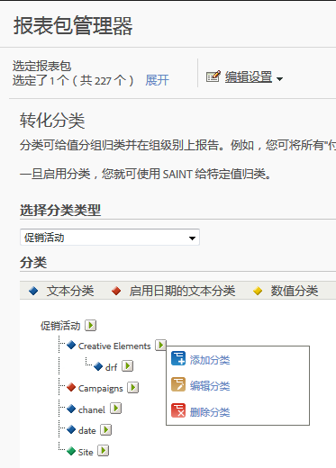

# 关于分类

分类是一种对Analytics变量数据进行分类的方法，然后在生成报告时以不同的方式显示数据。

有关 [Analytics 分类](https://video.tv.adobe.com/v/16853/?captions=chi_hans)的视频概述。

**[!UICONTROL 管理员]** &gt;报 **[!UICONTROL 表包]** &gt;编 **[!UICONTROL 辑设置]** &gt; *`<Traffic or Conversion>`*

在分类时，您会在变量以及与该变量相关的元数据之间建立关系。分类最常用在促销活动中。通过将元数据应用到变量中收集的值，可以汇总使用变量（eVar、prop 和事件）信息收集的数据。

分类后，任何可使用关键变量生成的报表也可通过关联的属性来生成。例如，您可以使用其他产品属性（如产品名称、颜色、大小、描述和 SKU）对[!UICONTROL 产品 ID] 进行分类。以其他属性增强 Reports &amp; Analytics 数据，可让您生成更深入、更复杂的报表。

>[!IMPORTANT]
>
>已从代码库中移除了导入数字 2 分类和启用日期的分类的功能。这项更改将随 2019 年 6 月维护版本的发布而生效。如果您的导入文件中包含“数字”或“启用日期”列，则这些单元格会被静默忽略，同时该文件中的任何其他数据均会正常导入。现有的分类仍可以通过标准分类工作流程导出，并将继续在报表中可用。

>[!NOTE]
>
>在2018年5月10日的Analytics维护版本中，Adobe开始限制启用日期的分类和数字分类的功能。 这些分类类型已从管理员和分类导入器界面中删除。无法添加新的启用日期的分类和数值分类。现有的分类仍可以通过标准分类工作流程进行管理（上传、删除），并将继续在报表中可用。

After creating the classifications, you can leverage the new data attributes throughout Adobe Analytics.

**跟踪代码示例**

假设您不通过跟踪代码来查看促销活动，而是要按照搜索引擎、关键词和促销活动渠道来查看促销活动结果。为此您不必费心研究上述每个项目的转化变量，而是可以为促销活动变量创建三个分类，以分别代表搜索引擎、关键词和促销活动渠道。使用这个策略，您可以按照所有四个变量来查看网站成功事件，而无需额外标记。

Reports &amp; Analytics 包含针对跟踪代码变量的预定义分类，从而提供以分类为基础的报表（名为“创作元素”和“促销活动”）。您必须针对其他所有转化和流量变量手动配置分类。

请参阅[流量分类](/help/admin/admin/c-traffic-variables/traffic-classifications.md)和[转化分类](https://marketing.adobe.com/resources/help/en_US/reference/conversion_classifications.html)。

下表说明了各种可用的分类类型，以及支持这些分类的变量类型。请在上载数据文件之前，查看 上传 [数据文件之前的常规文件结构](../../components/c-classifications2/c-classifications-importer/c-saint-data-files.md#concept_9EFF968DF5D244A887DE94075431C1BE) 。

<table id="table_279728C28D9C40EE832ACC9F211B5F17"> 
 <thead> 
  <tr> 
   <th colname="col1" class="entry"> 
类型 
 </th> 
   <th colname="col2" class="entry"> 
可用性 
 </th> 
   <th colname="col3" class="entry"> 
描述 
 </th> 
  </tr> 
 </thead>
 <tbody> 
  <tr> 
   <td colname="col1"> 
  文本 
 </td> 
   <td colname="col2"> 
转化变量和流量变量 
 </td> 
   <td colname="col3"> 
文本分类所定义的类别，可让您为了报告目的将变量数据分组。 
 
例如，如果您销售衬衫，可能会想按颜色、大小和样式将衬衫销售
（转化）分类，以便生成可让您查看按这些类别分组的衬衫销售报表。 
 </td> 
  </tr> 
  <tr> 
   <td colname="col1"> 
  启用日期的文本 
 
注意： 在2018年5月10日的Analytics维护版本中，Adobe开始限制启用日期的分类的功能。 这些分类类型已从管理员和分类导入器界面中删除。不能添加新的启用日期的分类。 现有的分类仍可以通过标准分类工作流程进行管理（上传、删除），并将继续在报表中可用。 
 </td> 
   <td colname="col2"> 
转化变量 
 </td> 
   <td colname="col3"> 
启用日期功能的文本分类，允许您为文本分类指定日期范围。该分类通常与促销活动分类一起使用，以便您充分利用促销活动报表中的“甘特图”视图。 
 
您可以在填充分类数据的数据文件中，包含实际的促销活动日期。 
 
Reports &amp; Analytics会收集系列活动跟踪代码，即使系列活动结束日期已经过去，但在系列活动结束日期之后收集的系列活动数据与系列活动没有关联。 
 </td> 
  </tr> 
  <tr> 
   <td colname="col1"> 
  数值 
注意： 在2018年5月10日的Analytics维护版本中，Adobe开始限制数字分类的功能。 这些分类类型已从管理员和分类导入器界面中删除。不能添加新的数字分类。 现有的分类仍可以通过标准分类工作流程进行管理（上传、删除），并将继续在报表中可用。 
 
 </td> 
   <td colname="col2"> 
转化变量 
 </td> 
   <td colname="col3"> 
数值分类可让您将固定数值应用到转化报表。这些分类在报表中显示为量度。 
 
考虑是否要添加数值分类时，数值必须是固定的，而且不会随着时间改变。 
 </td> 
  </tr> 
 </tbody> 
</table>

