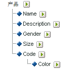

# 关于子分类

Adobe Analytics支持单级和多级分类模型。 使用分类层次结构可以将分类应用到分类。

> [!NOTE] 子分类是指创建分类分类的能力。 但请注意，这与创建[!UICONTROL 层次]报表的[!UICONTROL 分类层次]不同。有关分类层次结构的详细信息，请参阅 [分类层次结构](classification-hierarchies.md)。

<!-- 

Removed sub-classifications in rule builder. Preserve subclass files in project for future reference. 

 -->

<!-- 

c_single-level_classifications.xml

 -->

例如：

此模型中的每个分类都是独立的，并对应于所选报表变量的新子报表。此外，每个分类都构成数据文件中的一个数据列，并以分类名称作为列标题。例如：

| 键值 | 属性 1 | 属性 2 |
|---|---|---|
| 123 | ABC | A12B |
| 456 | DEF | C3D4 |

有关数据文件的更多信息，请参阅 [Classification Data Files](/help/components/c-classifications2/c-classifications-importer/c-saint-data-files.md).

<!-- 

c_multiple-level_classifications.xml

 -->

多级别分类由父项分类和子项分类组成。例如：

**父项分类：**&#x200B;父项分类是指具有一个关联子项分类的任何分类。分类既可以为父项分类也可以为子项分类。最上层父项分类对应于单级别分类（请参阅 [单级别分类](/help/components/c-classifications2/c-sub-classifications.md)).

**子项分类：**&#x200B;子项分类是以其他分类而非变量做为其父项的分类。子项分类提供其父项分类的附加信息。例如，[!UICONTROL 促销活动]分类可能有名为“促销活动所有者”的子项分类。[!UICONTROL 数值]分类也可当作分类报表中的量度。

每个分类（父项分类或子项分类）都构成数据文件中的一个数据列。子项分类的列标题使用以下命名格式：

`<parent_name>^<child_name>`

有关数据文件格式的详细信息，请参阅分 [类数据文件](/help/components/c-classifications2/c-classifications-importer/c-saint-data-files.md)。

例如：

| 键值 | 属性 1 | 属性1(&amp;A);Hat；属性1-1 | 属性1(&amp;A);Hat；属性1-2 | 属性 2 |
|---|---|---|---|---|
| 123 | ABC | 绿色 | 小 | A12B |
| 456 | DEF | 红色 | 大 | C3D4 |

虽然多级分类的文件模板较为复杂，但在多级分类中，单独的级别可以作为单独的文件上载。此方法可用于最大限度地减少需要定期（每天、每周等等）上载的数据量，方法是将数据分组为随时间变化的分类级别（而非不随时间变化的分类级别）。

> [!NOTE] 如果数 [!UICONTROL 据文件中] “键”列为空，Adobe会为每个数据行自动生成唯一键。 要避免在上载具有二级或更高级分类数据的数据文件时可能出现的文件损坏，请以星号 (*) 填充[!UICONTROL 键值]列的每一行。

如需疑难解答帮助，请参阅[常见分类上载问题](https://marketing.adobe.com/resources/help/en_US/home/index.html#kb-common-saint-upload-issues)。

<!-- 

c_classifications_example.xml

 -->

>[!NOTE] 产品分类数据仅限于与产品直接相关的数据属性。 而与产品在网站上的分类或销售方式无关。销售类别、网站浏览节点或销售项目等数据元素不是产品分类数据。这些元素是在报表转化变量中所捕获的。

在上载此产品分类的数据文件时，您可以将分类数据作为单个或多个文件进行上载（请参阅下文）。将文件 1 中的颜色代码与文件 2 中的颜色名称分开后，仅在创建新颜色代码时才需要更新颜色名称数据（可能只有少数几行）。这会从更频繁的更新文件1中消除颜色名称(CODE&amp;Hat;COLOR)字段，并在生成数据文件时减少文件大小和复杂性。

## 产品分类 - 单个文件 {#section_E8C5E031869C449F9B636F5EB3BFEC17}

| 键值 | 产品名称 | 产品信息 | 性别 | 大小 | 代码 | CODE&amp;Hat;COLOR |
|---|---|---|---|---|---|---|
| 410390013 | Polo-SS | 男式 Polo 衫，短袖 (M,01) | M | M | 01 | 铁灰 |
| 410390014 | Polo-SS | 男式 Polo 衫，短袖 (L,03) | M | L | 03 | 混色 |
| 410390015 | Polo-LS | 女式 Polo 衫，长袖 (S,23) | F | S | 23 | 浅绿色 |

## 产品分类 - 多个文件（文件 1） {#section_A99F7D0F145540069BA4EEC0597FF13F}

| 键值 | 产品名称 | 产品信息 | 性别 | 大小 | 代码 |
|---|---|---|---|---|---|
| 410390013 | Polo-SS | 男式 Polo 衫，短袖 (M,01) | M | M | 01 |
| 410390014 | Polo-SS | 男式 Polo 衫，短袖 (L,03) | M | L | 03 |
| 410390015 | Polo-LS | 女式 Polo 衫，长袖 (S,23) | F | S | 23 |

## 产品分类 - 多个文件（文件 2） {#section_19ED95C33B174A9687E81714568D56A3}

| 键值 | 代码 | CODE&amp;Hat;COLOR |
|---|---|---|
| * | 01 | 铁灰 |
| * | 03 | 混色 |
| * | 23 | 浅绿色 |
