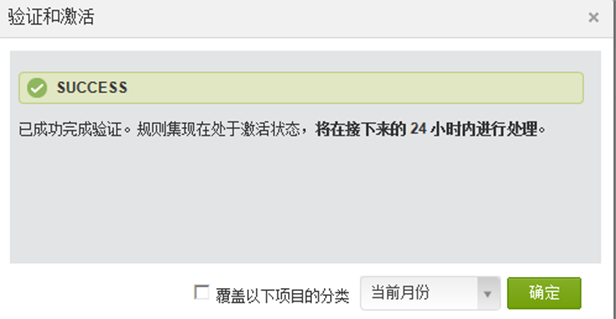
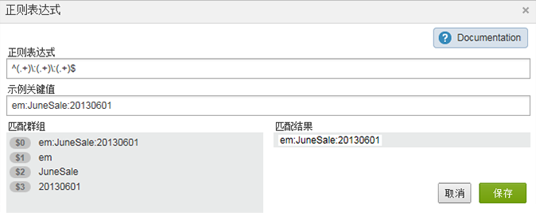
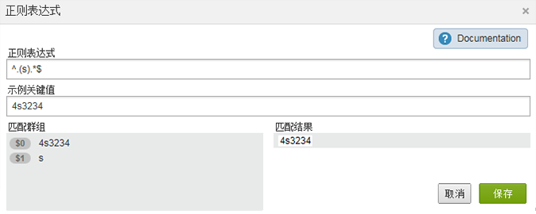
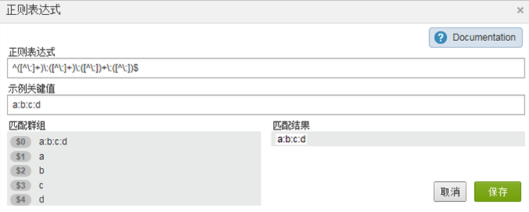
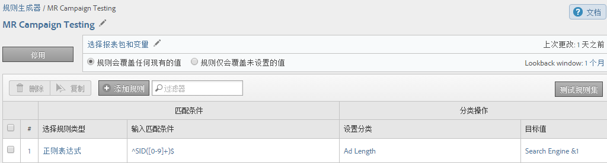
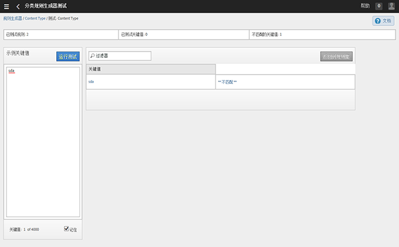

# 分类规则

分类规则会定期查找未分类的术语。如果找到匹配规则的术语，规则会自动将其添加到分类数据表。您还可以使用分类规则覆盖现有键值。

## 分类规则 {#concept_CF2F64BD96454FBFAA84638FC7DEA263}

分类规则会定期查找未分类的术语。如果找到匹配规则的术语，规则会自动将其添加到分类数据表。您还可以使用分类规则覆盖现有键值。

**[!UICONTROL 分析]** &gt;管 **[!UICONTROL 理]** &gt;分 **[!UICONTROL 类规则生成器]**

The Rule Builder lets you create a , which is a list of . *`classification rule set`**`classification rules`*&#x200B;如果规则与您指定的条件相匹配，则执行相应的操作。

分类规则可提供以下便利性：

* **电子邮件**&#x200B;和&#x200B;**展示广告**：创建分类规则可对各个展示广告促销活动进行分组，以便您了解展示促销活动是如何针对电子邮件促销活动执行的。

* **跟踪代码**：创建分类规则可对由跟踪代码中的字符串派生的键值进行分类，并将其与您定义的特定条件进行匹配。
* **搜索词**：使用[正则表达式](../../../components/c-classifications2/crb/classification-quickstart-rules.md#concept_8A63F9BCF9484963962E14E6286D312D)和通配符可简化搜索词分类。例如，如果搜索词包含 *`baseball`*&#x200B;内容，则可以将分 *`Sports League`* 类设置为 *`MLB`*。

例如，假设电子邮件促销活动 ID 的跟踪代码为：

`em:Summer:2013:Sale`。

您可以在规则集中设置三条规则来识别字符串的各个部分，然后对值进行分类：

| 选择规则类型 | 输入匹配条件 | 设置分类 | 值 |
|---|---|---|---|
| 开头 | em: | 渠道 | Email |
| 结尾 | Sale | 类型 | Sale |
| 包含 | 2013 | 年 | 2013 |

## 如何处理规则 {#concept_A67A23F523844D37898583C632DB9D25}

有关如何处理分类规则的重要信息。

<!-- 

about_classification_rules.xml

 -->

* [有关规则的重要信息](/help/components/c-classifications2/crb/classification-rule-builder.md)
* [规则何时不会对键值进行分类？](/help/components/c-classifications2/crb/classification-rule-builder.md)
* [关于规则优先级](../../../components/c-classifications2/crb/classification-quickstart-rules.md#concept_93527FEB3C9B48FB96FB7DF857E5F980)

>[!NOTE]
>
>The [!UICONTROL Rule Builder] does not support Numeric 2 classifications.

## 有关规则的重要信息 {#section_0BD46702FBEC4D98A4DD2EA0BD428046}

* Specify [group permissions](https://marketing.adobe.com/resources/help/en_US/reference/groups.html) for classifications in [!UICONTROL Admin Tools].

* **正则表达式**:有关帮助，请参阅分 [类规则中的正则表达式](../../../components/c-classifications2/crb/classification-quickstart-rules.md#concept_8A63F9BCF9484963962E14E6286D312D)。

* **报表包**：在至少选择一个报表包后，您才可以选取分类。在创建规则集并分配变量后，您才可以应用报表包。

   在测试规则集时，使用报表中的键值（经过分类的变量）可查看规则集将如何影响键值。（[键值](../../../components/c-classifications2/c-classifications-importer/c-saint-data-files.md#concept_0B77B3079B5C414F9956058688990443)是经过分类的变量，或者是分类上载表中的第一列。）

* **规则优先级**：如果一个键值匹配多条规则，这些规则设置了相同的分类（在“[!UICONTROL 设置分类]”列中），则将使用匹配分类的最后一条规则。请参阅 [关于规则优先级](../../../components/c-classifications2/crb/classification-quickstart-rules.md#concept_93527FEB3C9B48FB96FB7DF857E5F980).

* **规则数量的限制**：对于您可以创建的规则数量，不设定任何限制。但是，大量规则可能会影响浏览器性能。
* **处理**：根据分类相关的流量数目，定期处理规则。

   活动规则每四小时进行一次处理，通常每月检查一次返回的分类数据。规则会自动检查新值，并使用导入器上载分类。

* **覆盖现有分类**：请参阅[规则何时不会对键值进行分类？](../../../components/c-classifications2/crb/classification-quickstart-rules.md#section_4481E88CA28246B6B19EA16E2D83A3A8) 如有必要，您可以使用导入程序删除或删除现有分类。

## 规则何时不会对键值进行分类？{#section_4481E88CA28246B6B19EA16E2D83A3A8}

在激活规则时，您可以覆盖现有分类。对于以下情况，分类规则不会对[键值](../../../components/c-classifications2/c-classifications-importer/c-saint-data-files.md#concept_0B77B3079B5C414F9956058688990443)（变量）进行分类：

* 已对键值进行分类，并且您未选择[覆盖分类](../../../components/c-classifications2/crb/classification-rule-definitions.md#overwrite_classifications)。

   您可以在[](../../../components/c-classifications2/crb/classification-quickstart-rules.md#task_86F216DFD2534FA181E64ABDF306782B)添加和激活规则，以及激活 Data Connectors 集成时，覆盖分类。（对于 Data Connectors，规则由开发中心的合作伙伴创建，并显示在“[!UICONTROL 分类规则生成器]”中。）

* 在覆盖键值时指定的时间范围后，甚至在启用[覆盖分类](../../../components/c-classifications2/crb/classification-rule-definitions.md#overwrite_classifications)后，已分类的键值都没有出现在数据中。
* 在大约一个月前时间范围开始后，没有对键值进行分类，并且键值从未传递到 [!DNL Adobe Analytics]。

   >[!NOTE]
   >
   >在报表中，当关键字存在时，分类将应用于指定的任何时间范围。 报表的日期范围不会影响报表。



## 分类规则中的正则表达式 {#concept_8A63F9BCF9484963962E14E6286D312D}

使用正则表达式将格式一致的字符串值与分类进行匹配。例如，您可以从跟踪代码中的特定字符创建分类。您可以匹配特定字符、词语或字符模式。

<!-- 

regex_classification_rules.xml

 -->

* [正则表达式 - 跟踪代码示例](../../../components/c-classifications2/crb/classification-quickstart-rules.md#section_2EF7951398EB4C2F8E52CEFAB4032669)
* [正则表达式 - 对特定字符进行分类](../../../components/c-classifications2/crb/classification-quickstart-rules.md#section_5D300C03FA484BADACBFCA983E738ACF)
* [正则表达式 - 匹配不同长度的跟踪代码](../../../components/c-classifications2/crb/classification-quickstart-rules.md#section_E86F5BF5C2F44ABC8FFCE3EA67EE3BB2)
* [正则表达式 -“不包含”示例](../../../components/c-classifications2/crb/classification-quickstart-rules.md#section_FCA88A612A4E4B099458E3EF7B60B59C)
* [正则表达式 - 参考表](../../../components/c-classifications2/crb/classification-quickstart-rules.md#section_0211DCB1760042099CCD3ED7A665D716)

>[!NOTE]
>
>作为最佳实践，正则表达式最适合使用分隔符的跟踪代码。

## 正则表达式 - 跟踪代码示例 {#section_2EF7951398EB4C2F8E52CEFAB4032669}

>[!NOTE]
>
>If the tracking code is URL encoded, it will **not** be classified by the Rules Builder.

在此示例中，假设您要对以下促销活动 ID 进行分类：

[!UICONTROL Sample Key]: `em:JuneSale:20130601`

您要分类的跟踪代码包含以下部分：

* `em` = email
* `JuneSale` =营销活动名称
* `20130601` =日期

[!UICONTROL Regular Expression]: `^(.+)\:(.+)\:(.+)$`

正则表达式与促销活动 ID 的关联方式：


[!UICONTROL 匹配群组]：显示正则表达式如何与促销活动 ID 字符相对应，以便您可以对促销活动 ID 中的位置进行分类。



This example tells the rule that the campaign date `20140601` is at the third group `(.+)`, identified by `$3`.

**[!UICONTROL 规则生成器]**

在[!UICONTROL 规则生成器]中，采用如下方式配置规则：

| 选择规则类型 | 输入匹配条件 | 设置分类 | 值 |
|---|---|---|---|
| 正则表达式 | &amp;Hat;(.+)\:(.+)\:(.+)$ | 促销活动日期 | $3 |

**语法**

| 正则表达式 | 字符串或匹配结果 | 对应的匹配群组 |
|--- |--- |--- |
| `^(.+)\:(.+)\:(.+)$` | em:JuneSale:20130601 | `$0`:em:JuneSale:20130601 `$1`:em `$2`:6月销售 `$3`:邮编：20130601 |
| 构建语法 | `^` = starts the line  () = groups characters and lets you extract matching characters in the parentheses.  `(.+)` = 捕获一个 ( . )character和(+)any more \ = start of a string.  `$` =表示前面的字符（或字符组）是行中的最后一个字符。 |

有关正则表达式中字符含义的信息，请参阅[正则表达式 - 参考表](../../../components/c-classifications2/crb/classification-quickstart-rules.md#section_0211DCB1760042099CCD3ED7A665D716)。

## 正则表达式 - 对特定字符进行分类 {#section_5D300C03FA484BADACBFCA983E738ACF}

使用正则表达式的一种方式是对一串字符中的特定字符进行分类。例如，假设以下跟踪代码包含两个重要字符：

[!UICONTROL Sample Key]: `4s3234`

* `4` = brand name
* `s` = 标识搜索引擎，例如 Google



**[!UICONTROL 规则生成器]**

在[!UICONTROL 规则生成器]中，采用如下方式配置规则：

| 选择规则类型 | 输入匹配条件 | 设置分类 | 值 |
|--- |--- |--- |--- |
| 正则表达式 | `^.(s).*$` | 品牌和引擎 | `$0` (Captures the first two characters for brand name and search engine.) |
| 正则表达式 | `^.(s).*$` | 搜索引擎 | `$1` (Captures the second character for Google.) |

## 正则表达式 - 匹配不同长度的跟踪代码 {#section_E86F5BF5C2F44ABC8FFCE3EA67EE3BB2}

此示例显示当跟踪代码具有不同的长度时，如何识别逗号分隔符之间的特定字符。Adobe 建议为每个跟踪代码使用一个正则表达式。

示例关键值：

* `a:b`
* `a:b:c`
* `a:b:c:d`

**语法**




**[!UICONTROL 规则生成器]**

在[!UICONTROL 规则生成器]中，采用如下方式配置规则：

| 选择规则类型 | 输入匹配条件 | 设置分类 | 值 |
|--- |--- |--- |--- |
| 匹配字符串a:b的正则表达式 | `^([^\:]+)\:([^\:]+)$` | a | `$1` |
| 匹配字符串a:b的正则表达式 | `^([^\:]+)\:([^\:]+)$` | b | `$2` |
| 匹配字符串a:b:c的正则表达式 | `^([^\:]+)\:([^\:]+)\:([^\:]+)$` | a | `$1` |
| 匹配字符串a:b:c的正则表达式 | `^([^\:]+)\:([^\:]+)\:([^\:]+)$` | b | `$2` |
| 匹配字符串a:b:c的正则表达式 | `^([^\:]+)\:([^\:]+)\:([^\:]+)$` | c | `$3` |
| 正则表达式匹配字符串a:b:c:d | `^([^\:]+)\:([^\:]+)\:([^\:]+)\:([^\:])$` | d | `$4` |

## 正则表达式 -“不包含”示例 {#section_FCA88A612A4E4B099458E3EF7B60B59C}

此示例提供的正则表达式匹配不包含特定字符（在此例中为 `13`）的任意字符串。

正则表达式：

`^(?!.*13.*).*$`

测试字符串：

```
a:b:
a:b:1313
c:d:xoxo
c:d:yoyo
```

匹配结果：

```
a:b:
c:d:xoxo
c:d:yoyo
```

In this result, `a:b:1313` does not indicate a match.

## 正则表达式 - 参考表 {#section_0211DCB1760042099CCD3ED7A665D716}

| 表达式 | 描述 |
|---|---|
| `(?ms)` | 使整个正则表达式与一个多行输入匹配，这允许 . 通配符匹配任何新行字符 |
| (`?i`) | 使整个正则表达式区分大小写 |
| [`abc`] | 单个字符：a、b 或 c |
| [`^abc`] | 除以下字符外的任意单个字符：a、b 或 c |
| [`a-z`] | a 到 z 之间的任意单个字符 |
| [`a-zA-Z`] | a 到 z 或 A 到 Z 之间的任意单个字符 |
| `^` | 行的开始（匹配行的开始） |
| `$` | 匹配行的结尾（或在结尾新行的前面） |
| `\A` | 字符串的开始 |
| `\z` | 字符串的结尾 |
| `.` | 匹配任意字符（不包括新行） |
| `\s` | 任意空白字符 |
| `\S` | 任意非空白字符 |
| `\d` | 任意数字 |
| `\D` | 任意非数字 |
| `\w` | 任意单词字符（字母、数字、下划线） |
| `\W` | 任意非单词字符 |
| `\b` | 任意单词边界 |
| `(...)` | 捕获包含的任何内容 |
| `(a|b)` | a 或 b |
| `a?` | 零个或一个 a |
| `a*` | 零个或多个 a |
| `a+` | 一个或多个 a |
| `a{3}` | 恰好 3 个 a |
| `a{3,}` | 3 个或更多 a |
| `a{3,6}` | 3 到 6 个 a |

用于测试正则表达式有效性的一个好资源是https://rubular.com/。

## 关于规则优先级 {#concept_93527FEB3C9B48FB96FB7DF857E5F980}

如果一个键值匹配多条规则，并且这些规则在“[!UICONTROL 设置分类]”列中设置了相同的分类列，则将使用最后一条规则。因此，您可能需要将最重要的规则排在规则集的最后。

<!-- 

rule_priority.xml

 -->

如果创建的多条规则不共享相同的分类，则处理顺序无关紧要。

以下是对运动员搜索类型进行分类的搜索词规则示例：

| 规则编号 | 规则类型 | 匹配 | 设置分类 | 值 |
|---|---|---|---|---|
| 1 | 包含 | Cowboys | 搜索类型 | Team |
| 2 | 包含 | Fantasy | 搜索类型 | Fantasy |
| 3 | 包含 | Romo | 搜索类型 | Player |

如果用户搜索 *`Cowboys fantasy Tony Romo`*, the term *`Player`* is classified, because it matches the last given classification shown in the Set Classification column.

同样，假设您在规则集中为以下搜索词设置了两条规则：

| 规则编号 | 规则类型 | 匹配 | 设置分类 | 值 |
|---|---|---|---|---|
| 1 | 包含 | Cowboys | 城市 | Dallas |
| 2 | 包含 | Broncos | 城市 | Denver |

用户搜索 *`Cowboys vs. Broncos`*。如果规则生成器发现规则匹配存在冲突，则第二条规则的分类 (Denver) 将应用到此搜索。

## 将分类规则添加到规则集 {#task_86F216DFD2534FA181E64ABDF306782B}

<!-- 

t_classification_rule.xml

 -->

描述如何添加或编辑分类规则的步骤。

通过将条件与分类进行匹配并指定操作来添加规则。

>[!NOTE]
>
>在此过程中，您必须将规则应用于一个或多个报表包。 即使没有限制，我们也建议每个规则集的规则数量在 500 到 1000 之间。如果您的规则超过 1000 条，请考虑使用[子分类](../../../components/c-classifications2/c-sub-classifications.md#concept_19EE5513A7DC43C38CC396E96F306CFE)简化规则集。

1. [创建分类规则集](../../../components/c-classifications2/crb/classification-rule-set.md#task_86F216DFD2534FA181E64ABDF306782B) 。
1. On the rule set page, click **[!UICONTROL Add Rule]**.

   

1. Next to **[!UICONTROL Report Suites]**, click **[!UICONTROL Add Suites]** to specify one or more report suites to assign to this rule set.

   此时会显示&#x200B;**[!UICONTROL 选择报表包]页面。**

   >[!NOTE]
   当满足以下条件时，报 *`only`* 表包会显示在此页面上：&gt;

   * 报表包在[!UICONTROL 管理工具]中针对该变量至少定义了一个分类。
   （请参阅 在 *`Variable`* 分类 [规则集中](../../../components/c-classifications2/crb/classification-rule-set.md#concept_CD3D510F5070486584F3BB535AE41524) ，以了解有关此入门项目的说明。)

   * 您在“可用报表包”页面上选 **[!UICONTROL 择了报表包]** ，单击“添加规则集 [](/help/components/c-classifications2/crb/classification-rule-set.md) ”以创建规则集后将显示该报表包。


1. 指定是否覆盖现有的值：

   | **规则会覆盖任何现有的值** | （默认设置）始终覆盖现有的分类键值，包括通过导入器上载的分类 (SAINT)。 |
   |---|---|
   | **规则仅会覆盖未设置的值** | 仅填写空白（未设置）的单元格。不会更改现有分类。 |

1. [定义一条或多条规则](../../../components/c-classifications2/crb/classification-rule-definitions.md#section_4A5BF384EEEE4994B6DC888339833529)。

   

   有关构建规则的示例，请参 [阅分类规则构建器](/help/components/c-classifications2/crb/classification-rule-builder.md)[和分类规则中的正则表达式](../../../components/c-classifications2/crb/classification-quickstart-rules.md#concept_8A63F9BCF9484963962E14E6286D312D)。

   >[!NOTE]
   >
   >如果键与设置相同分类的多个规则匹配（在“设置分类”列中），则使用与分类匹配的最后一个规则。 See **About Rule Priority** above for more information about sorting rules.

1. [测试规则集](../../../components/c-classifications2/crb/classification-quickstart-rules.md#task_618A1E7CC8664E728F312250E8367158)。
1. After testing, click **[!UICONTROL Active]** to validate and activate the rule.

   激活规则会自动构建文件并进行上载。

   Field definitions: See [Classification Rule Builder](../../../components/c-classifications2/crb/classification-rule-definitions.md#concept_6CAEFB1CA4564E2CA5808097C11EF468) for complete definitions of interface options on this page.

## 测试分类规则集 {#task_618A1E7CC8664E728F312250E8367158}

<!-- 

t_classifications_test_rule.xml

 -->

描述如何测试分类规则或规则集的步骤。运行测试会检查规则集中的所有规则。

1. [创建分类规则集](../../../components/c-classifications2/crb/classification-rule-set.md#task_86F216DFD2534FA181E64ABDF306782B) 。
1. 在“[!UICONTROL 分类规则生成器]”中，单击规则集名称。
1. 确保该规则集已与报表包相关联。
1. On the rule editor, click **[!UICONTROL Test Rule Set]**.

   

1. 在“[!UICONTROL 示例关键值]”字段中键入或粘贴测试键值。

   示例关键值包括：

   * 跟踪代码
   * 搜索关键词或短语
   请参阅[分类规则中的正则表达式](../../../components/c-classifications2/crb/classification-quickstart-rules.md#concept_8A63F9BCF9484963962E14E6286D312D)以了解有关测试正则表达式的信息。
1. Click **[!UICONTROL Run Test]**.

   匹配的规则将显示在“[!UICONTROL 结果]”表中。
1. (Optional) Click **[!UICONTROL Activate]** to activate the rule, and to overwrite existing classifications.

   有关使用规则覆盖现有分类的更多信息，请参阅。

## Validate and Activate Classification Rules {#task_2B4FA41F1EE64F4AAC6170C5EFC066AC}

<!-- 

t_validate_rules.xml

 -->

描述如何验证和激活分类规则的步骤。

1. [创建分类规则集](../../../components/c-classifications2/crb/classification-rule-set.md#task_86F216DFD2534FA181E64ABDF306782B) ，然后 [将分类规则](../../../components/c-classifications2/crb/classification-quickstart-rules.md#task_86F216DFD2534FA181E64ABDF306782B) 添加到集。
1. On the rule editor, click **[!UICONTROL Activate]**.

   

1. (Optional) To overwrite classifications, enable **[!UICONTROL Overwrite classifications for]** *`<selection>`*.

   使用此选项可以覆盖受影响键值的现有分类。

   关于此选项的定义请参考[规则页面](../../../components/c-classifications2/crb/classification-rule-definitions.md#section_4A5BF384EEEE4994B6DC888339833529)。
