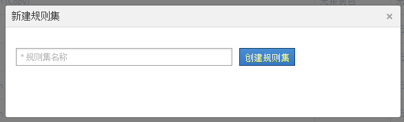

# 分类规则集

规则集是特定变量的一组分类规则。您可将变量应用到规则集。如果您要为一个变量创建多个规则集，则必须将每个规则集应用到多个报表包。

## 分类规则集 {#concept_CD3D510F5070486584F3BB535AE41524}

规则集是特定变量的一组分类规则。您可将变量应用到规则集。如果您要为一个变量创建多个规则集，则必须将每个规则集应用到多个报表包。

## 分类规则生成器页面 {#section_C60B0888C76D49C596EF19F11808B718}

**[!UICONTROL 分析]** &gt;管 **[!UICONTROL 理]** &gt;分 **[!UICONTROL 类规则生成器]**

“[!UICONTROL 分类规则生成器]”中提供了以下字段和选项。

<table id="table_A5D92409969747E39E041216A5AA32CD"> 
 <thead> 
  <tr> 
   <th colname="col1" class="entry"> 元素 </th> 
   <th colname="col2" class="entry"> 描述 </th> 
  </tr> 
 </thead>
 <tbody> 
  <tr> 
   <td colname="col1"> 
<a href="../../../components/c-classifications2/crb/classification-rule-set.md#task_86F216DFD2534FA181E64ABDF306782B" format="dita" scope="local"> 添加规则集</a> 
 </td> 
   <td colname="col2"> 
创建一个规则集。 
 </td> 
  </tr> 
  <tr> 
   <td colname="col1"> 
规则 
 </td> 
   <td colname="col2"> 显示规则集中包含的规则数量。 </td> 
  </tr> 
  <tr> 
   <td colname="col1"> 
状态 
 </td> 
   <td colname="col2"> 显示规则集的活动状态，如“草稿”或“活动”。活动规则每天进行处理，通常每月检查一次返回的分类数据。规则会自动检查新值，并上载分类。 </td> 
  </tr> 
  <tr> 
   <td colname="col1"> 
上次更改 
 </td> 
   <td colname="col2"> 指示规则集的编辑时间。 </td> 
  </tr> 
  <tr> 
   <td colname="col1"> 
复制 
 </td> 
   <td colname="col2"> 复制一个规则集，以便可以将该规则集应用到其他变量，或应用到不同报表包中的相同变量。 </td> 
  </tr> 
 </tbody> 
</table>

## Create a Classification Rule Set {#task_86F216DFD2534FA181E64ABDF306782B}

<!-- 

t_classification_rule_set.xml

 -->

命名分类规则集，应用变量并指定覆盖设置。

1. (Prerequisite) Define the classification structure in **[!UICONTROL Admin]** &gt; **[!UICONTROL Report Suites]**.

   （请参阅“管理工具”帮助中的[分类](https://marketing.adobe.com/resources/help/en_US/reference/classifications.html)，以了解有关添加分类的信息。）

   只有在变量至少定义了一个分类后，变量才会在[!UICONTROL 新建规则集]面板中显示。

   You can create classifications on a variable in **[!UICONTROL Admin]** &gt; **[!UICONTROL Report Suites]** &gt; **[!UICONTROL Traffic]** &gt; **[!UICONTROL Traffic Classifications]** (or **[!UICONTROL Conversion]** &gt; **[!UICONTROL Conversion Classifications]**). Then select the variable, then click **[!UICONTROL Add Classification]**.

1. To create the rule set, click **[!UICONTROL Admin]** &gt; **[!UICONTROL Classification Rule Builder]** &gt; **[!UICONTROL Add Rule Set]**.

   

1. Name the rule set, then click **[!UICONTROL Create Rule Set]**.
1. 选择要编辑的规则集。

   

1. Click **[!UICONTROL Select Report Suites and Variables]**.

   报表包和变量列表中填充了可在登录公司的所有报表包中使用的所有分类变量。报表包中的单个变量只能属于一个规则集。

   请参阅&#x200B;*`Variable`*（详细信息位于[分类规则生成器](../../../components/c-classifications2/crb/classification-rule-definitions.md#section_4D1A70A607C9419EB2116A5174EACB72)页面的定义中）。
1. Specify the report suites and variables to use, then click **[!UICONTROL Save]**.
1. Continue by [adding classification rules](../../../components/c-classifications2/crb/classification-rule-set.md#task_86F216DFD2534FA181E64ABDF306782B) to the rule set.
