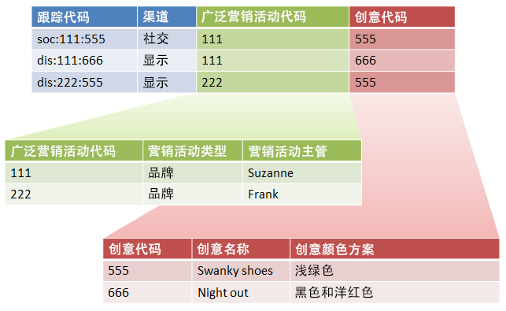
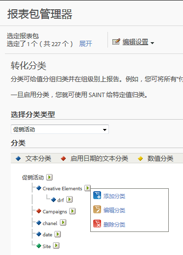

# 子分类和规则生成器-用例

您可以结合使用分类规则生成器和子分类，以简化分类管理和减少所需的规则数量。如果您的跟踪代码中包含需要单独分类的代码，您可能需要此功能。

## Sub-classifications and the Rule Builder - use case {#concept_6C8672C242544D7487E82886BBFABE6E}

您可以结合使用分类规则生成器和子分类，以简化分类管理和减少所需的规则数量。如果您的跟踪代码中包含需要单独分类的代码，您可能需要此功能。

See [Sub-Classifications](../../../components/c-classifications2/c-sub-classifications.md#concept_19EE5513A7DC43C38CC396E96F306CFE) for conceptual information about sub-classifications.

**示例**

假定以下跟踪代码：

`channel:broad_campaign:creative`

使用分类层次结构可以将分类应用到分类（称为 *`sub-classification`*). 表示您可以对多个表格使用导入器（如关系数据库）。一个表格将完全跟踪代码映射到键值，另一个表格将键值映射到其他表格。

在您准备好这种结构后，您可以使用[分类规则生成器](../../../components/c-classifications2/crb/classification-rule-builder.md)来上载只更新查找表格（上述图像中的绿色和红色表格）的小文件。然后，您可以使用规则生成器来保持主分类表格最新。

以下任务描述如何完成此操作。

## Set up Sub-Classifications using the Rule Builder{#task_2D9016D8B4E84DBDAF88555E5369546F}

<!-- 

t_rule_builder_subclass.xml

 -->

描述如何使用规则生成器上载子分类的示例步骤。

>[!NOTE]
>
>These steps describe how to accomplish the use case described in [Sub-Classifications and the Rule Builder](../../../components/c-classifications2/crb/sub-classification-rule-builder.md).

1. 在[分类管理器](https://marketing.adobe.com/resources/help/en_US/reference/index.html?f=classifications)中创建分类和子分类。

   示例：

   

1. In the [Classifications Rule Builder](../../../components/c-classifications2/crb/classification-rule-builder.md#concept_C1F219E622044D43852EF5168FF7192A), classify the sub-classification key from the original tracking code.

   使用正则表达式来执行此操作。在此示例中，用以填充&#x200B;*`Broad Campaign code`*&#x200B;的规则将使用此正则表达式：

   | `#` | 规则类型 | 匹配 | 设置分类 | 值 |
   |---|---|---|---|---|
   |  | 正则表达式 | `[^\:]:([^\:]):([^\:]`) | 广泛促销活动代码 | `$1` |
   |  | 正则表达式 | `[^\:]:([^\:]):([^\:]`) | 创作代码 | `$2` |

   >[!NOTE]
   >
   >At this point, you do not populate the sub-classifications *`Campaign Type`* and *`Campaign Director`*.

1. 上载仅包含指定子分类的分类文件。

   See [Multiple-Level Classifications](../../../components/c-classifications2/c-sub-classifications.md#concept_35AD906CDDC4441DAAF70664CF76AA0A).

   示例：

   | 键值 | 渠道 | 广泛促销活动代码 | 广泛的Campaign代码和amp；Hat；Campaign类型 | 广泛的Campaign代码和amp；Hat；系列活动总监 | ... |
   |---|---|---|---|---|---|
   | * |  | 111 | 品牌 | Suzanne |  |
   | * |  | 222 | 品牌 | Frank |  |

1. 要维护查找表，请上载一个小文件（如上方所示）。

   You would upload this file, for example, when a new *`Broad Campaign code`* is introduced. 此文件将应用于之前分类的值。同样，如果您创建了新的子分类（例如&#x200B;*`Creative Theme`* 作为子分类 *`Creative code`*，您只上传子分类文件，而不是整个分类文件。

   这些子分类函数的报告方式与顶级分类类似。这降低了使用它们所需的管理负担。
