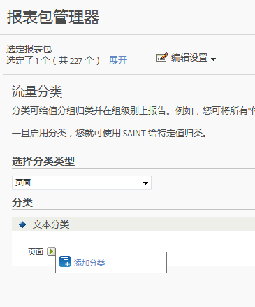

# 流量分类

流量分类允许您对流量变量 (prop) 进行分类。流量分类只能使用文本分类。

## Traffic classifications {#concept_028079B29A9C412AA68910A87E11176F}

流量分类允许您对流量变量 (prop) 进行分类。流量分类只能使用文本分类。

使用“流量分类”页面可以创建所选报表包的分类。分类后，任何可使用关键数据生成的报表也可通过关联的属性来生成。

在启动分类后，使用[分类导入器](../../components/c-classifications2/c-classifications-importer/c-working-with-saint.md#concept_08ED8C7A86C64E7DA5DE3044BB94B2EA)来对适当分类分配特定值。

## Add a Traffic Classification {#task_4DB49CCB1D764483907BC33A5CEB7315}

<!-- 

t_classification_add_traffic.xml

 -->

描述如何添加或编辑选定报表包的分类的步骤。

1. Click **[!UICONTROL Admin]** &gt; **[!UICONTROL Report Suites]** in the Suite header.
1. 选择一个报表包。
1.  在&#x200B;**选择分类类型**&#x200B;字段中，选择要添加分类的变量。
1. Click **[!UICONTROL Edit Settings]** &gt; **[!UICONTROL Traffic]** &gt; **[!UICONTROL Traffic Classifications]**.

   

1. Mouse over the **[!UICONTROL Edit Classification]** icon, then select **[!UICONTROL Add Classification]** or **[!UICONTROL Edit Classification]**.
1. In the **[!UICONTROL Text Classification]** dialog box, configure the classification as desired:

   **[!UICONTROL 名称：]**&#x200B;指定分类名称。

   **[!UICONTROL 描述]**：提供更加详细的描述。
1. 单击&#x200B;**[!UICONTROL 保存]**。
