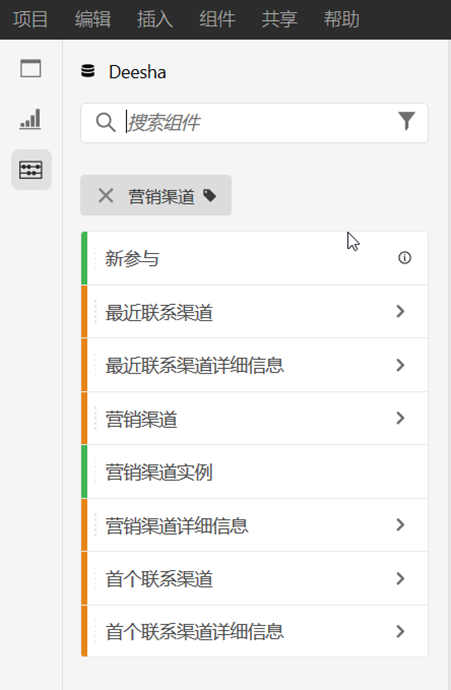
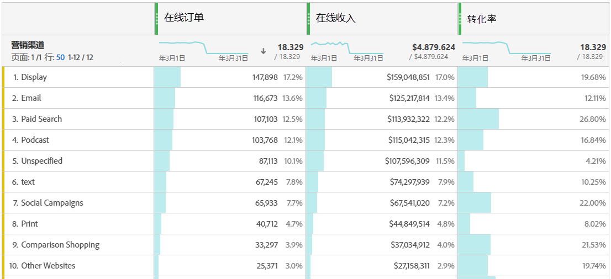
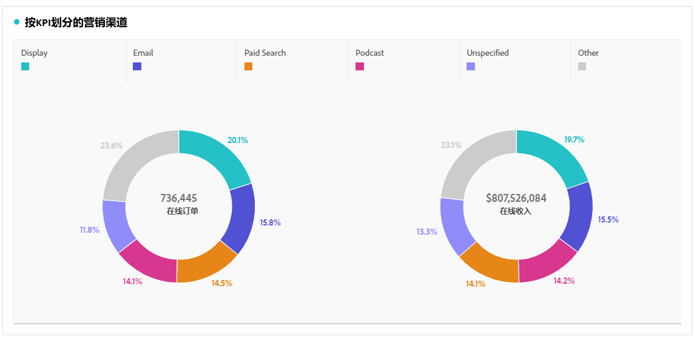
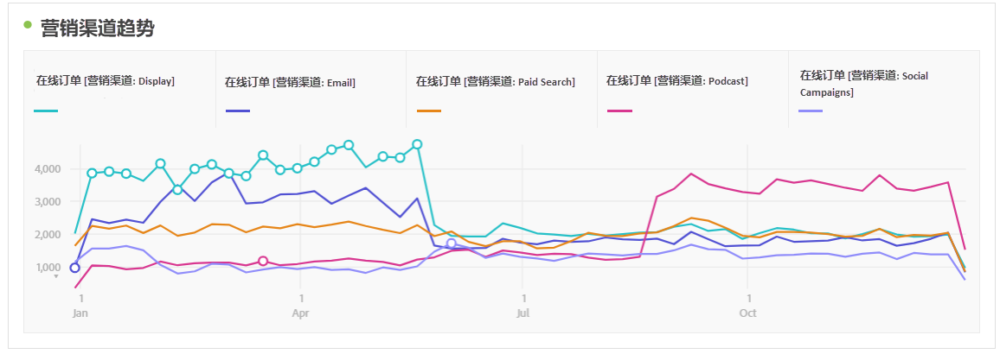
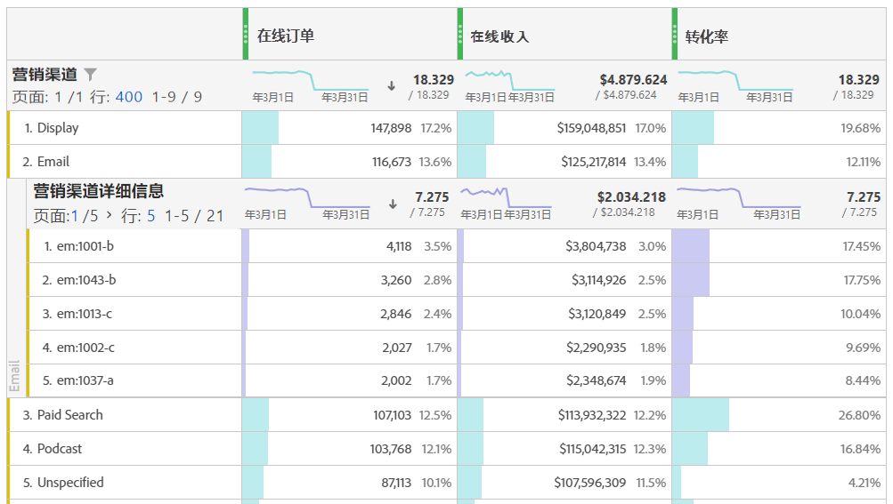
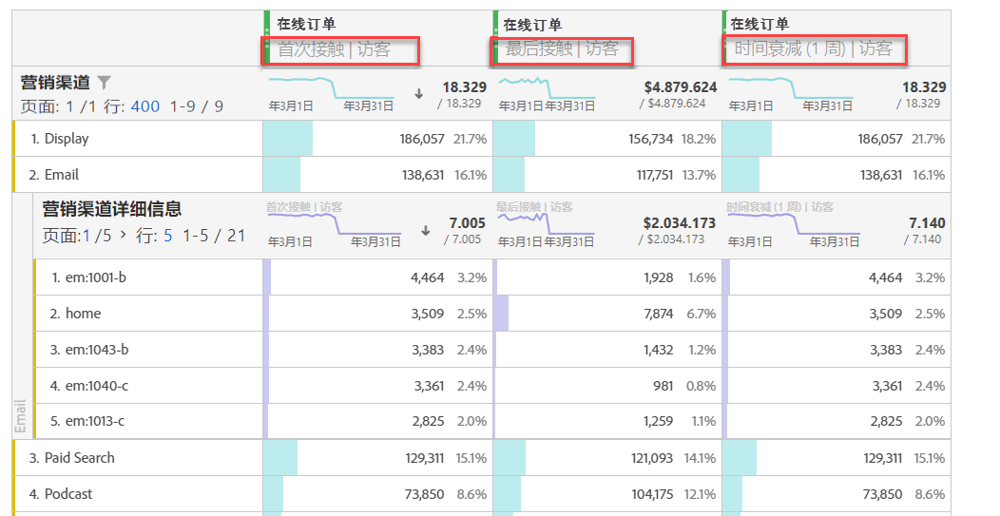
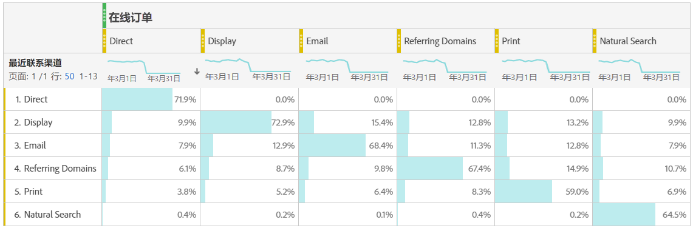

# 分析营销渠道

>[!NOTE]
>
>为了最大化归因和Adobe Analytics的营销渠道效率，我们发布了大约[修订后的最佳实践](/help/components/c-marketing-channels/mchannel-best-practices.md)。
>
>Analytics 管理员可以管理其组织的营销渠道，如[管理营销渠道](/help/admin/tools/manage-rs/edit-settings/marketing-channels/c-channels.md)中所述。

您可能希望了解哪些营销渠道以及与谁合作最有效，从而更好地集中您的精力，并从营销资金中获得更好的回报。在 Adobe Analytics 中，工作区中的营销渠道维度和量度是帮助您跟踪不同渠道对订单、收入等的影响的工具之一。并为您提供有用的渠道分析。以下是您可以使用的与营销渠道相关的维度和量度：

| 维度/量度 | 定义 |
| --- | --- |
| 营销渠道 | 这是建议使用的营销渠道维度。可在运行时对其应用归因模型。 此维度与“最近联系渠道”维度的行为相同，但采用不同的方式标记，以防止在与其他归因模型一起使用时产生混淆。 |
| 最近联系渠道 | 旧版维度，带有预应用的最近联系归因模型且不可更改。 |
| 首个联系渠道 | 旧版维度，带有预应用的首个联系归因模型且不可更改。 |
| 营销渠道实例 | 此量度衡量在图像请求中定义营销渠道的次数，包括标准页面查看和自定义链接调用。不包括持续得到的值。 |
| 新参与 | 此量度类似于实例，但只有在图像请求中定义了首个联系营销渠道时才会递增。 |

## 基本分析

此自由格式表显示每个营销渠道的在线订单、在线收入和转化率量度：

在此，您可以在圆环图中看到每个营销渠道的在线订单和在线收入：

此折线图显示一段时间内各渠道在线订单的趋势：

## 高级分析

营销渠道详细信息可更深入地挖掘每个渠道，以向您显示特定促销活动、位置等。您可以将每个营销渠道细分为详细信息：

## 应用归因模型

您可以使用[归因](/help/analyze/analysis-workspace/attribution/overview.md)即时应用不同的归因模型：

请注意当您应用不同的归因模型时，同一量度（在线订单）是如何生成不同结果的。

## 交叉表营销分析

使用旧版的首个联系渠道和最近联系渠道，您可以获得有助于了解渠道交互的见解：

通过本视频了解交叉表营销分析的详情：[在 Analysis Workspace 中使用交叉表分析来了解基本营销归因](https://experienceleague.adobe.com/docs/analytics-learn/tutorials/analysis-workspace/attribution-iq/using-cross-tab-analysis-to-explore-basic-marketing-attribution-in-analysis-workspace.html?lang=zh-Hans)。
