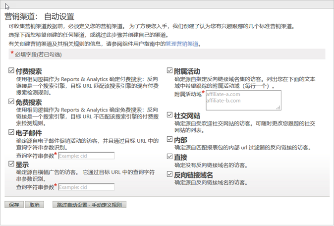

# 自动设置

为营销渠道报表运行一次性设置。

营销渠道报表包含一个一次性设置页面，帮助您入门。它提供了多个可用于跟踪的营销渠道。如果您觉得对创建渠道和规则得心应手，可以跳过此设置。然而，Adobe 建议您允许该向导为您创建渠道。自动设置可使您了解规则是如何构建的，还可让您根据自己的需要进行编辑。您可以随时禁用或删除预定义的渠道。

## 运行营销渠道的自动设置 {#run-auto-setup}

如何运行营销渠道自动设置。

1. 单击 **[!UICONTROL Analytics]** &gt; **[!UICONTROL 管理员]** &gt; **[!UICONTROL 报表包]**。
1. 在[!UICONTROL “报表包管理器”]上，选择一个报表包。
1. 单击&#x200B;**[!UICONTROL 编辑设置]** &gt; **[!UICONTROL 营销渠道]** &gt; **[!UICONTROL 营销渠道管理器]**。

   

   >[!NOTE]
   >
   >当您访问“管理工具”中的渠道配置应用程序时，会自动显示“[!UICONTROL 营销渠道: 自动设置]”页面。（请参阅[营销渠道管理器](/help/components/c-marketing-channels/c-channels.md)。）如果您的报表包包含一个或多个营销渠道，则本页面不会显示。除非您选择另一个不含营销渠道的报表包，否则您不能再访问此页面。

1. 确保选定您要创建的渠道。

   一旦选定，**[!UICONTROL 电子邮件]**、**[!UICONTROL 显示]**&#x200B;和&#x200B;**[!UICONTROL 附属活动]**&#x200B;便为必填字段。

   请参阅[营销渠道管理器](/help/components/c-marketing-channels/c-channels.md)。

1. 单击&#x200B;**[!UICONTROL 保存]**。
