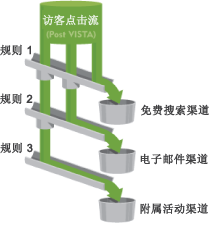

# 关于渠道和规则

先创建渠道和用于处理数据的基础规则，然后渠道和渠道数据才能显示在报表中。您还可以创建相关渠道的成本和预算金额，并指定您希望访客参与时间持续多久。在“管理工具”中执行报表配置任务。

渠道可以看作是一个收集访问的容器。规则把访问分配到正确的容器中。

Adobe 在[自动设置](../../components/c-marketing-channels/c-channel-autosetup.md#topic_E9ABE9E9E71B4E40A4E7EA9AD2C0372B)过程中提供了多个预定义渠道，您可以根据自己的需要对这些渠道进行编辑。

>[!NOTE]
>
>Adobe建议您在报表包中设置报表，该报表包可用作测试目的的模板。您可以使用该模板将这些渠道和规则集全局应用到一个或多个生产报表包中。
>
>请参阅[将模板报表包设置应用于多个报表包](../../components/c-marketing-channels/t-template.md#task_0DE0A320EDA94FC5A6E5912868B6E2DC)。

请查阅以下主题：

* [先决条件](../../components/c-marketing-channels/c-channels-rules.md#section_9913D2932E3140C099B7978CA95378B2)
* [重要处理说明](../../components/c-marketing-channels/c-channels-rules.md#section_DE372EEF02314F2395750CF2892DAAE1)

## 先决条件 {#section_9913D2932E3140C099B7978CA95378B2}

如有必要，请联系客户支持来帮助您实现这些先决条件：

* In the Administration Console (General Account Settings), enable the **[!UICONTROL Conversion Level]** (e-commerce) option for the report suite.

   See [General Account Settings](https://marketing.adobe.com/resources/help/en_US/reference/general_acct_settings_admin.html) in Analytics help for more information.

* Set up user group access to the **[!UICONTROL Marketing Channel Report]**.

   See [Configure User Group Access](../../components/c-marketing-channels/t-user-groups.md#task_B156E7527FE94055A43A697338FE8C8C).

* Ensure that your account manager has enabled **[!UICONTROL Channel Reports]** for your report suite.

## Important processing notes {#section_DE372EEF02314F2395750CF2892DAAE1}

* 系统会按您指定的顺序处理规则，当一个规则得到满足时，系统会停止处理剩余规则。
* 规则可以访问已由 VISTA 设置的变量，但不能访问已被 VISTA 删除的数据。
* 渠道只存储转化量度。流量量度不可用。
* 两个营销渠道从不会接收相同事件的信用，如购买或点击次数。在这方面，营销渠道不同于 eVar（两个 eVar 可能会接收相同事件的信用）。
* 该报表一次最多可处理 25 个渠道。

