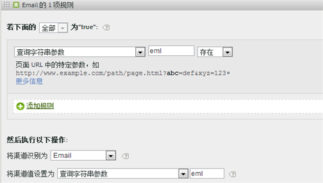
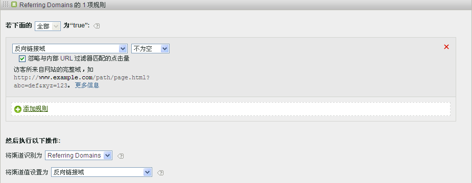
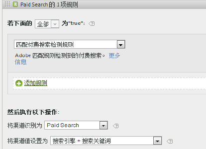
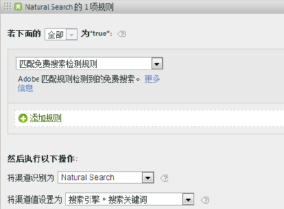
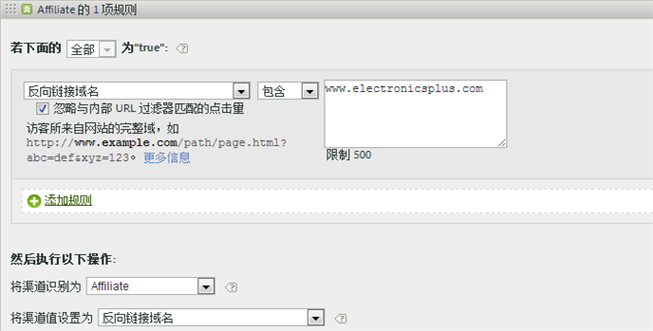
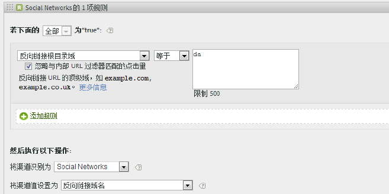
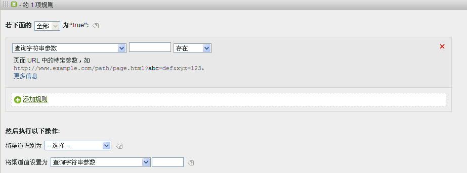
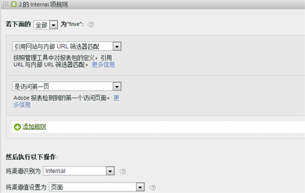
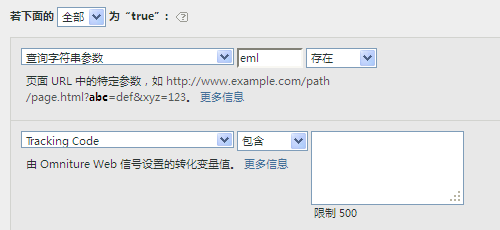

# 常见问题解答

了解如何填充为营销渠道设置的不同规则的最佳实践和相关示例。

* [常见问题](../../components/c-marketing-channels/c-faq.md#section_E490CEAF0E76422C91D34D8A80A0C573)
* [未识别渠道](../../components/c-marketing-channels/c-faq.md#section_451E42994DA247A8A7B8559C715A5EE7)
* [付费搜索](../../components/c-marketing-channels/c-faq.md#section_E934BFE182E4404A93FE07AFEAE64DC1)
* [免费搜索](../../components/c-marketing-channels/c-faq.md#section_A4C6B8F0360449BE94F0128FF7C71386)
* [附属活动](../../components/c-marketing-channels/c-faq.md#section_8D142C7074CD4DEC87DF55B691107622)
* [社交网站](../../components/c-marketing-channels/c-faq.md#section_492B72A3B261479D9C84F631E90C03D8)
* [显示](../../components/c-marketing-channels/c-faq.md#section_4FD846B89FCE4ECFB7781BD02874A1AB)
* [内部](../../components/c-marketing-channels/c-faq.md#section_179A2BE5C8E24719A9E5C0DC09AF0947)
* [电子邮件](../../components/c-marketing-channels/c-faq.md#section_4A927BE947B748E39595F4525B7280DE)
* [直接](../../components/c-marketing-channels/c-faq.md#section_D0A1DD9D5EEF4A05A1CC81F9EADC074A)

请参阅[创建营销渠道处理规则，以](../../components/c-marketing-channels/t-rules.md#task_84EDE9F46F404CB9B7CA0537328CEE08) 了解 [!UICONTROL 在营销渠道处理规则] 页面上显示的字段定义。

## 常见问题解答 {#section_E490CEAF0E76422C91D34D8A80A0C573}

每个营销渠道处理规则的实施可能有所不同，具体取决于跟踪代码。要配置可以提供所需结果的规则，需要一些足以解决问题的创新想法。

**问题**：我的跟踪代码不遵循模式，我必须为我的“附属活动”渠道指定数千个代码。

* 使用排除法。如果您的“电子邮件”和“附属活动”渠道使用相同的查询字符串参数，但您只有少数的电子邮件跟踪代码，则您可以在一个定义电子邮件的规则集中指定电子邮件跟踪代码。然后，分类其他所有跟踪代码时使用 *`affiliates.`*
* 在您的电子邮件系统中，为所有登陆页面 URL 添加一个查询字符串参数，例如 *`&ch=eml`*. 创建一个规则集，用于检测 ch 查询参数是否等于 *`eml`*. If it does not contain *`eml`*, then it is an affiliate.

**问题：**&#x200B;反向链接域包含的数据比我预期的多。

* 反向链接域可能在处理规则列表中排位过高。反向链接域应该是最后一个规则集之一（或最后一个规则集），因为处理顺序是很重要的。

**问题**：我创建了一个与查询字符串参数匹配的规则，但不能运行。

* 请确保在查询字符串参数字段中指定了参数名称（通常是一个字母数字值）。此外，还请确保在运算符之后指定了参数值，如以下电子邮件规则示例所示。

   

**问题**：为什么我所有的最近联系流量都被归于内部域？

* 您有一个与内部流量相匹配的规则。请记住，这些规则会处理访客在您网站上的每一次点击，而不仅仅是首次访问。如果您有一个像&#x200B;*`Page URL exists`*&#x200B;这样的规则，且没有其他标准，该渠道会与您网站上的每次连续点击相匹配，因为页面 URL 始终存在。

**问题**：我如何调试报表上“未识别渠道”中显示的流量？

* 规则按顺序处理。如果无任何具体标准相匹配，点击可以分为三大类：

1. 没有反向链接(直接访问)。

2. 内部引介，位于访问的第一页。

3. 页面上的处理故障。

请确保您拥有可以用于这三种可能的渠道。例如，创建以下规则：

1. **[!UICONTROL 参照]** 和 **[!UICONTROL 不存在]** ， **[!UICONTROL 且是访问的第一页]**。（请参阅[直接](../../components/c-marketing-channels/c-faq.md#section_D0A1DD9D5EEF4A05A1CC81F9EADC074A)。）

2. **[!UICONTROL 引用人匹配内部URL过滤器]** 和 **[!UICONTROL 访问第一页]**。（请参阅[内部](../../components/c-marketing-channels/c-faq.md#section_179A2BE5C8E24719A9E5C0DC09AF0947)。）

3. **[!UICONTROL 参照]** 和 **[!UICONTROL 现有]** 和 **[!UICONTROL 引用方不匹配内部URL过滤器]**。

最后，创建一个捕捉剩余点击的&#x200B;*其他*&#x200B;渠道，如[未识别渠道](../../components/c-marketing-channels/c-faq.md#section_451E42994DA247A8A7B8559C715A5EE7)中所述。

## 未识别渠道 {#section_451E42994DA247A8A7B8559C715A5EE7}

当您的规则没有捕获数据时，或者如果规则配置不正确，报表的[!UICONTROL “未识别渠道”]行中会显示数据。例如，您可以在处理顺序的结尾创建一个名为&#x200B;*其他*&#x200B;的规则集，以识别内部流量。

This kind of rule serves as a catch-all to ensure that channel traffic always matches external traffic, and typically does not end up in **[!UICONTROL No Channel Identified]**. 要小心不要建立一个同时确定内部流量的规则。将渠道值设置为&#x200B;**[!UICONTROL 反向链接域]**&#x200B;或&#x200B;**页面 URL]是创建有效“其他”规则的最常见、最有用的方法。[!UICONTROL **

>[!NOTE]
>
>可能仍有一些渠道流量可能会进入“未识别渠道”类别。例如：访客访问该网站并将某个页面添加为书签，并且在同一次访问中通过书签返回到该页面。由于这不是访问的第一个页面，而且没有反向链接域，因此它既不会被列入“直接”渠道，也不会被列入“其他”渠道。

## 付费搜索 {#section_E934BFE182E4404A93FE07AFEAE64DC1}

付费搜索是指您向搜索引擎支付一定费用，以让某个单词或短语出现在搜索结果中。为了匹配付费搜索检测规则，营销渠道使用[!UICONTROL “付费搜索检测”]页面上配置的设置。( **[!UICONTROL Admin]** &gt; **[!UICONTROL Report Suites]** &gt; **[!UICONTROL Edit Settings]** &gt; **[!UICONTROL General]** &gt; **[!UICONTROL Paid Search Detection]**). 目标 URL 匹配该搜索引擎的现有付费搜索检测规则。

对于营销渠道规则，[!UICONTROL “付费搜索”]设置如下：

有关详细信息，请参阅管理员中的[付费搜索检测](https://marketing.adobe.com/resources/help/en_US/reference/index.html?f=paid_search_detection)。

## 免费搜索 {#section_A4C6B8F0360449BE94F0128FF7C71386}

免费搜索是指，在您无需为您的网站排名向搜索引擎支付费用的情况下，访客就能通过网络搜索找到您的网站。您可以控制搜索引擎用于链接到网站的目标 URL。分析可使用此 URL 来确定搜索是否为免费搜索。

分析没有免费搜索检测的功能。在设置了“付费搜索检测”之后，系统可以推断出如果一个搜索反向链接不是付费的，则它必然是免费搜索反向链接。对于免费搜索，目标 URL 与该搜索引擎的现有付费搜索检测规则不匹配。

对于营销渠道规则，“免费搜索”设置如下：

有关详细信息，请参阅管理员中的[付费搜索检测](https://marketing.adobe.com/resources/help/en_US/reference/index.html?f=paid_search_detection)。

## 附属活动 {#section_8D142C7074CD4DEC87DF55B691107622}

附属活动规则识别来自一组指定反向链接域的访客。在规则中，您需要按如下所示列出要跟踪的附属活动域：

## 社交网站 {#section_492B72A3B261479D9C84F631E90C03D8}

这项规则识别来自 Facebook* 等社交网络的访客。其设置如下所示：

## 显示 {#section_4FD846B89FCE4ECFB7781BD02874A1AB}

这项规则识别来自横幅广告的访客。它是由目标 URL 中的查询字符串参数标识的，在此例中为 *`Ad_01`*。

## 内部 {#section_179A2BE5C8E24719A9E5C0DC09AF0947}

这项规则识别来自与报表包内部 URL 筛选器相匹配的反向链接的访客。

## 电子邮件 {#section_4A927BE947B748E39595F4525B7280DE}

要设置该规则，您要为您的电子邮件促销活动提供查询字符串参数。在此示例中，该参数为 *`eml`*:

如果规则中包含“跟踪代码”，请在每行输入一个值，如此处所示：

## 直接 {#section_D0A1DD9D5EEF4A05A1CC81F9EADC074A}

这项规则识别没有反向链接域的访客。这项规则包括直接进入您网站的访客，如从“收藏夹”链接进入或通过将链接粘贴到浏览器中进入的访客。

