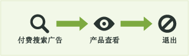
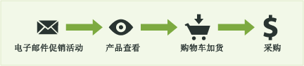
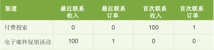
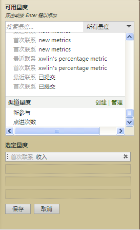

# 营销渠道报告中使用的指标

如何在营销渠道报告中使用指标。

## Metrics used in Marketing Channel reports {#topic_F83F5D4C3E144967AD90D956F0E8A999}

如何在营销渠道报告中使用指标。

添加（或编辑）量度。

 向报表中添加列。

## First and last-touch metrics {#concept_68D9A50204304BA58C1F8013451E7853}

首次接触和最后接触是渠道属性，可让您了解访客在渠道中的活动产生的新参与度(或指标数据等指标数据)。

When a success event occurs, Analytics looks at the entire visitor's activity and history (back to the [visitor's engagement expiration](../../components/c-marketing-channels/visitor-engagement.md#topic_32ADFDB12D3A4F35843A4545AC97C49F)). 它会记下用户登入所用的第一个渠道以及最近渠道。然后将成功事件的信用赋予每个相应的渠道。

<!-- 

<note>
  A first-touch value has a rolling expiration based on the frequency of a visitor returning to the site. This first-touch expiration resets whenever a visitor returns to the site. This effects reporting by causing first-touch values to persist longer than you might expect. For example, this can occur if an instance of an first-touch channel was created a year ago. Remove the values on the eVar in the admin console to reset. 
</note>

 -->

**示例**

假定您设置了两个销售渠道：付费搜索和电子邮件促销活动。

付费搜索是指给产品做的广告。它吸引访客的兴趣，并产生一次产品查看，但没有带来转换事件。

一个月后，您为同一产品开展电子邮件促销活动。它促成了 100 美元的购买（或其他期望的转换事件）。

在营销渠道报表中，其结果会显示如下：

付费搜索渠道作为首次联系收入渠道被记为 100 美元，产生 1 笔首次联系订单。电子邮件促销活动渠道作为最近联系收入渠道（转换事件前用户最近联系的渠道）被记为 100 美元，产生 1 笔最近联系订单。换言之，该报表的主要目的是了解首次联系渠道的收入细分与最近联系渠道的收入细分有何区别。

每个成功事件实例都将具有一个“首次联系”渠道和一个“最近联系”渠道。这意味着如果为任何成功事件添加一个给定的量度列，其值始终正好等于同一时间段内的总数。该总数还将正好等于相应[!UICONTROL “网站量度”]&gt;[!UICONTROL “自定义事件”]报表中的事件总数。非成功事件量度（如访问和访客）将不符合一一对应的关系，因为同一访问中可能触发多个渠道。

>[!NOTE]
>
>此报告使用每个指标的首次联系或上次联系版本。因此，[!UICONTROL 营销渠道]报表中显示的数据可能与其他报表中显示的数据不匹配。

## Metric definitions {#section_364D003D34D748B79503DFA4DD208EDB}

| 量度 | 定义 |
|--- |--- |
| 首次联系渠道 | 访客参与的第一个营销渠道。从技术上讲，首次接触渠道是一个具有原始分配的eVar。 |
| 首次联系访客 | 在渠道报表中，首次联系访客是来源于某一渠道的每日独特访客。访客参与此网站的持续时间将被存储，可以延续多次访问。 |
| 最近联系渠道 | 转化渠道，指的是访客参与并导致转化的最后一个营销渠道。只有一个渠道设置为首次联系渠道。最近联系渠道会随着对网站的每次回访而改变。每次访问都有首次联系渠道和最近联系渠道，但首次联系渠道的值从不随后续访问发生变化。 |

## 点进 {#reference_55E2254F02EF4E7EB0AD2838C948347A}

点进是最近联系渠道的实例。它是使用最近分配的 eVar。

例如，假定一位访客每日访问一次您的网站，每次访问来源于不同的营销渠道：

* 第 1 天：付费搜索
* 第 2 天：显示
* 第 3 天：免费搜索
* 第 4 天：显示
* 第 5 天：付费搜索
* 第 6 天：显示
* 第 7 天：免费搜索

首次联系渠道报表将显示 1 位付费搜索新参与。其他每项渠道将显示 0 位新参与。最近联系渠道报表将显示付费搜索点进 2 次、显示点进 3 次，以及免费搜索点进 2 次。

## 向营销渠道报表中添加量度 {#task_D381139E00504666AB2402D553CFEA5B}

向营销渠道报表中添加量度。报表中每列最多可添加四个量度，列数不限。

1. 打开[!UICONTROL 营销渠道报表]。
1. 单击添加量度。

   

1. 在[!UICONTROL “可用量度”]下，将量度从[!UICONTROL “可用量度”]区域拖放到[!UICONTROL “选定量度”]区域。

   

1. To create calculated metrics, scroll to [!UICONTROL Calculated Metrics], then click **[!UICONTROL Create]**.
1. Click **[!UICONTROL Save.]**
