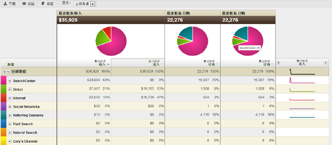

# 关于营销渠道报告

营销渠道报表让您对营销渠道产生的收入量一目了然。这些报表包含首次联系和最近联系渠道分配的概述报表，并显示关键和标准的量度，如收入、订购和成本等。

在管理工具中配置渠道定义规则。可使用针对渠道报表的特定 API。运行该[!UICONTROL 营销渠道]报表无需更改外部实施。

* [示例报表](../../components/c-marketing-channels/c-overview.md#section_64F7FB1326A64B318654BAFE66FA97EC)
* [可用报表](../../components/c-marketing-channels/c-overview.md#section_8A95A56AE24E4F34BBA069361D6354B9)

## 示例报表 {#section_64F7FB1326A64B318654BAFE66FA97EC}

功能板、API、Report Builder（适用于 Excel）、Ad Hoc Analysis、Data Warehouse 和数据提取均支持渠道数据。

添加（或编辑）量度。

 向报表中添加列。

## 可用报表 {#section_8A95A56AE24E4F34BBA069361D6354B9}

Experience Cloud 中提供了以下[!UICONTROL 营销渠道]报表。

| 报表 | 描述 |
|--- |--- |
| 渠道概述 | 概述报表就是摘要报表，它显示的饼图和图表描绘了选定时间段内的趋势。您可以为该报表添加首次联系和最近联系量度，也可以创建计算量度。您还可以从概述表访问首次联系和最近联系渠道以及详细报表。其他营销渠道报表提供了多种方式，帮助您更深入地了解该报表中汇总的数据。当您展开报表中的渠道时，可以查阅渠道值分类报表。渠道值在渠道详细信息中未进行分类。 |
| 首次联系或最近联系渠道 | 显示一些量度，这些量度提供了特定首次联系或最近联系渠道的相关数据。在这些报表中，您可以划分渠道，显示每个渠道的详细信息。 |
| 首次联系或最近联系渠道详细信息 | 显示页面名称和引介等详细信息，该信息取自您在配置规则时设置渠道值中设置的渠道值。通过渠道详细报表可以仔细检查概述报表的渠道明细值。 |