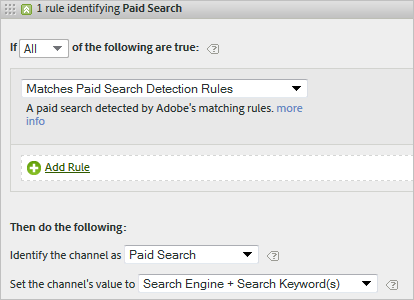

# 营销渠道常见问题解答和示例

See [Create Marketing Channel Processing Rules](/help/components/c-marketing-channels/mc-proc-rules/t-rules.md) for definitions of fields displayed on the [!UICONTROL Marketing Channel Processing Rules] page.

## 常见问题解答 {#faq}

每个营销渠道处理规则的实施可能有所不同，具体取决于跟踪代码。要配置可以提供所需结果的规则，需要一些足以解决问题的创新想法。

**问题**：我的跟踪代码不遵循模式，我必须为我的“附属活动”渠道指定数千个代码。

* 使用排除法。如果您的“电子邮件”和“附属活动”渠道使用相同的查询字符串参数，但您只有少数的电子邮件跟踪代码，则您可以在一个定义电子邮件的规则集中指定电子邮件跟踪代码。然后，分类其他所有跟踪代码时使用 *`affiliates.`*
* 在您的电子邮件系统中，为所有登陆页面 URL 添加一个查询字符串参数，例如 *`&ch=eml`*。创建一个规则集，用于检测 ch 查询参数是否等于 *`eml`*。如果该规则集中不包含 *`eml`*，则它是一个附属活动。

**问题**：反向链接域包含的数据比我预期的多。

* 反向链接域可能在处理规则列表中排位过高。反向链接域应该是最后一个规则集之一（或最后一个规则集），因为处理顺序是很重要的。

**问题**：我创建了一个与查询字符串参数匹配的规则，但不能运行。

* 请确保在查询字符串参数字段中指定了参数名称（通常是一个字母数字值）。此外，还请确保在运算符之后指定了参数值，如以下电子邮件规则示例所示。

   

**问题**：为什么我所有的最近联系流量都被归于内部域？

* 您有一个与内部流量相匹配的规则。请记住，这些规则会处理访客在您网站上的每一次点击，而不仅仅是首次访问。如果您有一个像&#x200B;*`Page URL exists`*&#x200B;这样的规则，且没有其他标准，该渠道会与您网站上的每次连续点击相匹配，因为页面 URL 始终存在。

**问题**：我如何调试报表上“未识别渠道”中显示的流量？

* 规则按顺序处理。如果无任何具体标准相匹配，点击可以分为三大类：

1. 无反向链接（一次直接的访问）。

2. 访问首页上的内部反向链接。

3. 页面处理故障。

请确保您拥有可以用于这三种可能的渠道。例如，创建以下规则：

1. **[!UICONTROL Referrer]** 以 **[!UICONTROL Does Not Exist]** 及 **[!UICONTROL Is First Page of Visit]**。 （请参阅[直接](/help/components/c-marketing-channels/mc-faq/c-faq.md)。）

2. **[!UICONTROL Referrer Matches Internal URL Filters]** 和 **[!UICONTROL Is First page of Visit]**. （请参阅[内部](/help/components/c-marketing-channels/mc-faq/c-faq.md)。）

3. **[!UICONTROL Referrer]** 以 **[!UICONTROL Exists]** 及 **[!UICONTROL Referrer Does Not Match Internal URL Filters]**。

最后，创建一个捕捉剩余点击的&#x200B;*其他*&#x200B;渠道，如[未识别渠道](/help/components/c-marketing-channels/mc-faq/c-faq.md#no-channel-identified)中所述。

## 未识别渠道 {#no-channel-identified}

When your rules do not capture data, or if rules are not configured correctly, the report displays the data in the [!UICONTROL No Channel Identified] row on the report. 例如，您可以在处理顺序的结尾创建一个名为&#x200B;*其他*&#x200B;的规则集，以识别内部流量。

This kind of rule serves as a catch-all to ensure that channel traffic always matches external traffic, and typically does not end up in **[!UICONTROL No Channel Identified]**. 要小心不要建立一个同时确定内部流量的规则。Setting the channel&#39;s value to **[!UICONTROL Referring Domain]** or to **[!UICONTROL Page URL]** are the most common, useful ways to create an effective Other rule.

> [!NOTE] 仍可能会有一些渠道流量被列入“未识别渠道”类别。例如：访客访问该网站并将某个页面添加为书签，并且在同一次访问中通过书签返回到该页面。由于这不是访问的第一个页面，而且没有反向链接域，因此它既不会被列入“直接”渠道，也不会被列入“其他”渠道。

## 付费搜索 {#paid-search}

付费搜索是指您向搜索引擎支付一定费用，以让某个单词或短语出现在搜索结果中。To match paid search detection rules, the marketing channel uses settings configured on the [!UICONTROL Paid Search Detection] page. ( **[!UICONTROL Admin]** > **[!UICONTROL Report Suites]** > **[!UICONTROL Edit Settings]** > **[!UICONTROL General]** > **[!UICONTROL Paid Search Detection]**). 目标 URL 匹配该搜索引擎的现有付费搜索检测规则。

For the marketing channel rule, the [!UICONTROL Paid Search] settings are as follows:

有关详细信息，请参阅管理员中的[付费搜索检测](https://docs.adobe.com/content/help/en/analytics/admin/admin-tools/paid-search-detection/paid-search-detection.html)。

## 免费搜索 {#natural-search}

免费搜索是指，在您无需为您的网站排名向搜索引擎支付费用的情况下，访客就能通过网络搜索找到您的网站。您可以控制搜索引擎用于链接到网站的目标 URL。分析可使用此 URL 来确定搜索是否为免费搜索。

分析没有免费搜索检测的功能。在设置了“付费搜索检测”之后，系统可以推断出如果一个搜索反向链接不是付费的，则它必然是免费搜索反向链接。对于免费搜索，目标 URL 与该搜索引擎的现有付费搜索检测规则不匹配。

对于营销渠道规则，“免费搜索”设置如下：

有关详细信息，请参阅管理员中的[付费搜索检测](https://docs.adobe.com/content/help/en/analytics/admin/admin-tools/paid-search-detection/paid-search-detection.html)。

## 附属活动 {#afilliates}

附属活动规则识别来自一组指定反向链接域的访客。在规则中，您需要按如下所示列出要跟踪的附属活动域：

## 社交网站 {#social-networks}

这项规则识别来自 Facebook* 等社交网络的访客。其设置如下所示：

## 显示 {#display}

这项规则识别来自横幅广告的访客。它是由目标 URL 中的查询字符串参数标识的，在此例中为 *`Ad_01`*.

## 内部 {#internal}

这项规则识别来自与报表包内部 URL 筛选器相匹配的反向链接的访客。

## 电子邮件 {#email}

要设置该规则，您要为您的电子邮件促销活动提供查询字符串参数。在此示例中，该参数为 *`eml`*:

如果规则中包含“跟踪代码”，请在每行输入一个值，如此处所示：

## 直接 {#direct}

这项规则识别没有反向链接域的访客。这项规则包括直接进入您网站的访客，如从“收藏夹”链接进入或通过将链接粘贴到浏览器中进入的访客。

