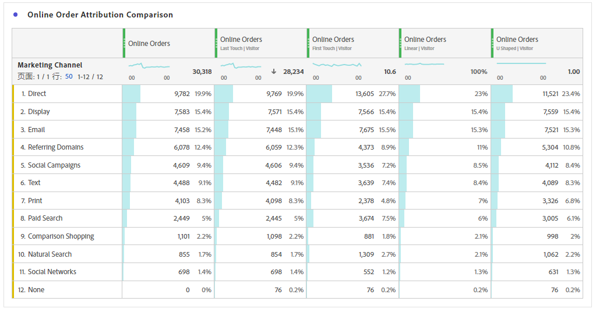
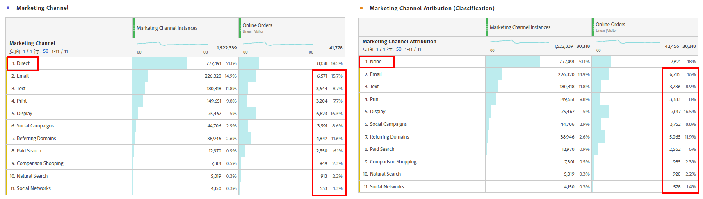
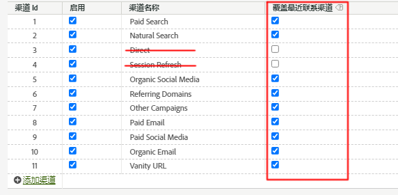
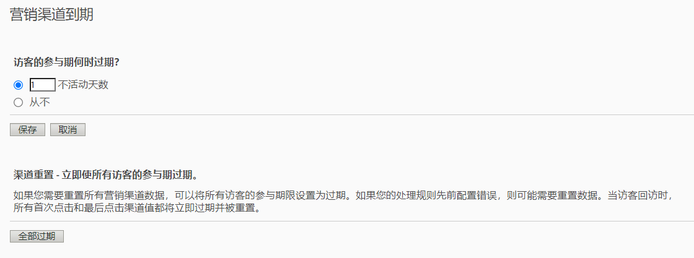

# 归因和营销渠道 - 最佳实践

[营销渠道](/help/components/c-marketing-channels/c-getting-started-mchannel.md)是 Adobe Analytics 宝贵且强大的功能。在制定有关营销渠道的当前指南时，[归因](/help/analyze/analysis-workspace/attribution/overview.md)和 [Customer Journey Analytics](https://experienceleague.adobe.com/docs/analytics-platform/using/cja-usecases/marketing-channels.html?lang=zh-Hans#cja-usecases) 都还不存在。

为了确保您的营销渠道实施能够在未来使用并且确保与归因以及与 Customer Journey Analytics 的报告一致性，我们发布了一组更新后的最佳实践。如果您已经在使用营销渠道，则可以在这些新的指南中选择最佳选项。如果您是刚开始使用营销渠道，我们建议您遵守所有新的最佳实践。

当营销渠道在首次引入时，它们只具有首个联系和最近联系维度。在有了当前版本的归因后，不再需要显式的首个联系/最近联系维度。Adobe 提供了通用的“营销渠道”和“营销渠道详细信息”维度，以便您将其与所需的归因模型结合使用。这些一般化的维度的行为与最近联系渠道维度相同，但采用了不同的标记以防止在将营销渠道用于不同的归因模型时造成混淆。

由于营销渠道维度取决于传统的访问定义（由其处理规则定义），因此使用虚拟报表包无法更改其访问定义。这些修订后的实践在归因和Adobe Analytics中实现了清楚可控的回溯窗口。

## 最佳实践 1：利用归因进行可控分析

我们推荐使用[归因](/help/analyze/analysis-workspace/attribution/overview.md)而不是现有的营销渠道归因以调整您的营销渠道分析。按照其他最佳实践操作，以确保使用归因进行分析时一致且可靠的控制。

* 维度“营销渠道”和“营销渠道详细信息”的配置确定了要评估的接触点，与各个营销渠道实例对应。
* 对于量度分析，您的组织应该与一个或多个归因模型保持一致。将自定义量度与此模型一起保存以便重用。
* 默认情况下，使用“最后接触”和“访客参与期”的设置进行分配。归因量度模型提供了对回溯窗口更好的控制并且更多样化，包括[算法归因](/help/analyze/analysis-workspace/attribution/algorithmic.md#analysis-workspace)。

## 最佳实践 2：不使用直接和会话刷新渠道定义

建议不要将直接和内部/会话刷新渠道用于自定义归因模型。

如果组织已经配置了直接和会话刷新会怎么样？在这种情况下，Adobe建议您[为首次联系/最近联系创建分类](/help/admin/tools/manage-rs/edit-settings/marketing-channels/classifications-mchannel.md)，并将直接和会话刷新渠道保留不分类。 分类的维度会生成与从未配置这些渠道的情况类似的归因结果。

如果禁用这些渠道并删除其营销渠道处理规则，则结果与分类方法略有不同。 值`None`表示不匹配任何营销渠道处理规则的访问。 当与某个渠道匹配的访问跟在某个渠道匹配的访问之后时，可能会出现差异。

在任一情况下，您仍可以使用自定义归因模型来应用回顾窗口和归因模型。

## 最佳实践 3：为所有渠道启用覆盖最近联系渠道

在 Workspace 中与营销渠道维度一起使用的自定义归因模型在启用了此设置时表现最好。启用此设置会导致营销渠道实例在遇到新渠道/详细信息时计数。您应为除了直接或内部/会话刷新之外的所有渠道启动此项，我们不建议将它们用于自定义归因模型。

## 最佳实践 4：尽可能缩短访客参与期

将此访客参与期设置为最小值“1 天”以尽可能减少保留值的可能性。由于自定义归因模型 (AIQ) 允许灵活的回溯窗口，我们建议设置最小值以尽可能减少此设置的影响。

## 最佳实践 5：营销渠道处理规则应该只有已启用的渠道才能具有。

确保您为禁用的渠道删除了所有营销渠道处理规则。规则应该只有已选中启用的渠道才能具有。
