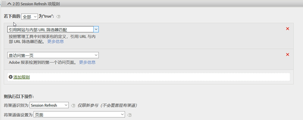
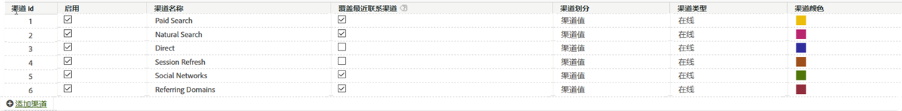

# 内部（会话刷新）渠道

内部渠道（通常又称为“会话刷新”）由对网站的访问组成，这些访问的反向链接 URL 与在 Admin Console 中设置的内部 URL 过滤器相匹配，这意味着访客从网站内部开始其访问。

## 覆盖最佳实践

最好取消选中“直接”和“内部”渠道的覆盖最近联系选项，以便这些渠道不能从其他持久保留的最近联系渠道获得点数（或相互获得点数）。

>[!NOTE] 本文档假定“直接”和“会话刷新”已取消选中覆盖设置。

## 参与期

访客的首次联系和最近联系渠道在该浏览器上处于非活动状态 30 天后会进行重置。

>[!NOTE] 30 天是默认设置，可根据需要通过“管理员”设置进行修改。

如果访客频繁使用网站，则参与窗口将随着这些访问渠道一起滚动。渠道必须处于非活动状态 30 天后，该期限才会到期，并且渠道才会重置。示例：

* 第 1 天：用户通过“显示”访问网站。首次联系和最近联系渠道将设置为“显示”。

* 第 2 天：用户通过“免费搜索”访问网站。首次联系仍为“显示”，最近联系将设置为“免费搜索”。

* 第 35 天：用户已经 33 天没有访问过该网站，现在使用他们在浏览器中打开的选项卡重新访问该网站。假设参与期为 30 天，此时，该窗口将关闭，并且营销渠道 Cookie 将过期。由于用户来自内部 URL，因此首次联系和最近联系渠道将被重置，并且都将设置为“会话刷新”。

## 首次联系与最近联系之间的关系

要了解首次联系与最近联系之间的交互情况，并确认是否可以按预期进行覆盖，您可以提取与最近联系渠道报表相关的首次联系渠道报表，并在其中添加关键成功量度（请参阅下面的示例）。该示例展示了首次联系与最近联系渠道之间的交互情况。

首次联系等于最近联系的相交区域以橙色突出显示。只有同时作为首次联系渠道时，“直接”和“会话刷新”才能获得最近联系点数，因为它们不能从其他持久保留的渠道（以灰色突出显示的行）获得点数。

## 为什么会出现会话刷新？

我们知道，仅当最近联系会话刷新也是首次联系渠道时，才会出现最近联系会话刷新，因此，以下场景解释了会话刷新如何成为首次联系渠道。

### 场景 1：会话超时

访客访问网站，然后在浏览器中保持打开选项卡，以备日后使用。访客的参与期到期（或访客主动删除其 Cookie），他们使用打开的选项卡再次访问网站。由于反向链接 URL 是内部域，访问将被分类为“会话刷新”。

### 场景 2：并非所有网站页面都已标记

访客登陆未标记的页面 A，然后移至已标记的页面 B。页面 A 将被视为内部反向链接，并且该访问将被分类为“会话刷新”。

### 场景 3：重定向

如果未将重定向设置为将反向链接数据传递到新登陆页面，则真正的登入反向链接数据将会丢失，并且此时重定向页面（可能是内部页面）将显示为反向链接域。该访问将被分类为“会话刷新”。

### 场景 4：跨域流量

访客从一个触发包 A 的域移动到另一个触发包 B 的域。如果在包 B 中，内部 URL 过滤器包括第一个域，则包 B 中的访问将被记录为内部访问，因为营销渠道将其视为第二个包中的新访问。该访问将被分类为“会话刷新”。

### 场景 5：登入页面加载时间较长

访客登陆具有大量内容的页面 A，且 Adobe Analytics 代码位于页面底部。在加载所有内容（包括 Adobe Analytics 图像请求）之前，访客单击了页面 B。页面 B 触发其 Adobe Analytics 图像请求。由于页面 A 的图像请求从未加载，因此在 Adobe Analytics 中，第二个页面将显示为访问的首次点击，而页面 A 将作为反向链接。该访问将被分类为“会话刷新”。

### 场景 6：在访问网站期间清除 Cookie

访客访问网站，并在会话期间清除了其 Cookie。此时，首次联系和最近联系渠道都将重置，并且访问将被分类为“会话刷新”（因为反向链接将是内部链接）。
