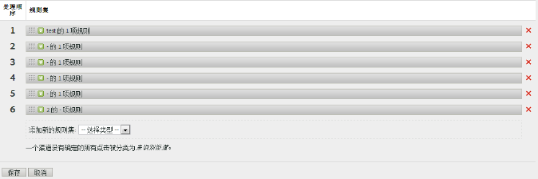

# 创建营销渠道处理规则

创建营销渠道处理规则，这些规则决定访客点击是否符合分配到渠道的标准。

此步骤使用电子邮件规则作为示例。该示例假定您已经将电子邮件渠道添加到“营销渠道管理器”页面上的渠道列表中。

1. Click **[!UICONTROL Analytics]** &gt; **[!UICONTROL Admin]** &gt; **[!UICONTROL Report Suites]**.
1. 选择一个报表包。

   如果您的报表包未定义渠道，则会显示[!UICONTROL “营销渠道：自动设置”]页面。

   请参阅 [运行自动设置](/help/components/c-marketing-channels/c-channel-autosetup.md).

1. Click **[!UICONTROL Edit Settings]** &gt; **[!UICONTROL Marketing Channels]** &gt; **[!UICONTROL Marketing Channel Processing Rules]**.

   

1. From the **[!UICONTROL Add New Rule Set]** menu, select **[!UICONTROL Email]**.

   这样做不是在选择渠道，而是选择使用几个必要参数填充规则的模板。

   

   使用布尔逻辑（若/则语句）配置规则。例如，在电子邮件渠道规则中，提供以下规则语句中强调的设置或信息：

   `"If **[!UICONTROL All]** or **[!UICONTROL Any]** of the following are true:  **[!UICONTROL Query String Parameter]** *<value>* **[!UICONTROL exists]**...`

   `"Then identify the channel as **[!UICONTROL Email]**...`

   `"Then set the channel's value to **[!UICONTROL Query String Parameter]** *<value>*."`

   In this example, *`<value>`* is the query string parameter that you use for your email campaign, such as *`eml`*.
1. To continue creating rules, click **[!UICONTROL Add Rule]**.
1. 要对规则优先排序，请将其拖放到所需位置。
1. Click **[!UICONTROL Save.]**

>[!MORE_LIKE_THIS]
>
>* [常见问题和示例](/help/components/c-marketing-channels/c-faq.md)

