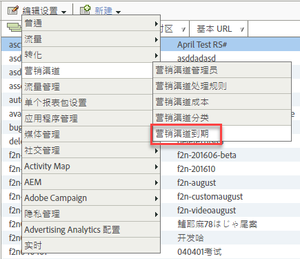

# 访客参与期满

了解如何在营销渠道中指定访客参与到期。

## Visitor engagement expiration {#topic_32ADFDB12D3A4F35843A4545AC97C49F}

了解如何在营销渠道中指定访客参与到期。

访客参与是指您希望多长时间使访客在网站上的先前活动归于首次联系渠道。

例如，访客通常点进付费搜索促销活动，并将产品添加到购物车，但他们在转换事件前就结束了会话。如果访客在以后返回进行购买，您可指定他们过去和目前的活动是否称之为一次参与。默认到期设置为 30 天。

| 字段 | 定义 |
|--- |--- |
| 不活动天数 | 访客首次联系参与到期前必须经过的天数。默认值为 30。 |
| 从不 | 访客的参与期限不会到期。 |
| 渠道重置 | 将所有访客的参与期限设置为过期。如果您需要重置所有营销渠道数据，可以将所有访客的参与期限设置为过期。如果您的处理规则先前配置错误，则可能需要重置数据。当访客回访时，所有首次联系和最近联系渠道值都将立即过期并被重置。 |

## 指定访客参与到期 {#task_A8B8B5A07C5A4882BB895252A018FDED}

指定访客参与到期。

1. Click **[!UICONTROL Analytics]** &gt; **[!UICONTROL Admin]** &gt; **[!UICONTROL Report Suites]**.
1. In the [!UICONTROL Report Suite Manager], click **[!UICONTROL Edit Settings]** &gt; **[!UICONTROL Marketing Channels]** &gt; **[!UICONTROL Marketing Channel Expiration]**.

   

1. 配置访客参与到期字段。
1. Click **[!UICONTROL Save.]**
