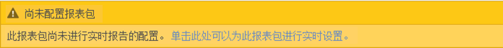
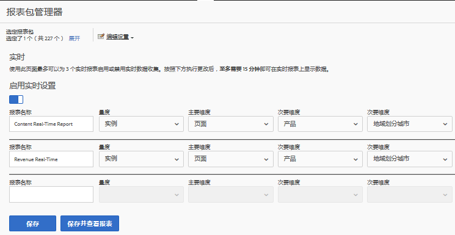
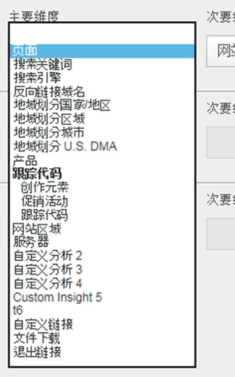
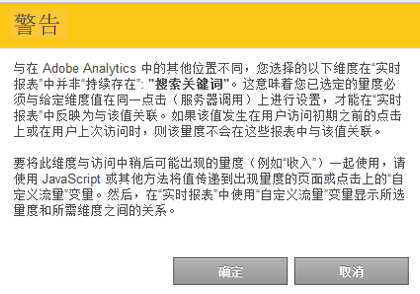

# 配置实时报表

设置实时报表的管理步骤。

Setting up real-time reports within [!UICONTROL Reports &amp; Analytics] consists of selecting the report suite and configuring up to 3 reports for it.

1. 选择您要为其启用实时报表的报表包。

   Navigate to **[!UICONTROL Analytics]** &gt; **[!UICONTROL Reports]** &gt; **[!UICONTROL View All Reports &gt; Site Metrics]** &gt; **[!UICONTROL Real-Time]** and select the report suite from the drop-down at the top:

   

   如果某个报表包未设置实时报表功能，而您尝试查看该报表包的实时报表，则会显示一条消息，让您设置该报表包。

   

1. Click **[!UICONTROL Configure]** (gear icon) to run the [!UICONTROL Report Suite Manager].

   (Also available under **[!UICONTROL Analytics]** &gt; **[!UICONTROL Admin &gt; Report Suites]** &gt; **[!UICONTROL Edit Settings]** &gt; **[!UICONTROL Real-Time]**.)

1. Turn on the **[!UICONTROL Enable Real-Time]** setting.
1. 为至多 3 个表报设置实时数据收集，每个报表具有 1 个量度和 3 个维度或分类。

   

   有关支持的实时指标和维度的信息，请参 [阅支持的指标和维度](../../components/c-real-time-reporting/realtime-metrics.md#concept_B86D8DF89AD448839332AD84B1DF2AE7)。

   如果已创建了分类，则分类会缩进显示在其所定义的维度下。

   

   >[!NOTE]
   >
   >对于单个实时报表，我们当前不支持启用重复维，即使为每个维选择了不同的分类也是如此。

   有关分类的详细信息，请参阅关 [于分类](../../components/c-classifications2/c-classifications.md#concept_4CEC7FF1A9E24204A7DA6B9AC70709DE)。

   >[!NOTE]
   >
   >某些维度（如“搜索关键字”或“产品”）不会像Adobe Analytics中的其他位置那样实时保留。 当选择非持续量度时，会出现以下警告：

   

1. Click **[!UICONTROL Save]** or **[!UICONTROL Save and View Report]**.

   在初始报表设置中，最多需要 20 分钟数据才会开始传输。之后，数据会立即可用。有关查看实时报表的信息，请参阅[运行实时报表](https://marketing.adobe.com/resources/help/en_US/sc/user/reports_realtime.html)。

1. 默认情况下，所有用户均有权访问实时报表。
