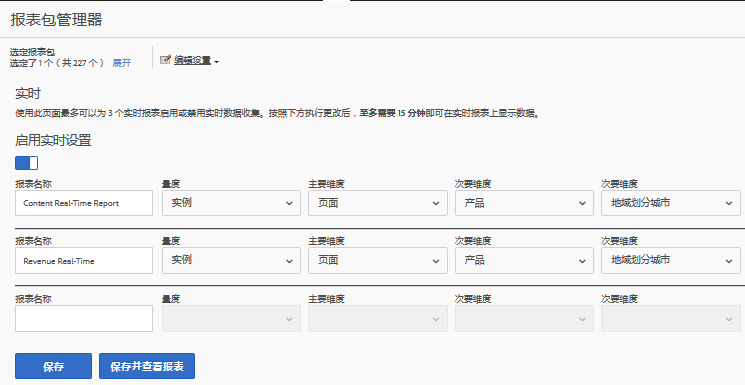
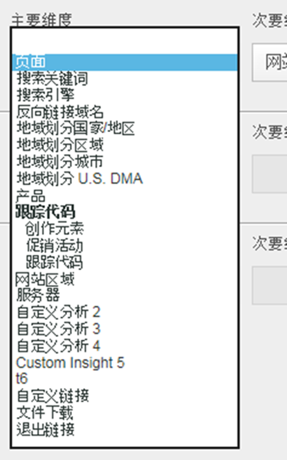

# 配置实时报表

以下信息包含设置实时报表的管理步骤。

这包括选择报表包并为其配置至多3个报表。

1. 选择您要为其启用实时报表的报表包。

   1. 在Analysis Workspace中，选择&#x200B;[!UICONTROL **Workspace**]&#x200B;选项卡，然后选择&#x200B;[!UICONTROL **报表**] > [!UICONTROL **参与**] > **[!UICONTROL 实时]**。

   1. 从顶部的下拉列表中选择报表包：

      

      如果某个报表包未设置实时报表功能，而您尝试查看该报表包的实时报表，则会显示一条消息，让您设置该报表包。

      

1. 选择&#x200B;**[!UICONTROL 配置]**&#x200B;以运行[!UICONTROL 报表包管理器]。

   （也可以通过 **[!UICONTROL Analytics]** > **[!UICONTROL 管理员 > 报表包]** > **[!UICONTROL 编辑设置]** > **[!UICONTROL 实时]**&#x200B;获取。）

1. 打开&#x200B;**[!UICONTROL 启用实时设置]**。
1. 为至多 3 个表报设置实时数据收集，每个报表具有 1 个量度和 3 个维度或分类。

   

   有关受支持的实时量度和维度的信息，请参阅[受支持的量度和维度](/help/admin/tools/manage-rs/edit-settings/realtime/realtime-metrics.md)。

   如果已创建了分类，则分类会缩进显示在其所定义的维度下。

   

   >[!NOTE]
   >
   >对于单个实时报表，目前不支持启用重复维度，即使为每个维度选择不同分类也是如此。

   >[!NOTE]
   >
   >某些维度（例如“搜索关键词”或“产品”）在实时报表中并非持续存在，这一点与 Adobe Analytics 中的其他位置不同。 当选择非持续量度时，会出现以下警告：

   

1. 选择&#x200B;**[!UICONTROL 保存]**&#x200B;或&#x200B;**[!UICONTROL 保存并查看报表]**。

   初次设置报表后，可能需要20分钟才能开始流式传输数据。 从那时起，数据立即可用。

1. 默认情况下，所有用户均有权访问实时报表。
