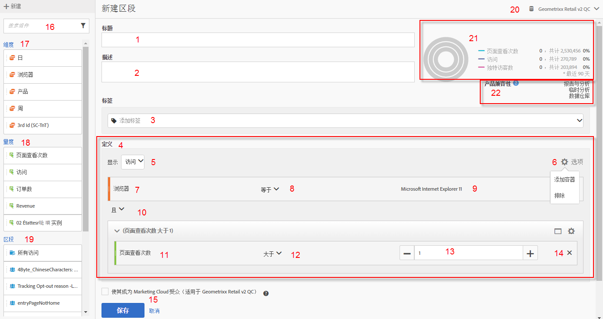
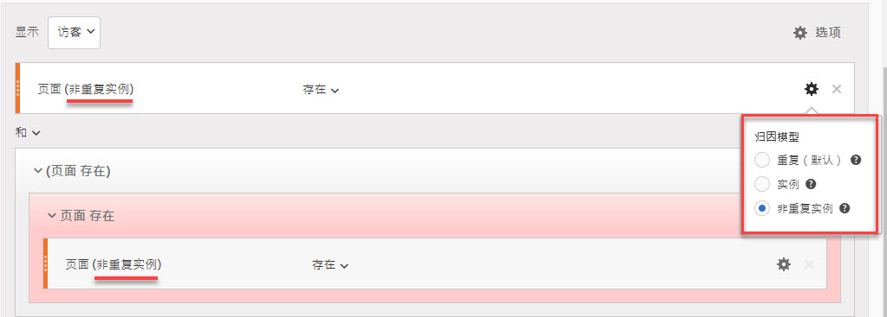
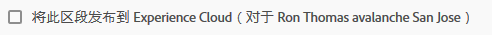
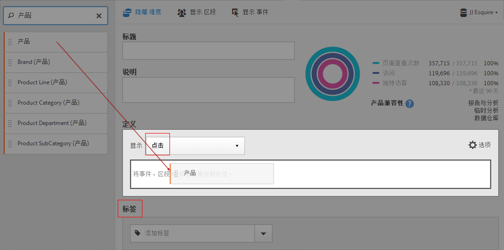
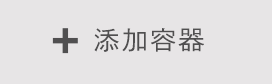
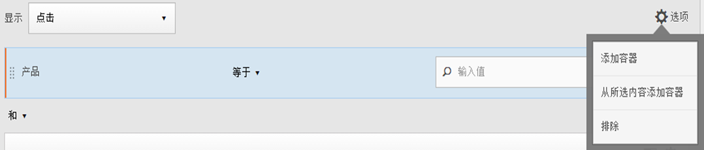
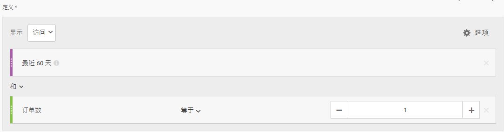
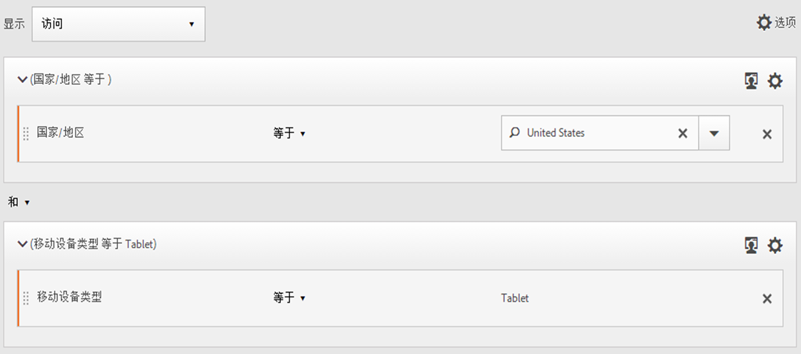
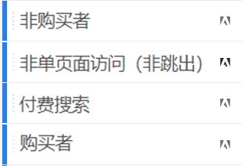
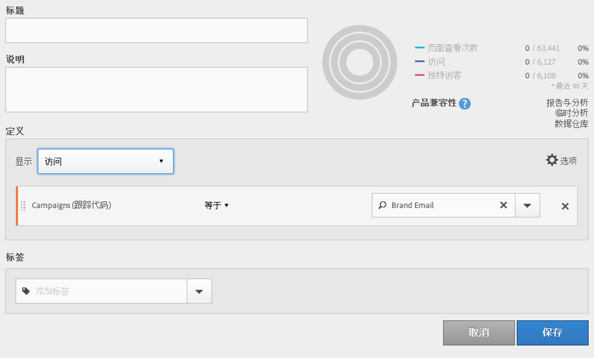

# 区段生成器

区段生成器提供了一个画布以将量度维度、区段和事件拖放到其中，从而根据容器层次结构逻辑、规则和运算符划分访客。通过使用该集成开发工具，您可以生成和保存简单或复杂的区段，以确定跨访问和页面点击的访客属性和操作。

[!UICONTROL 区段生成器]提供了一个画布以将量度维度、区段和事件拖放到其中，从而根据容器层次结构逻辑、规则和运算符划分访客。通过使用该集成开发工具，您可以生成和保存简单或复杂的区段，以确定跨访问和页面点击的访客属性和操作。

>[!IMPORTANT]
>
>我们在2019年月发布了维度归因模型。请参阅下面Web UI功能下的#6。

访问区段生成器的方法有以下几种：

* **分析顶部导航：** 单击 **[!UICONTROL “分析]** ”&gt; **[!UICONTROL “组件]** ”&gt; **[!UICONTROL “区段]**”。
* **[!UICONTROL Analysis Workspace]：** 单击 **[!UICONTROL “分析]** ”&gt; **[!UICONTROL “工作区]**”，打开项目并单击 **[!UICONTROL “+新建]** ”&gt; **[!UICONTROL “创建区段]**”。
* **[!UICONTROL Reports&amp; Analytics]：** 单击 **[!UICONTROL “Analytics]** ”(分析)&gt; **[!UICONTROL “Reports”(报告)]**，打开现有报表并单击左侧导航  中的区段图标，然后单击 **[!UICONTROL 添加]**。
* **[!UICONTROL 临时分析]：**[在临时分析中构建细分](../../../components/c-segmentation/c-segmentation-workflow/seg-build.md#section_E440630183D64999BA2369D1B8048AA6)。
* **[!UICONTROL Report Builder]：**[在Report Builder中添加或编辑区段](https://marketing.adobe.com/resources/help/en_US/arb/segmentation.html)。

## Segment Builder user interface {#concept_643F2DF74C544796B58F4656ABC5F726}

通过使用[!UICONTROL 区段生成器]，您可以生成和保存简单或复杂的区段，以确定跨访问和页面点击的访客属性和操作。它提供了一个画布以将量度维度、事件或其他区段拖放到其中，从而根据层次结构逻辑、规则和运算符分段访客。

## Web UI 功能 {#section_F61C4268A5974C788629399ADE1E6E7C}

通过使用[!UICONTROL 区段生成器]，您可以在 Web UI（或 [Ad Hoc Analysis 的 Java UI](../../../components/c-segmentation/c-segmentation-workflow/seg-workflow.md#section_E440630183D64999BA2369D1B8048AA6)）中生成和编辑区段。您可以添加规则定义和容器来优化区段、堆叠区段和嵌套区段以对其进行优化。还可以验证由当前区段定义产生的页面查看、访问和独特访客数量。接下来，保存区段以供将来使用。

区段生成器可通过以下方式访问

* 显示一个现有报表，然后单击左侧导航中的“区段”图标 In the segment rail that displays, click **[!UICONTROL Add]**.

* From within the Segment Manager, clicking **[!UICONTROL + Add]**.
* 在区段管理器中单击现有区段的标题以在区段生成器中编辑该区段。

1. **[!UICONTROL 标题：]** 允许您命名区段或重命名区段。
1. **[!UICONTROL 描述：]** 提供区段描述。如果要共享区段，则必须提供描述。
1. **[!UICONTROL 标记：]**[通过从现有标记列表或创建新标记标记您](../../../components/c-segmentation/c-segmentation-workflow/seg-workflow.md#concept_CD892CEB326C4986A1B67487052DBA50) 正在创建的区段。
1. **[!UICONTROL 定义：]** 您可以在这里 [构建和配置区段](../../../components/c-segmentation/c-segmentation-workflow/seg-workflow.md#concept_BD4C17B01C5B4E378D0C14C852D055D4)、添加规则以及嵌套和序列容器。允许您通过选择容器，并将维度、区段或量度拖放到定义中来为新区段提供描述。
1. **[!UICONTROL 显示：]** (顶部容器选择器。)Lets you select the top-level [container](../../../components/c-segmentation/seg-overview.md#concept_A38E7000056547399E346559D85E2551) ( [!UICONTROL Visitor], [!UICONTROL Visit], [!UICONTROL Hit]). 默认的顶级容器为“点击”容器。
1. **[!UICONTROL 选项：]** (齿轮)图标

   * **[!UICONTROL +添加容器：]** 允许您在区段定义中添加新容器(顶级容器下)。
   * **[!UICONTROL +添加容器：]** 允许您从定义字段中选择的元素/秒创建新容器。
   * **[!UICONTROL 排除：]** 允许您通过排除一个或多个维度、区段或指标来定义区段。
   **[!UICONTROL 归因模型：]** 针对维度细分。维度模型在顺序分段中尤为有用，如支持流可视化的模型：
   * **[!UICONTROL 重复(]** (默认))：包括维度的实例和持久值。
   * **[!UICONTROL 实例]**：包括维度实例。
   * **[!UICONTROL 非重复实例]**：包括维度的唯一实例(非重复)。
   

1. **[!UICONTROL 尺寸：]** 维度会从“尺寸”列表(橙色提要栏)中拖放。
1. **[!UICONTROL 比较：]** 您可以使用选定的运算符来比较和constra值。
1. **[!UICONTROL 值：]** 您为维度或区段或指标输入或选择的值。
1. **[!UICONTROL 然后/或/然后]**：在容器或规则之间分配 [!UICONTROL 和/或然后] 分配运算符。The THEN operator lets you [define sequential segments](../../../components/c-segmentation/c-segmentation-workflow/seg-sequential-build.md#concept_83AEC78CD25F442EBEE364856A889560).
1. **[!UICONTROL 指标]**：(绿色提要栏)从“量度”列表拖放的量度。
1. **[!UICONTROL 比较]** 运算符：您可以使用选定的运算符来比较和constra值。
1. **[!UICONTROL 值]**：您为维度或区段或指标输入或选择的值。
1. **[!UICONTROL X]**：(删除)允许删除区段定义的此部分。
1. **[!UICONTROL 保存]** 或 **[!UICONTROL 取消]**：保存或取消区段。After clicking **[!UICONTROL Save]**, you are taken to the Segment Manager where you can manage the segment.
1. **[!UICONTROL 搜索：]** 搜索维度、区段或指标的列表。
1. **[!UICONTROL 尺寸：]** (列表)单击标题展开。
1. **[!UICONTROL 指标：]** 单击标题以展开。
1. **[!UICONTROL 区段：]** 单击标题以展开。
1. **[!UICONTROL 报表包选择器：]** 允许您选择此区段将保存到的报表包。您仍可以在所有报表包中使用该区段。
1. **[!UICONTROL 区段预览：]** 可让您预览关键指标，以了解您是否具有有效细分以及区段范围。表示应用此区段时预期的数据集划分。显示 3 个同心圆和一个列表，以显示针对数据集运行的区段的[!UICONTROL 点击]、[!UICONTROL 访问]和[!UICONTROL 访客]的匹配项数量和百分比。在创建区段定义或对区段定义做出更改之后，将立即更新此图表。
1. **[!UICONTROL 产品兼容性：]** 提供与您创建的区段兼容的Adobe Analytics产品(Analysis Workspace、 [!UICONTROL Reports和Analytics]、Ad Hoc Analysis、数据仓库)列表。大多数区段与所有产品都兼容。但是，并非所有运算符和维度都与 Analytics 的所有产品兼容，特别是 [Data Warehouse](../../../components/c-segmentation/seg-reference/seg-compatibility.md#concept_7A2CC00352274A75ACD4949CA3C144D4). 在对区段定义做出更改之后，将立即更新此图表。

   Segments with embedded date ranges continue to operate differently in Analysis Workspace versus [!UICONTROL Reports &amp; Analytics]: In Workspace, a segment with an embedded date range overrides the panel date range. By contrast, [!UICONTROL Reports &amp; Analytics] gives you the intersection of the report date range and the segment's embedded date range.

**[!UICONTROL 发布到Experience Cloud(针对`<report suite name>`)]**：(未显示在屏幕上)仅当您将此区段保存为Experience Cloud [启用的报表包时，此选项才会显示](../../../components/c-segmentation/c-segmentation-workflow/seg-workflow.md#concept_1E9FC92437D748C392546542B6511D01)。By publishing a segment to the Experience Cloud, you can use the segment for marketing activity in the [!UICONTROL Audience Library], [!DNL Target], and [!DNL Audience Manager]. 区段标题和描述为必填字段。

>[!NOTE]
>
>在 Analytics 中，您可以编辑或删除已经发布的区段。如果区段正在使用，会在您编辑区段时给出一条警告消息。您无法删除一个已发布但 Adobe [!DNL Target] 正在使用的区段。

>[!IMPORTANT]
>
>您必须将从Analytics共享的受众数量限制为20，以避免额外的处理延迟。从 Analytics 共享到 Experience Cloud 的受众数量不能超过 2000 万个独特成员。另外，由于缓存，在 Analytics 中删除报表包 12 小时后，该删除操作才能反映在 Experience Cloud 中。

>[!IMPORTANT]
>
>Once a visitor qualifies for the audience shared from Analytics, there is a 24 - 48 hour delay before that information is actionable in [!DNL Target], [!DNL Advertising Cloud], and [!DNL Campaign].

## Build segments {#section_050E3343533E45C3923242398E0E0213}

1. 只需将维度、区段或量度事件从左侧窗格拖动到[!UICONTROL 定义]字段。

   

   将元素拖动到[!UICONTROL 定义]中之后，将显示默认的顶级[!UICONTROL 点击]容器。您可以从“显示”**下拉菜单中将容器类型更改为“访问”或“访客”。**

1. Set the [operator](../../../components/c-segmentation/seg-reference/seg-operators.md) from the drop-down menu.
1. 输入或选择所选项目的值。
1. Add additional containers if needed, using **[!UICONTROL And]**, **[!UICONTROL Or]**, or **[!UICONTROL Then]** rules.
1. 在放置容器并设置规则之后，可以在右上方的验证图表中看到区段的结果。验证器将指示与所创建区段匹配的页面查看、访问和独特访客的百分比和绝对数。
1. Under **[!UICONTROL Tags]**, [tag](../../../components/c-segmentation/c-segmentation-workflow/seg-tag.md#concept_CD892CEB326C4986A1B67487052DBA50) the container by selecting an existing tag or creating a new one.
1. 单击“保存”**以保存区段。**

You are now taken to the [Segment Manager](../../../components/c-segmentation/c-segmentation-workflow/seg-manage.md#concept_7A2E019317864065B7C641DC3315928F), where you can tag, share, and manage your segment in multiple ways.

## Build and nest containers {#section_1C38F15703B44474B0718CEF06639EFD}

You can [build a framework of containers](../../../components/c-segmentation/seg-overview.md#concept_82653C7E29FE49F5A4B5E5E93B0A6399) and then place logic rules and operators between.

1. Click **[!UICONTROL Options &gt; Add Container]**.

   

   将打开新的[!UICONTROL 点击]容器，不包含确定的[!UICONTROL 点击]（页面查看）。

   

1. 根据需要更改容器类型。
1. 将维度、区段或事件从左侧窗格拖动到容器中。
1. Continue to add new containers from the top-level **[!UICONTROL Options]** &gt; **[!UICONTROL Add container]** button at the top of the definition, or add containers from within a container to nest logic.

   **或者**

   Select one or more rules and then click **[!UICONTROL Options]** &gt; **[!UICONTROL Add container from selection]**. 这会将您的选择转换为单独的容器。

## Use date ranges in segments {#concept_252A83D43B6F4A4EBAB55F08AB2A1ACE}

您可以生成包含滚动日期范围的区段，以获取有关持续促销活动或事件问题的解答。

例如，您可以轻松生成一个区段，包含“过去 60 天中购买过产品的用户”。

您可以创建一个访问容器，并在其中添加“[!UICONTROL 最近 60 天]”时间范围和量度“[!UICONTROL 订单大于或等于 1]”，以及一个 AND 运算符：

## Stack segments {#task_58140F17FFD64FF1BC30DC7B0A1B0E6D}

堆叠区段通过使用“and”运算符组合每个区段中的条件，然后应用该组合条件来进行工作。

例如，堆栈“移动电话用户”区段和“美国地区”区段将只返回美国的移动电话用户的数据。

将这些区段看作是区段库内包含的积木或模块，用户看到合适时就能使用。通过这种方式可以显著减少所需的区段数量。例如，假设您有 40 个区段：

* 20 个用于不同国家/地区的移动电话用户（US_mobile、Germany_mobile、France_mobile、Brazil_mobile 等）
* 20 个用于不同国家/地区的平板电脑用户（US_tablet、Germany_tablet、France_tablet、Brazil_tablet 等）

通过使用区段堆栈，您可以将区段数量减少到 22 个，然后根据需要进行堆栈。您需要创建以下区段：

* 一个用于移动电话用户的区段
* 一个用于平板电脑用户的区段
* 20 个用于不同国家/地区的区段

>[!NOTE]
>
>堆叠两个区段时，默认情况下它们由AND语句加入。无法更改为 OR 语句。

1. 转到区段生成器。
1. 提供区段的标题和描述。

   Step Result1.单击&#x200B;**[!UICONTROL 显示区段]可在左侧导航中显示区段列表。**

   Step Result1.将要堆栈的区段拖放到区段定义画布上。下面是堆栈现有的“来自平板电脑的访问”和“美国地区”区段的区段示例：

   

1. 保存该区段。

   步骤结果

## Use segment templates {#concept_5098446CC78D441E93B8E4D1D1EA6558}

模板表示预先配置的旧包区段。

In the Segment Manager, click **[!UICONTROL Add]**, which takes you to the Segment Builder. Now click the Segments icon  

来显示区段边栏。区段模板会显示在区段列表底部。它们可以通过模板名称左侧的文件夹图标识别出来：

您可以将以下模板拖动到定义画布中，并按照它们的定义方式使用或修改它们。

<table id="table_98B87D807E9344C9BEBF072C65D87B1B"> 
 <thead> 
  <tr> 
   <th colname="col1" class="entry"> 模板名称 </th> 
   <th colname="col2" class="entry"> 定义 </th> 
  </tr> 
 </thead>
 <tbody> 
  <tr> 
   <td colname="col1"> 放弃购物车 </td> 
   <td colname="col2">查看向购物车添加了物品但没有订购任何货物的访客的数据。在区段定义中，容器为访问。此顺序区段的规则为 
 购物车加货不为空 
 
Then 
 
订单等于 0。 
 </td> 
  </tr> 
  <tr> 
   <td colname="col1"> 首次访问量 </td> 
   <td colname="col2">查看最多访问一 [1] 次的访客的数据。在区段定义中，容器为访问。规则为 
访问次数等于 1。 
 </td> 
  </tr> 
  <tr> 
   <td colname="col1"> 非顾客 </td> 
   <td colname="col2">查看未参与订购事件的访客的数据。在区段定义中，容器为访客。此区段使用排除逻辑。规则为 
订单不为空。 
 </td> 
  </tr> 
  <tr> 
   <td colname="col1"> 非单页面访问（非跳出） </td> 
   <td colname="col2">查看多次访问的访客的数据。在区段定义中，容器为访客。此区段使用排除逻辑。规则为 
单次访问不为空。 
 </td> 
  </tr> 
  <tr> 
   <td colname="col1"> 付费搜索 </td> 
   <td colname="col2">查看源自付费搜索的访客的数据。在区段定义中，容器为访问。规则为 
付费搜索等于 1。 
 </td> 
  </tr> 
  <tr> 
   <td colname="col1"> 顾客 </td> 
   <td colname="col2">查看参与订购事件的访客的数据。在区段定义中，容器为访客。规则为 
订单不为空。 
 </td> 
  </tr> 
  <tr> 
   <td colname="col1"> 回访 </td> 
   <td colname="col2">查看至少访问一次的访客的数据。在区段定义中，容器为访问。规则为 
访问次数大于 1。 
 </td> 
  </tr> 
  <tr> 
   <td colname="col1"> 单页面访问量 </td> 
   <td colname="col2"> 查看包含某个页面值的访问数据，可以提交该次访问过程中的多个页面查看。该区段包含具有退出链接事件的单页面访问。在区段定义中，容器为访问。规则为 
单个页面访问次数等于 1。 
 </td> 
  </tr> 
  <tr> 
   <td colname="col1"> 查看的产品未添加到购物车 </td> 
   <td colname="col2">查看浏览了产品但未添加到购物车的访客的数据。在区段定义中，容器为访问。此顺序区段的规则为 
产品查看不为空 
 
Then 
 
 购物车加货等于 0。 
 </td> 
  </tr> 
  <tr> 
   <td colname="col1"> 来自促销活动的访问量 </td> 
   <td colname="col2">查看通过促销活动引荐的访客的数据。在区段定义中，容器为访问。规则为 
跟踪代码不为空。 
 </td> 
  </tr> 
  <tr> 
   <td colname="col1"> 来自移动设备的访问量 </td> 
   <td colname="col2">查看使用移动设备的访客的数据。在区段定义中，容器为访问。规则为 
移动设备不为空。 
 </td> 
  </tr> 
  <tr> 
   <td colname="col1"> 来自免费搜索的访问量 </td> 
   <td colname="col2">查看非源自付费搜索的访客的数据。在区段定义中，容器为访问。规则为 
付费搜索等于 0。 
 </td> 
  </tr> 
  <tr> 
   <td colname="col1"> 来自非移动设备的访问量 </td> 
   <td colname="col2">查看非使用移动设备的访客的数据。在区段定义中，容器为访问。此区段使用排除逻辑。规则为 
移动设备类型等于手机 
 
或 
 
移动设备类型等于平板电脑 
 </td> 
  </tr> 
  <tr> 
   <td colname="col1"> 来自手机的访问量 </td> 
   <td colname="col2">查看使用手机的访客的数据。在区段定义中，容器为访问。规则为 
设备类型等于手机。 
 </td> 
  </tr> 
  <tr> 
   <td colname="col1"> 来自搜索引擎的访问量 </td> 
   <td colname="col2">查看通过搜索引擎引荐的访客的数据。在区段定义中，容器为访问。规则为 
反向链接类型等于搜索引擎。 
 </td> 
  </tr> 
  <tr> 
   <td colname="col1"> 社交网站访问量 </td> 
   <td colname="col2">查看通过社交网站反向链接的访客的数据。在区段定义中，容器为访问。规则为 
反向链接类型等于“社交网络”。 
 </td> 
  </tr> 
  <tr> 
   <td colname="col1"> 来自平板电脑的访问量 </td> 
   <td colname="col2">查看使用平板电脑的访客的数据。在区段定义中，容器为访问。规则为 
设备类型等于平板电脑。 
 </td> 
  </tr> 
  <tr> 
   <td colname="col1"> 使用访客 ID Cookie 的访问量 </td> 
   <td colname="col2">查看需要永久性 Cookie 的网站上访客的数据。在区段定义中，容器为访问。规则为 
永久性 Cookie 等于 1。 
 </td> 
  </tr> 
 </tbody> 
</table>

## Example: Campaign visitors segment {#concept_61AC6115097B4EB3AEFE8CE98F38315D}

显示此常用区段的示例。

很多客户希望查看对特定促销活动做出响应的访客的量度。创建促销活动访客区段可轻松获取此数据。

在区段生成器中生成此区段意味着您可以从顶级访问容器拖入促销活动维度，在此例中为“促销活动名称”：

（可选）如果您希望对所有与促销活动关联的区段进行过滤，也可以将“促销活动”标签应用到此区段。
