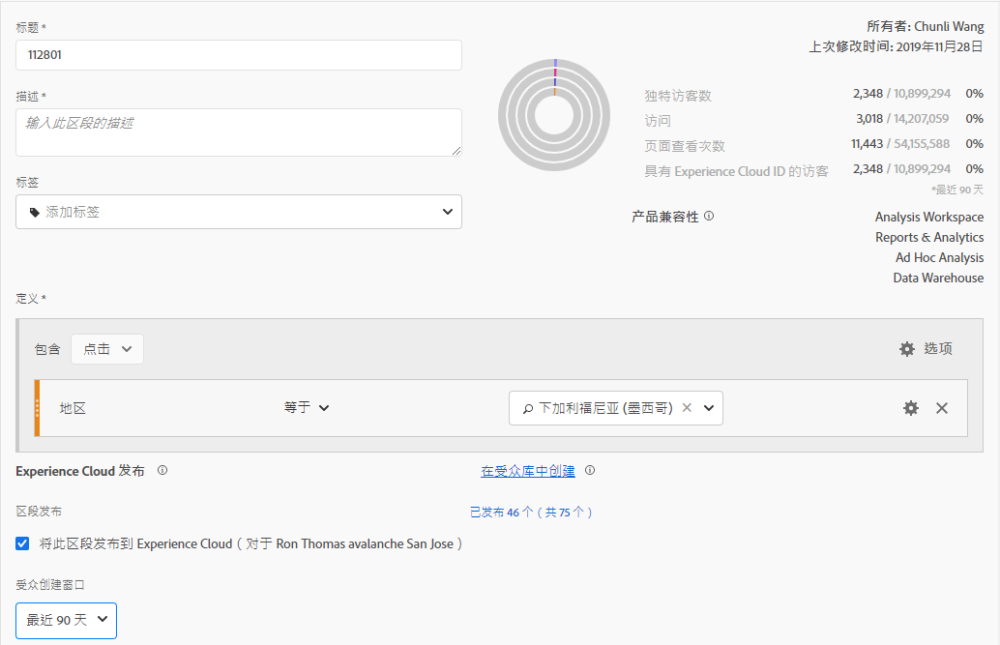
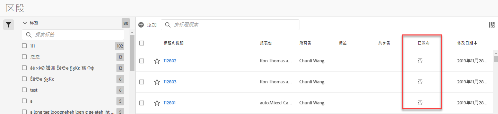

# 将区段发布到 Experience Cloud

>[!IMPORTANT]
>
>The latency improvements regarding segment publishing and the user interface that are described on this page are not rolled out to all customers yet. The current production environment is described here.

Publishing a segment to the Experience Cloud lets you use the segment for marketing activity in the [!UICONTROL Audience Library], [!DNL Target], [!DNL Audience Manager], and [!DNL Advertising Cloud]. Recent updates have significantly optimized the publishing workflow. Previously, publishing a usable segment took approximately 48 hours.

Now, processing can take up to 8 hours, but depending on other traffic and on the segment size, processing may be even faster. (However, we currently do not have a way to inform you when the segment is available, so you will have to check manually.) We have also increased the maximum number of publishable segments to 75 (from 20). You can view published segments in Components &gt; Segments.

## 先决条件

* Ensure that the report suite that you are saving this segment to is [enabled for the Experience Cloud](https://docs.adobe.com/content/help/en/core-services/interface/audiences/t-publish-audience-segment.html). Otherwise you cannot publish it to the Experience Cloud.
* Make sure you are working in a report suite that is mapped to your Experience Cloud organization.
* Ensure that your organization is using Experience Cloud IDs.
* Before you can publish segments, your Admin needs to assign the Segment Publishing permission to a product profile in the Admin Console, and add you to the product profile.

## 注意事项

* **Report Suite limits**: You can publish up to 75 segments per report suite. 此限制是强制执行的。 如果已发布75个区段，则只有在取消发布足够的区段以低于75个区段阈值时，才能发布任何其他区段。
* **Membership limits**: Audiences shared to the [!DNL Experience Cloud] from Analytics cannot exceed 20 million unique members.
* **数据隐私**:不会根据访客的身份验证状态过滤受众。 如果访客可在未验证或已验证的状态下浏览您的站点，则访客在处于未验证状态时执行的操作仍会导致访客被包含在受众中。查 [看Adobe Experience cloud隐私](https://www.adobe.com/privacy/experience-cloud.html) ，了解受众共享对隐私的全面影响。
* 有关中和中区 **段之间差异的[!DNL Adobe Analytics]讨[!DNL Audience Manager]**&#x200B;论，请 [访问](https://docs.adobe.com/content/help/en/analytics/integration/audience-analytics/audience-analytics-workflow/aam-analytics-segments.html)。

## 区段发布时间线

| 可用功能 | 当它可用时 | 可用位置 |
|---|---|---|
| 元数据（区段标题和定义） | 发布后立即 | [!DNL Audience Manager], [!UICONTROL Experience Cloud受众库], [!DNL Target] |
| 具有会员资格的可用细分 | 发布后8小时 | 中的访客资料查看器 [!DNL Audience Manager] |
| 特征和会员人数 | 24小时内 | [!DNL Audience Manager] |

## 在区段生成器中 [!UICONTROL 发布区段]

1. 导航到 **[!UICONTROL Analytics &gt; Workspace &gt;组件&gt;区段]&gt; +**
1. 在“区段生成器”中 [!UICONTROL 创建区段]。
1. 为区段提供标题和说明——否则您将无法保存它。
1. Check **[!UICONTROL Publish this segment to the Experience Cloud (for *report suite*)]**.

>[!IMPORTANT]
>
>在Analytics中查看区段预览时，请确保使用“具有Experience Cloud ID的访客”，而不是在将Adobe Analytics数字与Audience manager数字进行比较时使用总的“唯一访客”区段预览。

| 元素 | 描述 |
|---|---|
| **[!UICONTROL Publish this segment to the Experience Cloud (for *<report suite>*)]** | 启用此选项后，区段标题和定义（即广告平台中经常使用的Shell受众）会即时与Experience cloud共享，而区段成员资格则每4小时评估一次并共享一次。   例如，当该受众与某个活动关 [!DNL Target]联时，开始为符合该Experience cloud资格的 [!DNL Analytics] 访客和受众发送ID [!DNL Target] 。 At that point, the audience name and corresponding data begins displaying on the Experience Cloud Audiences page.   |
| **[!UICONTROL 受众创建窗口]** | 您选择的时间范围用于创建滚动日历的受众。 例如，“最近30天”（默认）包括从今天起的最近30天（而非从创建区段的原始日期起）内符合受众资格的访客。 |
| **[!UICONTROL 在受众库中创建]** | 您创建和发布的区段可在Experience Cloud受众库中提供，且无延迟。 它们不依赖于Analytics更新。 这些区段不计入您对75个已发布区段的限制。 |
| **[!UICONTROL 第x页（共75页）已发布]** | 显示您已发布到Experience cloud的区段数。 单击该链接可查看已发布区段及其关联的报表包和所有者的列表。 |
| **[!UICONTROL 保存]** | 保存此区段。 |

## Unpublish or delete segments

要删除已发布到 Experience Cloud 的区段，必须先取消发布该区段。要取消发布区段，只需&#x200B;**取消选中**&#x200B;用于发布该区段的复选框。

>[!NOTE]
>
>您&#x200B;**无法**&#x200B;取消发布以下任何一个 Adobe 解决方案当前正在使用的区段：[!DNL Analytics]（位于 [!DNL Audience Analytics] 中）、[!DNL Campaign]、[!DNL Advertising Cloud]（适用于 [!DNL Core Service] 和 [!DNL Audience Manager] 客户）和所有其他外部合作伙伴（适用于 [!DNL Audience Manager] 客户）。您&#x200B;**可以**&#x200B;取消发布 [!DNL Target] 正在使用的区段。

## View segment publishing status in the Segment Manager

1. Navigate to Analytics &gt; Components &gt; Segments.
1. Notice the new Published column. Yes/No refers to whether the segment has been published to the Experience Cloud or not.

## Retrieve the  UUID[!DNL Audience Manager]

There are two ways to capture the AAM UUID currently associated with the browser:

* Adobe Experience Cloud 调试器
* Native developer tool in browsers (e.g., Chrome Developer Tools)

The following screenshots show you how to retrieve the AAM UUID on your browser and use it in Audience Manager Visitor Profile Viewer to validate trait &amp; segment membership.

**Method 1: Use Adobe Experience CLoud Debugger**

1. Download and install Adobe Experience Cloud Debugger in the Chrome Web Store.
1. Launch the debugger when loading a page.
1. Scroll to the Audience Manager section and find the AAM UUID set on the current browser page
( in the example below)`50814298273775797762943354787774730612`

**Method 2: Use Chrome Developer Tools (or other browser developer tools)**

1. 在加载页面之前启动Chrome开发人员工具
1. Load the page and check Applications &gt; Cookies. AAM UUID应在第三方Demdex cookie(以下示例中的[adobe.demdex.net](https://marketing.adobe.com/resources/help/en_US/aam/demdex-calls.html) )中设置。 字段demdex是浏览器中的AAM UUID选项(`50814298273775797762943354787774730612` 在以下示例中)。

## 使用Audience Manager访客 [!UICONTROL 资料查看器]

默认情况下，在加载访客配置文件查看器时，将使 [!UICONTROL 用浏览器上的AAM] UUID。 如果验证其他用户的特征实现，请在UUID字段中输入UUID，然后单击“刷 [!UICONTROL 新”]。 有关详细 [信息，请参阅访客资料查看器](https://marketing.adobe.com/resources/help/en_US/aam/t_visitor_profile_viewer.html) 。

## 查看 [!DNL Audience Manager]

在AAM中，当Analytics与Experience cloud共享区段时，将以流式方式评估特定区段的ECID访客列表。

1. 在中， [!DNL Audience Manager]转到“受 [!UICONTROL 众数据”&gt;“特征”&gt;“分析特征”]。 您将看到每个Analytics报表包的一个文件夹，该文件夹已映射到您的Experience cloud组织。 在启动或配置Profiles和Audiences/People核心服务时，将创建这些文件夹（针对特征、区段和数据源）。
1. 选择您之前在其中创建了要共享的区段的报表包的文件夹 [!DNL Audience Manager]。 您将看到您创建的区段／受众。 当您共享区段时，会发生以下两种情况 [!DNL Audience Manager]:
* 将创建一个特征，首先没有数据。 约 在区段发布8小时后，ECID [!DNL Analytics]列表即会载入并与其他Experience cloud解决方 [!DNL Audience Manager] 案共享。

* 创建单特征段。 它使用与您发布区段的报表包关联的数据源。

## 在 [!DNL Adobe Target]

The [!UICONTROL Publish this segment to the Experience Cloud] checkbox during the segment creation process in Adobe Analytics allows the segment to be available within the Adobe Target's custom audience library. 在 Analytics 或 Audience Manager 中创建的区段可用于 Target 中的活动。例如，你可以根据 Analytics 转化量度和 Analytics 中创建的受众区段，来创建营销活动。]，单击 [!UICONTROL 受众]。
1. On the [!UICONTROL Audiences] page, locate the audience sourced from the [!DNL Experience Cloud]. These audiences are available for use in [!DNL Target] activities.

