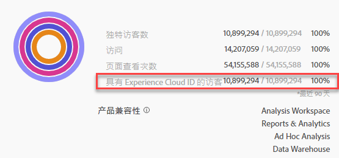

# 将区段发布到 Experience Cloud

>[!IMPORTANT]
>
>尚未针对所有客户推出本页中介绍的有关区段发布的延迟改进和相应用户界面。[此处](https://docs.adobe.com/content/help/en/core-services/interface/audiences/t-publish-audience-segment.html)介绍了当前的生产环境。

通过将区段发布到 Experience Cloud，可以将该区段用于“[!UICONTROL 受众库]”、[!DNL Target]、[!DNL Audience Manager]、[!DNL Advertising Cloud] 和 [!DNL Campaign] 中的营销活动。最近的更新显著优化了发布工作流程。以前，发布可用区段大约需要 48 小时。

现在，处理过程可能最多需要 8 小时，但是根据其他流量和区段大小，处理速度可能会更快。（不过，我们目前无法通知您区段何时可用，因此您必须手动查看。）我们还将可发布区段的最大数量从 20 个增加到 75 个。您可以在“组件”&gt;“区段”中查看已发布的区段。

> [!NOTE] Adobe Campaign（Classic 和 Standard）的行为方式不同，因为它在 8 小时延迟的基础之上会额外产生 24 小时的延迟。

## 先决条件

* 确保[已为 Experience Cloud 启用](https://docs.adobe.com/content/help/en/core-services/interface/audiences/t-publish-audience-segment.html)要保存此区段的报表包。否则，您无法将其发布到 Experience Cloud。
* 确保您使用的报表包[已映射到 Experience Cloud 组织](https://docs.adobe.com/content/help/en/core-services/interface/about-core-services/report-suite-mapping.html)。
* 确保您的组织使用的是 Experience Cloud ID。
* 在发布区段之前，您的管理员需要先在[管理控制台](https://docs.adobe.com/content/help/en/core-services/interface/manage-users-and-products/admin-getting-started.html)中向产品配置文件分配“[!UICONTROL 区段发布]”权限，并将您添加到产品配置文件中。

## 注意事项

* **报表包限制**：每个报表包最多可发布 75 个区段。此限制是强制实施的。如果已发布 75 个区段，则只有在取消发布足够数量的区段，使区段数量低于 75 个区段的阈值后，才能发布任何其他区段。
* **会员资格限制**：从 Analytics 共享到 [!DNL Experience Cloud] 的受众数量不能超过 2000 万个独特会员。
* **数据隐私**：受众并非基于访客的身份验证状态进行过滤。如果访客可在未验证或已验证的状态下浏览您的站点，则访客在处于未验证状态时执行的操作仍会导致访客被包含在受众中。请查看 [Adobe Experience Cloud 隐私](https://www.adobe.com/privacy/experience-cloud.html)，了解受众共享对隐私的全面影响。
* 有关&#x200B;**[!DNL Adobe Analytics]和[!DNL Audience Manager]中的区段之间的差异**&#x200B;的讨论，请转到[此处](https://docs.adobe.com/content/help/en/analytics/integration/audience-analytics/audience-analytics-workflow/aam-analytics-segments.html)。

## 区段发布时间轴

| 可用内容 | 可用时间 | 可用位置 |
|---|---|---|
| 元数据（区段标题和定义） | 发布后立即 | [!DNL Audience Manager]、[!UICONTROL Experience Cloud 受众库]、[!DNL Target] |
| 具有会员资格的可用区段 | 发布后约 8 小时 | [!DNL Audience Manager] 中的访客资料查看器 |
| 特性和会员人群 | 24 - 48 小时内 | [!DNL Audience Manager] |

## 在[!UICONTROL 区段生成器]中发布区段

1. 导航到 **[!UICONTROL Analytics &gt; 工作区 &gt; 组件 &gt; 区段]&gt; +**
1. 在[!UICONTROL 区段生成器]中创建区段。
1. 为区段提供标题和描述，否则，您将无法保存。
1. 选中&#x200B;**[!UICONTROL 将此区段发布到 Experience Cloud（对于&#x200B;*报表包*）]**。

>[!IMPORTANT]
>
>将 Adobe Analytics 数字与 Audience Manager 数字进行比较时，确保在 Analytics 中查看区段预览时使用“具有 Experience Cloud ID 的访客”，而不是总计“独特访客数”区段预览：
>
>

| 元素 | 描述 |
|---|---|
| **[!UICONTROL 将此区段发布到 Experience Cloud（对于&#x200B;*<report suite>*）]** | 启用此选项后，区段标题和定义（即，广告平台中经常使用的 Shell 受众）会立即与 Experience Cloud 共享，而区段会员资格则每 4 小时进行一次评估和共享。 例如，当该受众与 [!DNL Target] 中的某个活动关联时，[!DNL Analytics] 将开始发送具有 Experience Cloud 和 [!DNL Target] 受众资格的访客的 ID。此时，受众名称和相应的数据开始显示在“Experience Cloud 受众”页面中。  |
| **[!UICONTROL 受众创建窗口]** | 您选择用于在滚动日历基础上创建受众的时间范围。例如，“最近 30 天”（默认）包括从当天日期（不是最初创建区段的日期）起，最近 30 天中符合受众条件的访客。 |
| **[!UICONTROL 在受众库中创建]** | 您创建和发布的区段可在 Experience Cloud 受众库中立即提供。它们不依赖于 Analytics 更新。这些区段不会计入 75 个已发布区段的限制。 |
| **[!UICONTROL 已发布 x 个（限制为 75 个）]** | 显示您已发布到 Experience Cloud 的区段数。单击该链接可查看已发布的区段，及其关联的报表包和所有者的列表。 |
| **[!UICONTROL 保存]** | 保存此区段。 |

## 取消发布或删除区段

要删除已发布到 Experience Cloud 的区段，必须先取消发布该区段。要取消发布区段，只需&#x200B;**取消选中**&#x200B;用于发布该区段的复选框。

> [!NOTE]您&#x200B;**无法**&#x200B;取消发布以下任何一个 Adobe 解决方案当前正在使用的区段：[!DNL Analytics]（位于 [!DNL Audience Analytics] 中）、[!DNL Campaign]、[!DNL Advertising Cloud]（适用于 [!DNL Core Service] 和 [!DNL Audience Manager] 客户）和所有其他外部合作伙伴（适用于 [!DNL Audience Manager] 客户）。您&#x200B;**可以**&#x200B;取消发布 [!DNL Target] 正在使用的区段。

## 在[!UICONTROL 区段管理器]中查看区段发布状态

1. 导航到[!UICONTROL “Analytics”&gt;“组件”&gt;“区段”]。
1. 请注意新的“[!UICONTROL 已发布]”列。“是”/“否”指区段是否已发布到 Experience Cloud。

## 检索 [!DNL Audience Manager] UUID

有两种方法可捕获当前与浏览器关联的 AAM UUID：

* Adobe Experience Cloud 调试器
* 浏览器中的本机开发人员工具（例如，Chrome 开发人员工具）

以下屏幕截图显示了如何在浏览器中检索 AAM UUID，并在 Audience Manager 访客资料查看器中使用此 AAM UUID 来验证特性和区段会员资格。

**方法 1：使用 Adobe Experience Cloud 调试器**

1. 从 Chrome 网上应用店中，下载并安装 [Adobe Experience Cloud 调试器](https://docs.adobe.com/content/help/en/analytics/implementation/testing-and-validation/debugger.html)。
1. 加载页面时启动该调试器。
1. 滚动到 Audience Manager 部分，然后找到在当前浏览器页面上设置的 AAM UUID
（以下示例中为 `50814298273775797762943354787774730612`）

**方法 2：使用 Chrome 开发人员工具（或其他浏览器开发人员工具）**

1. 在加载页面之前启动 Chrome 开发人员工具
1. 加载页面，并选中“应用程序”&gt;“Cookie”。AAM UUID 应在第三方 Demdex Cookie 中进行设置（以下示例中为 [adobe.demdex.net](https://marketing.adobe.com/resources/help/en_US/aam/demdex-calls.html)）。字段“demdex”即为在浏览器中设置的 AAM UUID（以下示例中为 `50814298273775797762943354787774730612`）。

## 使用 Audience Manager [!UICONTROL 访客资料查看器]

默认情况下，在加载[!UICONTROL 访客资料查看器]时，将使用浏览器中的 AAM UUID。如果验证其他用户的特性实现，请在“UUID”字段中输入 UUID，然后单击“[!UICONTROL 刷新]”。请参阅[访客资料查看器](https://marketing.adobe.com/resources/help/en_US/aam/t_visitor_profile_viewer.html)，以了解详细信息。

## 在 [!DNL Audience Manager] 中查看区段特性

在 AAM 中，当 Analytics 与 Experience Cloud 共享区段时，将以流式方式评估给定区段的具有 ECID 的访客列表。

1. 在 [!DNL Audience Manager] 中，转到[!UICONTROL “受众数据”&gt;“特性”&gt;“Analytics 特性”]。您将看到每个 Analytics 报表包对应的文件夹，这些报表包已映射到您的 Experience Cloud 组织。在启动或置备配置文件和受众/人员核心服务时，将创建这些文件夹（针对特性、区段和数据源）。
1. 选择报表包对应的文件夹，您之前在该报表包中创建了要与 [!DNL Audience Manager] 共享的区段。您将看到所创建的区段/受众。当您共享区段时，会在 [!DNL Audience Manager] 中发生以下两种情况：
* 将创建一个特性，起初该特性中没有数据。在 [!DNL Analytics] 中发布该区段大约 8 小时后，会载入一个 ECID 列表，并将其与 [!DNL Audience Manager] 和其他 Experience Cloud 解决方案共享。

* 将创建一个区段，其中包含一个特性。该区段使用与您在其中发布该区段的报表包关联的数据源。

## 在 [!DNL Adobe Target] 中查看区段

在 Adobe Analytics 中创建区段的过程中显示的“[!UICONTROL 将此区段发布到 Experience Cloud]”复选框，可使该区段在 Adobe Target 的自定义受众库中提供。在 Analytics 或 Audience Manager 中创建的区段可用于 Target 中的活动。例如，您可以根据 Analytics 转化量度和 Analytics 中创建的受众区段，来创建营销活动。单击“[!UICONTROL 受众]”。
1. 在“[!UICONTROL 受众]”页面上，找到来源于 [!DNL Experience Cloud] 的受众。这些受众可在 [!DNL Target] 活动中使用。

