# 生成顺序区段

顺序区段使用 THEN 运算符（而非 AND 或 OR）创建。THEN 意味着出现一个区段标准后，接着出现另一个区段标准。默认情况下，顺序区段会标识所有匹配数据，并显示过滤器“包含每个人”。可以使用“仅在序列前”和“仅在序列后”选项将顺序区段进一步过滤为匹配点击的子集。

此外，您还可以使用[After 和 Within 运算符](../../../components/c-segmentation/c-segmentation-workflow/seg-sequential-build.md#concept_07708877D06742998C6237DD9FD194EA)将顺序区段限制为检查点之间的特定持续时间、粒度和计数。

## 包含每个人 {#section_75ADDD5D41F04800A09E592BB2940B35}

在创建一个设置了“包含每个人”的区段时，该区段能够识别匹配整个给定模式的路径。这是一个基本的序列区段示例，用于查找同一访客访问的一个点击（页面 A）及下一个点击（页面 B）。将区段设置为“包含每个人”。

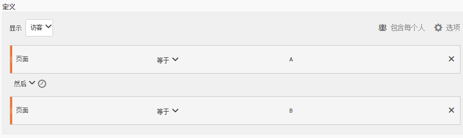

| 如果结果…… | 序列 |
|--- |--- |
| 匹配 | A，然 后BA（在另一次访问中） BA，然后D，然后B |
| 不匹配 | B -&gt; A |

## “仅在序列前”和“仅在序列后” {#section_736E255C8CFF43C2A2CAAA6D312ED574}

**[!UICONTROL 仅在序列前]**&#x200B;和&#x200B;**仅在序列后[!UICONTROL 选项可将区段过滤为指定序列之前或之后的数据子集。]**

* **仅在序列前**：包含序列之前的所有点击 + 该序列自身的第一次点击（见示例 1、3）。如果序列在路径中出现多次，则“仅在序列前”包括该序列最后一个实例的第一次点击和之前的所有点击（见示例 2）。
* **仅在序列后**：包含序列之后的所有点击 + 该序列自身的最后一次点击（见示例 1、3）。如果序列在路径中出现多次，则“仅在序列后”包括该序列首个实例的最后一次点击和之后的所有点击（见示例 2）。

以 B -&gt; D 序列为例。三种过滤器将按以下方式确定点击量：

**示例 1：B -&gt; D 出现一次**

| 示例 | A | B | C | D | E | F |
|---|---|---|---|---|---|---|
| 包含每个人 | A | B | C | D | E | F |
| 仅在序列前 | A | B |  |  |  |  |
| 仅在序列后 |  |  |  | D | E | F |

**示例 2：B -&gt; D 出现多次**

| 示例 | A | B | C | D | B | C | D | E |
|---|---|---|---|---|---|---|---|---|
| 包含每个人 | A | B | C | D | B | C | D | E |
| 仅在序列前 | A | B | C | D | B |  |  |  |
| 仅在序列后 |  |  |  | D | B | C | D | E |

我们还可以使用“点击深度”维度来描述这个概念。

**示例 3：点击深度 3 -&gt; 5**

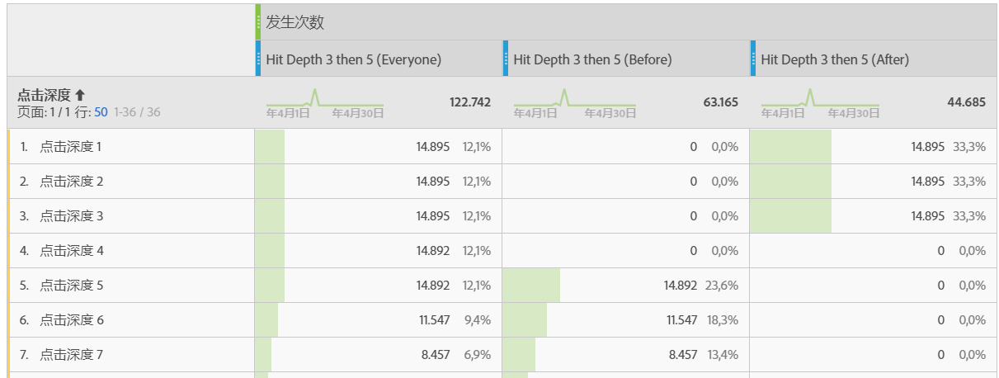

## 维度约束 {#section_EAFD755F8E674F32BCE9B642F7F909DB}

在“THEN”语句之间的“within”子句中，您可以添加“在 1 个搜索关键字实例之内”、“在 1 个 eVar 47 实例之内”。此条件可将区段限制在维度的一个实例之内。

在规则之间设置“在维度之内”子句，能够使区段将数据限制为满足此子句的序列。请参见以下示例，其中约束条件被设置为“在 1 个页面之内”：

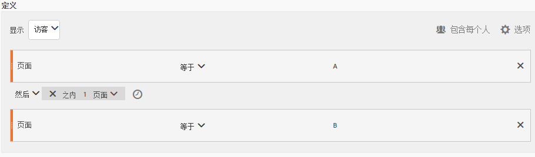

| 如果结果…… | 序列 |
|--- |--- |
| 匹配 | A -&gt; B |
| 不匹配 |   A, C, B（因为B不在A的1页内）注&#x200B;****&#x200B;意： 如果取消维限制，“A then B”和“A then C then B”将匹配。 |

## 简单的页面查看序列

确定查看某个页面并随后查看另一个页面的访客。点击级别数据将过滤该序列，但不考虑之前、过去或中间的访问会话或它们之间的时间或页面查看次数。

**示例**:访客查看了页面A，然后在同一次或另一次访问中查看了页面B。

**用例**

以下是如何使用该区段的示例：

1. 体育站点的访客查看足球登录页面，然后按顺序（但不必在同一次访问中）查看篮球登录页面。这提示促销活动在足球赛季期间向足球观众推送篮球内容。
1. 汽车经销商确定登录客户忠诚度页面，然后在该次访问或另一次访问期间的任何时候转到视频页面的访客之间的关系。

**创建此区段**

在顶级[!UICONTROL 访客]容器中嵌套两个页面规则，然后使用 [!UICONTROL THEN] 运算符序列化页面点击。

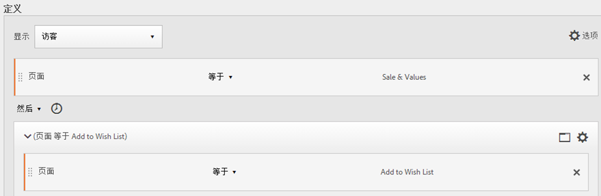

## 跨访问的访客序列

确定退出促销活动但随后在另一个会话中返回页面查看序列的访客。

**示例**:访客在一次访问中查看了页面A，然后在另一次访问中查看了页面B。

**用例**

以下是如何使用这种类型区段的示例：

* 访客先访问新闻站点的“体育”页面，然后在另一个会话中再次访问“体育”页面。
* 服装零售商可以查看访客先在一个会话内访问登录页面，然后在另一个会话中直接进入支付页面之间的关系。

**创建此区段**

此示例将两个&#x200B;**[!UICONTROL 访问]**&#x200B;容器嵌套至顶级&#x200B;**[!UICONTROL 访客]容器，并使用[!UICONTROL THEN]运算符对区段进行排序。**

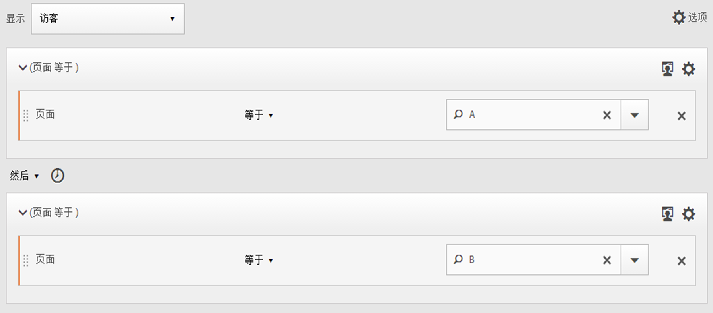

## 混合级序列

识别在次数不定的访问中查看两个页面，然后在单独的访问中查看第三个页面的访客。

**示例**:访客在一次或多次访问中依次访问页面A和页面B，然后在单独访问中访问页面C。

**用例**

以下是如何使用这种类型区段的示例：

* 访客首先访问新闻站点，然后在同一次访问中查看体育页面。在另一次访问中，访客访问天气页面。
* 经销商确定进入主页，然后转到“我的帐户”页面，并在另一次访问中访问“查看购物车”页面的访客。

**创建此区段**

1. 从左侧窗格中拖动两个页面维度到顶级[!UICONTROL 访客]容器中。
1. 在两个维度之间添加 THEN 运算符。
1. Click **[!UICONTROL Options]** &gt; **[!UICONTROL Add container]** and add a [!UICONTROL Visit] container underneath the [!UICONTROL Visitor] level and sequenced using the [!UICONTROL THEN] operator.

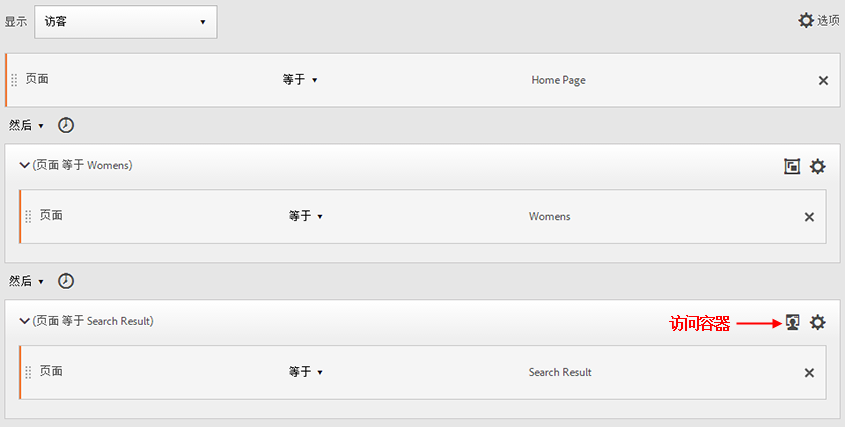

## 聚合容器

通过在[!UICONTROL 访客]容器中添加多个[!UICONTROL 点击]容器，您可以在相同类型的容器之间使用相应的运算符，使用规则和维度（如页数和访问次数）定义页面查看以及在[!UICONTROL 点击]容器中提供序列维度。通过在点击级别应用逻辑，您可以在[!UICONTROL 访客]容器中的相同点击级别限制和合并匹配项，从而生成各种不同类型的区段。

**示例**：在页面查看序列中的第一次点击（示例中的页面 D）后，访客访问页面 A，然后访问页面 B 或页面 C，而与访问次数无关。

**用例**

以下是如何使用这种类型区段的示例：

* 确定在一次访问中转到主登录页面，然后在另一次访问中查看男士服装页面，接着在其他访问中查看女士或儿童服装登录页面的访客。
* e-zine 捕获在一次访问中转到主页，在另一次访问中查看体育页面，在其他访问中查看意见页面的访客。

**创建此区段**

1. 选择[!UICONTROL 访客]容器作为顶级容器。
1. 添加两个[!UICONTROL 点击]级别容器，这是一个使用 [!UICONTROL AND] 和 [!UICONTROL OR] 运算符在相同[!UICONTROL 点击]级别联接相应数值维度的维度。
1. 在[!UICONTROL 访问]容器中，再添加一个[!UICONTROL 点击]容器，并嵌套两个使用 [!UICONTROL OR] 或 [!UICONTROL AND] 运算符联接的其他[!UICONTROL 点击]容器。

   使用 [!UICONTROL THEN] 运算符排列这些嵌套的[!UICONTROL 点击]容器。

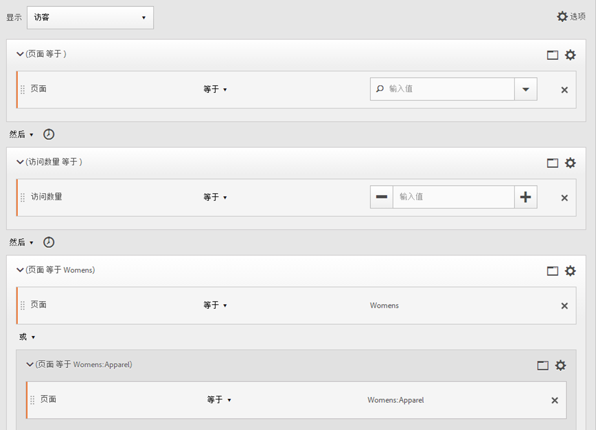

## 顺序区段中的“嵌套”

通过在[!UICONTROL 访问]和[!UICONTROL 点击]级别放置检查点，您可以限制区段以满足特定访问以及特定点击中的要求。

**示例**:访客访问了页面A，然后在同一访问中访问了页面B。 接下来，访客在新的访问中访问页面 C。

**创建此区段**

1. 在顶级[!UICONTROL 访问]容器下，拖入两个页面维度。
1. Multi-select both rules, click **[!UICONTROL Options]** &gt; **[!UICONTROL Add container from selection]** and change it to a [!UICONTROL Visit] container.
1. 使用 [!UICONTROL THEN] 运算符将二者联接起来。
1. 创建一个点击容器作为[!UICONTROL 访问]容器的对等容器并拖入一个页面维度。
1. 使用另一个 [!UICONTROL THEN] 运算符，将[!UICONTROL 访问]容器中的嵌套序列与[!UICONTROL 点击]容器联接在一起。

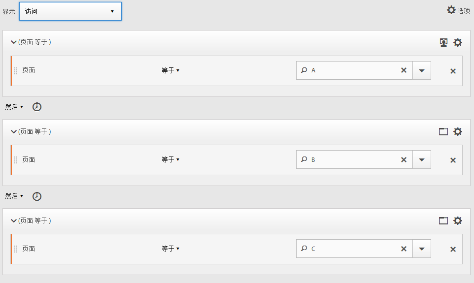

## 排除点击

区段规则包括所有数据，除非您明确使用[!UICONTROL 排除]规则排除[!UICONTROL 访客]、[!UICONTROL 访问]或[!UICONTROL 点击]数据。这样，您就可以排除一般数据，创建更具目标性的区段。或者，您可以在创建区段时排除找到的组，以确定其余数据集，例如，创建一个规则以包括成功下订单的访客，然后将他们排除以确定非顾客。不过，在大多数情况下，最好创建规则以[!UICONTROL 排除]大多数的值，而不是尝试使用排除规则排除特定的包含值。

例如：

* **排除页面**。使用区段规则从报表中排除特定页面（如 *`Home Page`*) from a report, create a Hit rule where the page equals "Home Page," and then exclude it. 此规则自动包括 Home Page 以外的所有值。
* **排除反向链接域**。使用仅包括 Google.com 中的反向链接域并排除所有其他域的规则。
* **确定非顾客**。确定订单大于零的[!UICONTROL 访客]，然后将其排除。

可以使用 [!UICONTROL Exclude] 运算符确定访客没有执行特定访问或点击的序列。[!UICONTROL 排除检查点]也可以包含在 [逻辑组](../../../components/c-segmentation/c-segmentation-workflow/seg-sequential-build.md#concept_23CE0E6071E14E51B494CD21A9799112).

### 在检查点之间排除

执行逻辑以细分符合以下条件的访客：某个检查点没有明确出现在两个其他检查点之间。

**示例**:访问页面A，然后访问页面C的访客，但未访问页面B。

**用例**

以下是如何使用这种类型区段的示例：

* 访客访问“日常生活”页面，然后访问“剧院”部分，但未访问“艺术”页面。
* 汽车零售商可以看到那些先访问主登录页面，然后不访问“汽车”页面而直接进入“免付利息”促销活动的访客之间的关系。

**创建此区段**

像创建简单、混合级别或嵌套顺序段一样创建段，然后为容器元素设置 [!UICONTROL EXCLUDE] 运算符。 下面的示例是一个聚合区段，其中将三个[!UICONTROL 点击]容器拖到画布中，分配 [!UICONTROL THEN] 运算符以联接容器逻辑，然后排除中间的页面查看容器以仅包含从序列中的页面 A 访问页面 C 的访客。

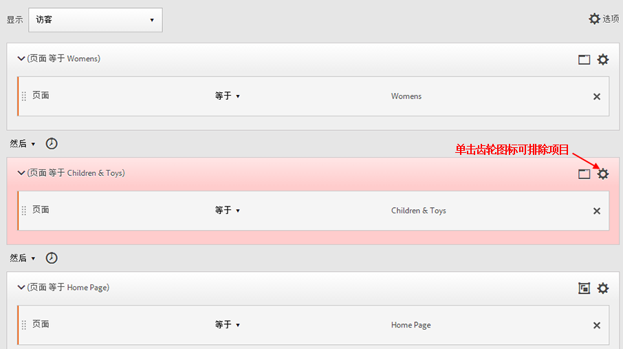

### 在序列开头排除

如果排除检查点位于顺序区段开头，则它确保排除的页面查看不会位于第一个非排除的点击前面。

**示例**:访客访问了页面A，而非页面B。

**用例**

以下是如何使用此类型区段的示例用例：

* 访客访问页面 A，没有访问页面 B。
* 餐馆想要查看避开主登录页面，直接转到 Order Out 页面的铁杆用户。

**创建此区段**

在顶级“访客”容器中创建两个单独的“点击”容器。然后，为第一个容器设置 [!UICONTROL EXCLUDE] 运算符。

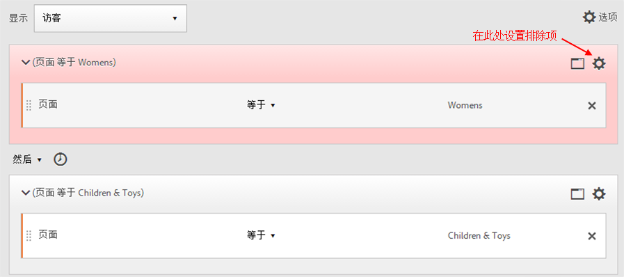

### 在序列末尾排除

如果排除检查点位于序列末尾，则它确保在上一非排除的检查点和访客序列结束之间不会出现检查点。

**示例**:访客访问页面A，但在当前或随后的访问中不访问页面B。

**用例**

以下是如何使用这种类型区段的示例：

* 访客访问页面 A，没有访问页面 B。
* 餐馆想要查看避开主登录页面，直接转到 Order Out 页面的铁杆用户。

**创建此区段**

Build a simple sequence segment by dragging two [!UICONTROL Hit] containers to the canvas and connecting them using the [!UICONTROL THEN] operator. 接下来，将 [!UICONTROL EXCLUDE] 运算符分配给序列中的第二个[!UICONTROL 点击]容器。

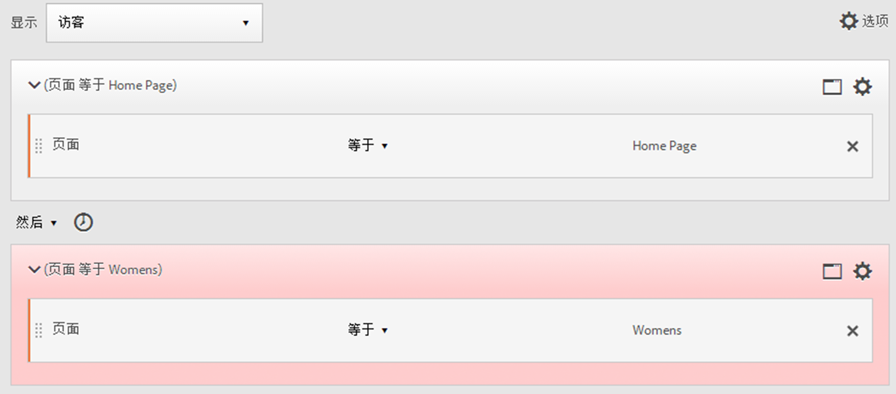

## 逻辑组容器

逻辑组容器需要将条件分组到单个顺序段检查点中。 特殊逻辑组容器仅在顺序分段中可用，以确保其条件在任何先前顺序检查点之后和任何后续顺序检查点之前得到满足。 逻辑组检查点本身内的条件可以按任意顺序满足。 相反，非顺序容器（点击、访问、访客）不要求在整个序列中满足其条件，如果与THEN运算符一起使用，则会产生不直观的结果。
逻辑 [!UICONTROL 组容器设计为将多个检查点] 视为一个组 *，而*&#x200B;不在分组检查点之间进行任何排序 ** 。 换句话说，我们并不关心该组内检查点的顺序。 例如，无法在[!UICONTROL 访客]容器中嵌套[!UICONTROL 访客]容器。But instead, you can nest a [!UICONTROL Logic Group] container within a [!UICONTROL Visitor] container with specific [!UICONTROL Visit]-level and [!UICONTROL Hit]-level checkpoints.

>[!NOTE]
>
>A [!UICONTROL Logic Group] can only be defined in a sequential segment, meaning that the [!UICONTROL THEN] operator is used within the expression.

| 容器层次结构 | 插图 | 定义 |
|---|---|---|
| 标准容器层次结构 |  | 在[!UICONTROL 访客]容器中，按顺序嵌套[!UICONTROL 访问]和[!UICONTROL 点击]容器，以便根据点击数、访问次数和访客提取区段。 |
| 逻辑容器层次结构 | 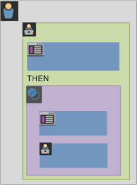 | 在[!UICONTROL 逻辑组]容器外部，也需要使用标准容器层次结构。但在[!UICONTROL 逻辑组]容器内，检查点不需要采用设置的顺序或层次结构；采用任意顺序的访客都可以满足这些检查点的要求。 |

逻辑组可能看起来令人望而却步——以下是一些关于如何使用逻辑组的最佳实践：

**逻辑组或点击／访问容器？**
如果要对顺序检查点进行分组，则“容器”是逻辑组。 但是，如果这些连续检查点必须出现在单个点击或访问范围内，则需要“点击”或“访问”容器。 （当然，“点击”对于一组连续检查点来说没有意义，当一个点击可能只计入一个检查点时）。

**逻辑组是否简化了顺序细分的构建？**
是的，他们可以。 假设您正在尝试回答这个问题：访 **客是否在页面A后看到页面B、C或页面D?**

您无需Logic Group容器即可构建此区段，但它既复杂又费力：
* `Visitor Container [Page A THEN Page B THEN Page C THEN Page D] or`
* `Visitor Container [Page A THEN Page B THEN Page D THEN Page C] or`
* `Visitor Container [Page A THEN Page C THEN Page B THEN Page D] or`
* `Visitor Container [Page A THEN Page C THEN Page D THEN Page B] or`
* `Visitor Container [Page A THEN Page D THEN Page B THEN Page C] or`
* `Visitor Container [Page A THEN Page D THEN Page C THEN Page B]`

逻辑组容器大大简化了构建此区段的过程，如下所示：

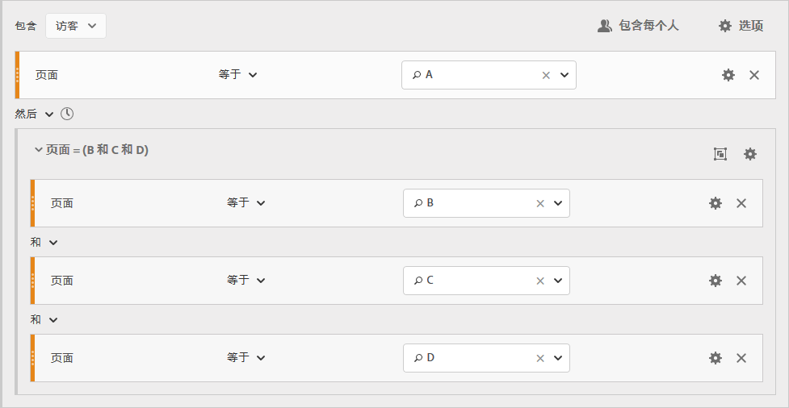

### Build a Logic Group segment {#section_A5DDC96E72194668AA91BBD89E575D2E}

与其他容器一样， [!UICONTROL 逻辑组容器可以在区段生成器中以多种方] 式构建 。 下面是嵌套[!UICONTROL 逻辑组]容器的首选方法：

1. 从左侧窗格拖动维度、事件或区段。
1. 将顶部容器更改为[!UICONTROL 访客]容器。
1. 将默认插入的 [!UICONTROL AND] 或 [!UICONTROL OR] 运算符更改为 THEN 运算符。
1. Select the [!UICONTROL Hit] containers (the Dimension, Event, or Item) and click **[!UICONTROL Options]** &gt; **[!UICONTROL Add container from selection]**.
1. Click the container icon and select **[!UICONTROL Logic Group]**.  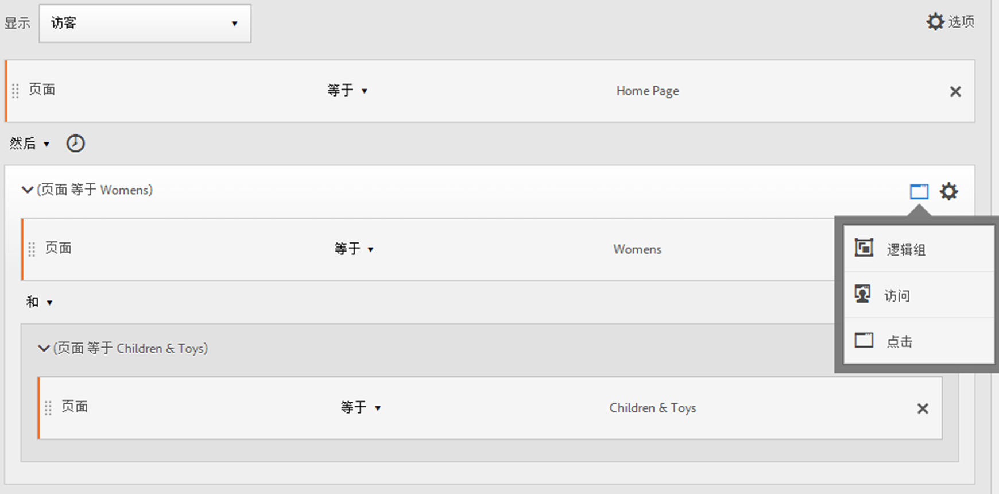
1. 现在，您可以在[!UICONTROL 逻辑组]容器中设置[!UICONTROL 点击]，而与层次结构无关。

### 任意顺序的逻辑组检查点

通过使用[!UICONTROL 逻辑组]，您可以满足该组中不在序列范围内的条件。这样，您就可以生成一些区段，其中的[!UICONTROL 访问]或[!UICONTROL 点击]容器不采用正常的层次结构。

**示例**:访问页面A，然后按任意顺序访问页面B和页面C的访客。

**创建此区段**

将页面 B 和 C 嵌套到外部[!UICONTROL 访客]容器的[!UICONTROL 逻辑组]容器中。页面 A 的[!UICONTROL 点击]容器后跟[!UICONTROL 逻辑组]容器，并使用 [!UICONTROL AND] 运算符指定页面 B 和 C。Because it is in the [!UICONTROL Logic Group], the sequence is not defined and hitting both page B and C in any order makes the argument true.

**另一个示例**:访问页面B或页面C，然后访问页面A的访客：

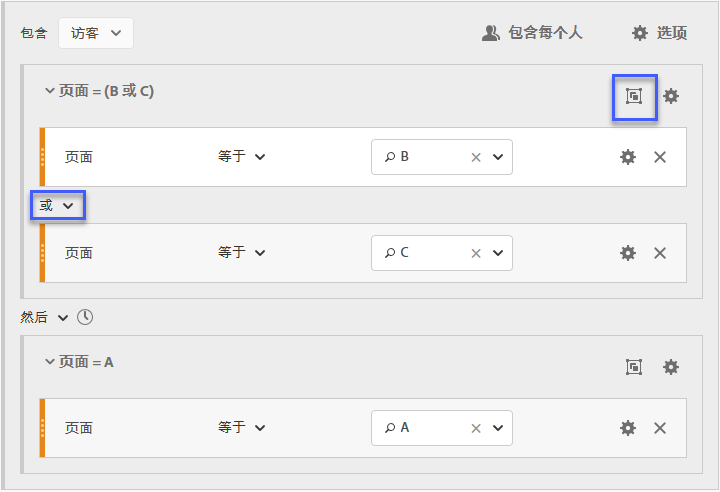

区段必须至少匹配逻辑组的一个检查点（B或C）。 同时，逻辑组条件可在同一点击中或在多个点击中得到满足&#x200B;。

### 逻辑组首次匹配

通过使用[!UICONTROL 逻辑组]，您可以满足该组中不在序列范围内的条件。在该无序的第一个匹配区段中，先将[!UICONTROL 逻辑组]规则指定为页面 B 或页面 C 的页面查看，然后指定为页面 A 的所需查看。

**示例**:访问过页面B或页面C的访客，然后访问了页面A。

**创建此区段**

在[!UICONTROL 逻辑组]容器中放入页面 B 和页面 C 维度并选择 [!UICONTROL OR] 运算符，然后[!UICONTROL 点击]容器将页面 A 的页面查看识别为该值。

### 逻辑组排除AND

Build segments using the [!UICONTROL Logic Group] where multiple page views are aggregated to define what pages were necessary to be hit while other pages were specifically missed. ****

**示例**:访客访问了页面A，然后明确不访问页面B或C，而是点击页面D。

**创建此区段**

从左窗格中拖动维度、事件和预生成的区段以生成该区段。See [Building a Logic Group Segment](../../../components/c-segmentation/c-segmentation-workflow/seg-sequential-build.md#concept_23CE0E6071E14E51B494CD21A9799112).

在[!UICONTROL 逻辑组]中嵌套这些值后，单击&#x200B;**[!UICONTROL 逻辑组]容器中的“排除”**按钮。

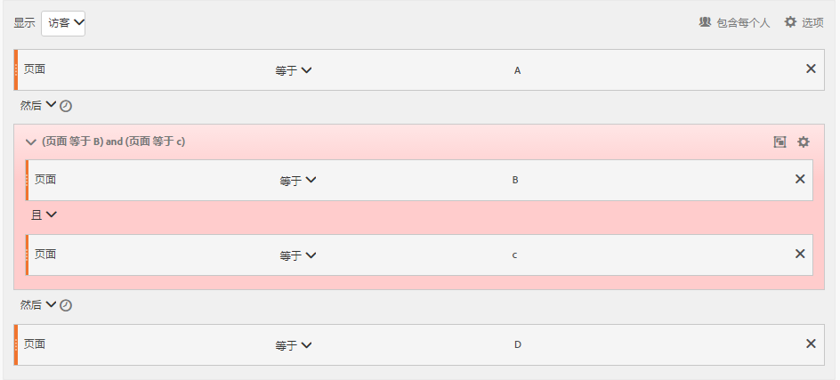

### 逻辑组排除OR

使用[!UICONTROL 逻辑组]生成区段，其中聚合多个页面查看以定义需要点击的页面，同时明确跳过其他页面。

**示例**:访问了页面A但未在页面A之前访问页面B或页面C的访客。

**创建此区段**

在排除的[!UICONTROL 逻辑组]容器中指定初始页面 B 和 C，然后访客点击页面 A。

从左窗格中拖动维度、事件和预生成的区段以生成该区段。

在[!UICONTROL 逻辑组]中嵌套这些值后，单击&#x200B;**[!UICONTROL 逻辑组]容器中的“排除”**按钮。

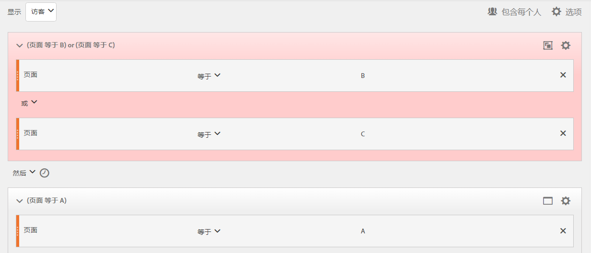

## 构建时间内和时间后细分

可以使用每个容器标题中内置的 [!UICONTROL Within] 和 [!UICONTROL After] 运算符定义时间、事件和计数。

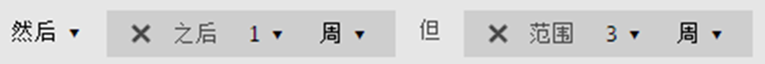

您可以使用 [!UICONTROL Within] 和 [!UICONTROL After] 容器并指定粒度和计数，以将匹配限制为指定的持续时间。[!UICONTROL Within] 运算符用于指定两个检查点之间的时间长度的最大限制。[!UICONTROL After] 运算符用于指定两个检查点之间的时间长度的最小限制。

### After 和 Within 运算符 {#section_CCAF5E44719447CFA7DF8DA4192DA6F8}

持续时间是由表示粒度的单个大写字母以及后面表示粒度重复次数的数字指定的。

**[!UICONTROL Within]** 包括终结点（小于或等于）。

**[!UICONTROL After]** 不包括终结点（大于）。

| 运算符 | 描述 |
|--- |--- |
| AFTER | After 运算符用于指定两个检查点之间的时间长度的最小限制。在设置 After 值后，时间限制将从应用区段时算起。例如，如果在容器上设置After运算符以标识访问页面A但直到一天后才返回访问页面B的访客，那么该日将在访客离开页面A时开始。 对于要包含在区段中的访客，离开页面A至查看页面B后，必须至少传输1440分钟（一天）。 |
| WITHIN | Within 运算符用于指定两个检查点之间的时间长度的最大限制。例如，如果在容器上设置Within运算符以标识访问页面A的访客，然后在一天内返回访问页面B，那么当访客离开页面A时，该日将开始。要包含在区段中，访客在打开页面B前最长将有一天的时间。  对于要包含在区段中的访客，在将页面A离开到查看页面B后，最多必须在1440分钟（一天）内对页面B进行访问。 |
| AFTER/WITHIN | 在使用 After 和 Within 运算符时，一定要了解这两个运算符是并行开始和结束的，而不是按顺序开始和结束的。For example, if you build a segment with the container set to: `After = 1 Week(s) and Within = 2 Week(s)` Then the conditions to identify visitors in the segment are met only between 1 and 2 weeks. 这两个条件是从第一次页面点击时开始执行的。 |

### 使用After运算符

* 通过使用 Time After，您可以按年、月、日、小时和分钟跟踪以匹配访问。
* Time After 只能应用于[!UICONTROL 点击]容器，因为它是定义这种细粒度的唯一级别。

**示例**:访问页面A的访客在2周后才访问页面B。****

**创建区段**:此区段是通过添加一个包含两个 [!UICONTROL 点击容] 器的访客 [!UICONTROL 容器] 。 然后，您可以设置 [!UICONTROL THEN] 运算符，打开 [!UICONTROL AFTER] 运算符下拉列表并设置星期数。

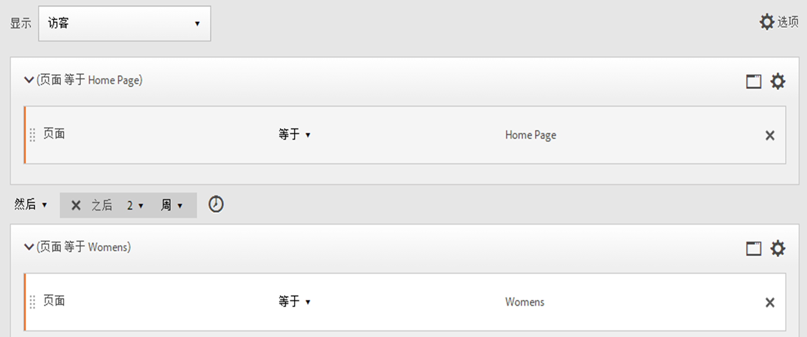

**匹配**

在指定“After 2 weeks”时，如果在 2019 年 6 月 1 日 00:01 点击了页面 A，只要随后在 2019 年 6 月 15 日 00:01（14 天后）之前点击页面 B，该点击就匹配。

| 点击 A | 点击 B | 匹配 |
|--- |--- |--- |
| **A** 点击：2019 年 6 月 1 日，00:01 | **B** 点击：2019 年 6 月 15 日，00:01 | **** 匹配：此时间限制匹配，因为它是2019年6月1日之后（两周）。 |
| **A** 点击：2019 年 6 月 1 日，00:01 | **B点** :2019年6月8日B点击：2019年6月15日00时01分 | **** 不匹配：页面B的第一次点击不匹配，因为它与约束冲突，要求在两周后点击。 |

### 使用Within运算符

* 通过使用 [!UICONTROL Within]，您可以按年、月、日、小时和分钟跟踪以匹配访问。
* [!UICONTROL Within] 只能应用于[!UICONTROL 点击]容器，因为它是定义这种细粒度的唯一级别。

>[!IMPORTANT]
>
>在“THEN”语句之间的“within”子句中，您可以添加“在 1 个搜索关键字实例之内”、“在 1 个 eVar 47 实例之内”。此条件可将区段限制在维度的一个实例之内。

**示例**:访问页面A的访客在5分钟内访问了页面B。

**创建区段**:此区段是通过添加一个访客容 [!UICONTROL 器] ，然后使用两个点击容 [!UICONTROL 器拖动] 。 随后您可以设置 [!UICONTROL THEN] 运算符，并打开 [!UICONTROL AFTER] 运算符下拉列表，然后设置间隔：点击、页面查看、访问、分钟、小时、天、周、月、季度或年。

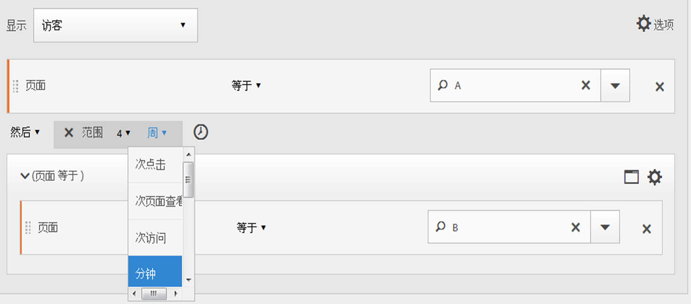

**匹配**

匹配项必须位于时间限制内。对于   表达式，如果访客在 00:01 点击页面 A，只要随后在 00:06（5 分钟后，含 5 分钟）或之前点击页面 B，该点击就匹配。整 5 分钟的点击也匹配。

### Within和After运算符

可以使用 [!UICONTROL Within] 和 [!UICONTROL After] 在区段两端提供最大和最小端点。

**示例**:访问页面A的访客在2周后但在1个月内访问了页面B。

**创建区段**:通过对访客容器内的两个 [!UICONTROL 点击容] ，创建 [!UICONTROL 区段] 。 然后设置 [!UICONTROL After] 和 [!UICONTROL Within] 运算符。

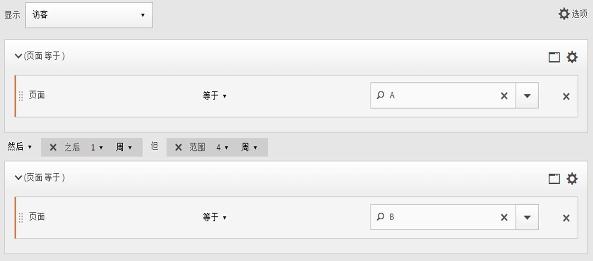

**匹配**

在 2019 年 6 月 1 日点击页面 A 并在 2019 年 6 月 15 日 00:01 之后但在 2019 年 7 月 1 日&#x200B;*之前*&#x200B;返回的任何访客将包含在该区段中。与[排除项之间的时间](../../../components/c-segmentation/c-segmentation-workflow/seg-sequential-build.md#concept_C5CB0A391B7C4AC8A95B9724A14E28E8)进行比较。

可以将 [!UICONTROL After] 和 [!UICONTROL Within] 运算符一起使用以定义顺序区段。

该示例说明在两周后但在一个月内第二次访问以点击页面 B 的情况。
