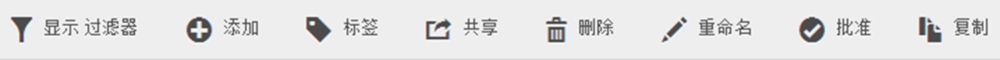
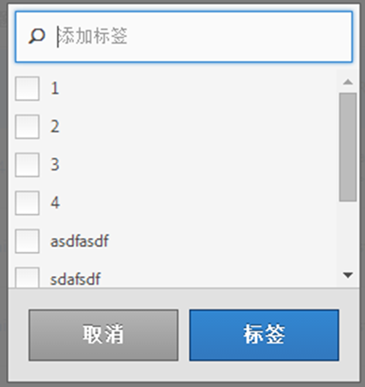

# 标记区段

在“区段管理器”中，您可以通过标记区段来组织区段。

所有用户均可为区段创建标记，并将一个或多个标记应用于区段。但是，您只能查看您所拥有的或与您共享的那些区段的标记。应创建哪种类型的标记？以下是对实用标记的一些建议：

* 基于&#x200B;**团队名称**&#x200B;的标记，如社交营销、移动营销。
* **项目**&#x200B;标记（分析标记），如登录页面分析。
* **类别**&#x200B;标记：男士；地理位置。
* **工作流程**&#x200B;标记：待批准；策划（为特定的业务部门）

1. 在区段管理器中，选中要进行标记的区段旁边的复选框。将显示区段管理工具栏：

   

1. 单击&#x200B;**[!UICONTROL 标记]并执行以下操作之一**

   * 从现有标记中进行选择，或者
   * add a new tag and press **[!UICONTROL Enter]**.

      

1. 再次单击“**[!UICONTROL 标记]”以标记区段。**

标记现在应会显示在“标记”列中。（单击右上方的齿轮图标可管理您的列。）

You can also filter on tags by going to **[!UICONTROL Filters]** &gt; **[!UICONTROL Tags]**.
