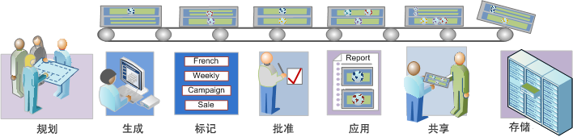

# 分段工作流程概述

描述了使用区段生成器创建并通过区段管理器管理的区段的建议工作流程。

## Segmentation workflow overview {#concept_6D2E1A72A3AD4EBBB9135094F2D9DEDF}

描述了使用区段生成器创建并通过区段管理器管理的区段的建议工作流程。

<!-- 

seg_workflow.xml

 -->

[ 计划细分](../../../components/c-segmentation/c-segmentation-workflow/seg-plan.md#concept_D8BE6AB8D8E540E58C3462F9E02F4847)

在生成区段和设置区段管理环境之前，是否提出了所有该问的问题？设计的区段是否符合其预期目标和拥有明确的用途？

请参阅区段规划检查表以获取关于规划和组织区段的帮助。

 [生成区段](../../../components/c-segmentation/c-segmentation-workflow/seg-build.md#concept_BD4C17B01C5B4E378D0C14C852D055D4)

生成和编辑区段以便在所有 Analytics 功能中使用。

请参阅[为如何使用THEN运算符构建区段构建顺序区段](../../../components/c-segmentation/c-segmentation-workflow/seg-sequential-build.md#concept_83AEC78CD25F442EBEE364856A889560) 。

[ 标记区段](../../../components/c-segmentation/c-segmentation-workflow/seg-tag.md#concept_CD892CEB326C4986A1B67487052DBA50)

标记区段以便于组织和共享。标记替代了 Ad Hoc Analysis 中的文件夹层次结构。请参阅如何规划和分配标记以进行简单和高级搜索和组织。

[ 批准区段](../../../components/c-segmentation/c-segmentation-workflow/seg-approve.md#concept_DF477F151A9E483A92ED1DDAAF035953)

批准区段作为规范区段。

[ 应用区段](../../../components/c-segmentation/c-segmentation-workflow/t-seg-apply.md#task_13E69C7D428A43EF9CCCA7F1104F1E8F)

您可以在报表中直接从区段边栏（“显示区段”）应用区段。

 [ 共享区段](../../../components/c-segmentation/c-segmentation-workflow/t-seg-share.md#task_7DC54643083E42C28F918E4F0845C5A5)

将您的区段与其他 Analytics 工具中的目标受众共享，以及共享到 Adobe Target 和 Adobe Marketing Cloud。

[ 过滤器区段](../../../components/c-segmentation/c-segmentation-workflow/t-seg-filter.md#task_B59946C6D38945629C1FEACF80A85746)

按照标记、所有者和其他过滤器（全部显示、我的、已与我共享、收藏和已批准）进行过滤。

[ 将区段标记为收藏夹](../../../components/c-segmentation/c-segmentation-workflow/t-seg-favorite.md#task_F45DFA3FBF0C4082B46A0D032CB20FC5)

将区段标记为收藏是另一种组织区段以便于使用的方式。

[管理区段](../../../components/c-segmentation/c-segmentation-workflow/seg-manage.md#concept_7A2E019317864065B7C641DC3315928F)

区段管理器提供了许多种管理区段的方式，如共享、过滤、标记、批准、复制、删除和标记为收藏。