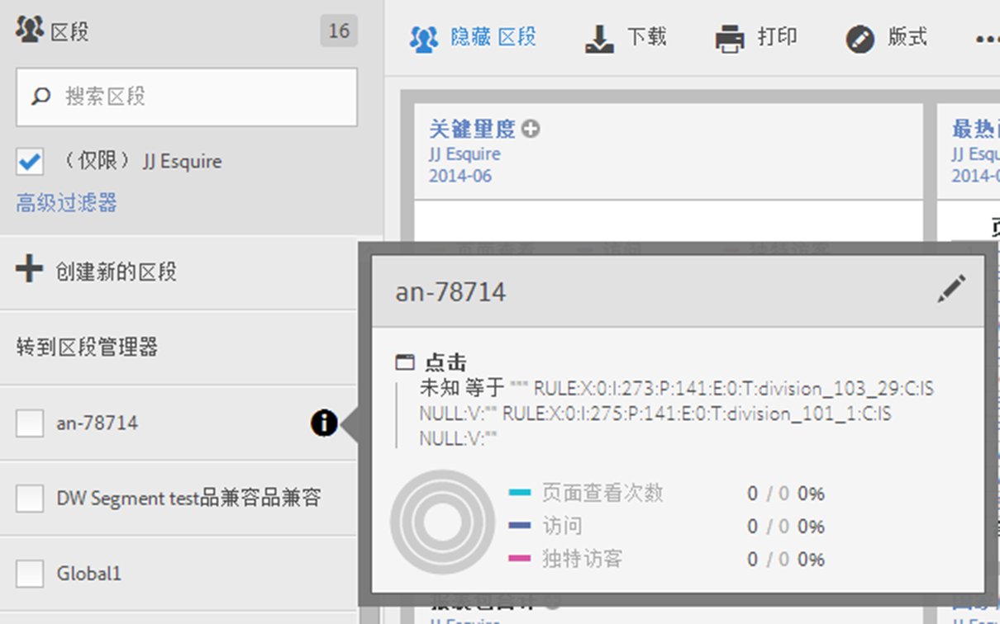
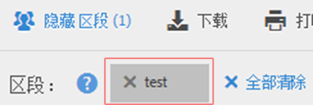

# 选择并应用区段

如何从区段边栏将一个或多个区段应用于报表。

1. 显示要应用区段的报表，例如[!UICONTROL 页面报表]。
1. Click **[!UICONTROL Show Segments]** above the report. 将打开区段边栏。

   

1. Mark the checkbox next to one or more of the segments or **[!UICONTROL Search Segments]** to find the right segment.

   >[!NOTE]
   >
   >您可以对报表应用多个区段(这称为区段堆栈)。在应用多个区段时，每个区段中的条件将使用“and”运算符组合在一起，然后再加以应用。可堆叠的区段数量没有任何限制。

   >[!NOTE]
   >
   >单击区段名称旁边的“信息”图标(i)可预览关键指标，以查看您是否具有有效区段以及区段的范围。

1. You can filter by report suite by selecting the **[!UICONTROL (Only)`<report suite name>`]** check box. 这将仅显示该报表包中最后保存的区段。
1. Click **[!UICONTROL Apply Segment]** and the report will refresh. 应用的区段现在将显示在报表顶部：

   
