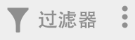
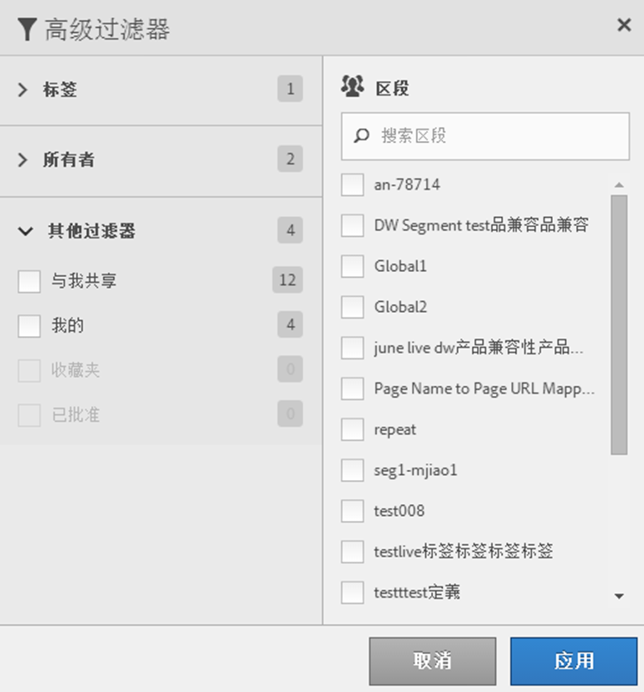

# 过滤区段

按照标记、所有者和其他过滤器（全部显示、我的、已与我共享、收藏和已批准）进行过滤。

过滤功能使得在区段边栏中搜索区段变得更加容易。

1. In the Segment Manager, click the **[!UICONTROL Filters]** icon:  

   

1. 可用过滤器如下：

   | 过滤器名称 | 描述 |
   |---|---|
   | 标记 | 用于过滤具有特定[标记](../../../components/c-segmentation/c-segmentation-workflow/seg-tag.md#concept_CD892CEB326C4986A1B67487052DBA50)。默认情况下显示“标记”列。 |
   | 所有者 | 用于按所有者过滤区段。 |
   | “其他过滤器”&gt;“全部显示” | **（仅限管理员）**&#x200B;显示所有区段、其所有者和上一次修改日期。 |
   | “其他过滤器”&gt;“我的” | 显示您拥有的所有区段。 |
   | “其他过滤器”&gt;“已与我共享” | 显示其他人与您[共享](../../../components/c-segmentation/c-segmentation-workflow/t-seg-share.md#task_7DC54643083E42C28F918E4F0845C5A5)的所有区段。 |
   | “其他过滤器”&gt;“收藏” | 显示标记为 [收藏次数](../../../components/c-segmentation/c-segmentation-workflow/t-seg-favorite.md#task_F45DFA3FBF0C4082B46A0D032CB20FC5). |
   | “其他过滤器”&gt;“已批准” | 显示所有正式[批准](../../../components/c-segmentation/c-segmentation-workflow/seg-approve.md#concept_DF477F151A9E483A92ED1DDAAF035953)的区段。 |
   | 搜索区段 | 用于按名称搜索区段。 |

