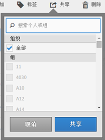

# 共享区段

根据您的权限，可以与整个组织、组或个人用户共享区段。

| 管理员 | 可以与“所有人”、“组”和“用户”共享区段。组在管理控制台内设置为权限组。 |
|---|---|
| 非管理员 | 只能与个人用户共享区段。 |

相比于与用户组或个人用户共享，什么时候应当与整个公司共享区段？下面是可能需要遵循的一些最佳实践：

* 作为管理员，如果某个区段对整个公司都有用，或者每个人都能熟练使用，那么就应当与“**[!UICONTROL 所有人]”共享该区段。** In this case, you should also consider making it an [approved](../../../components/c-segmentation/c-segmentation-workflow/seg-approve.md#concept_DF477F151A9E483A92ED1DDAAF035953) segment.

* 作为管理员，如果某个区段为团队带来良好的商业价值，那么就应当将此区段与特定“**[!UICONTROL 组]”共享。**&#x200B;请不要正式批准此类型的区段。
* 作为管理员或个人用户，请将区段与其他个人用户共享，以便审查和验证该区段。如果经证实没有用处，则可以放弃。请不要正式批准此类型的区段。

1. 在区段管理器中，选中要共享的区段旁边的复选框。将显示区段管理工具栏：

   

1. 单击&#x200B;**[!UICONTROL 共享]**。

   

   如果您是管理员，则可以选择“**[!UICONTROL 所有人]**”或组织中的“**[!UICONTROL 组]”和“**&#x200B;用户&#x200B;**”。**&#x200B;如果您不是管理员，则只能看到个人用户。使用“**[!UICONTROL 搜索]”字段搜索组或用户。** 1. Click **[!UICONTROL Share]**.

   “共享”图标将在区段旁边显示：

1. You can filter on segments shared with you by going to **[!UICONTROL Filters]** &gt; **[!UICONTROL Other Filters]** &gt; **[!UICONTROL Shared with Me]**.
