# 关于区段和容器

您可以使用区段根据特性或网站交互来确定访客子集。区段是作为可编码的受众分析而设计的，您可以针对特定的需求生成区段，然后验证、编辑和与其他团队成员共享或在其他 Adobe 产品和 Analytics 功能中使用。

## About segments and containers {#concept_82653C7E29FE49F5A4B5E5E93B0A6399}

您可以使用区段根据特性或网站交互来确定访客子集。区段是作为可编码的受众分析而设计的，您可以针对特定的需求生成区段，然后验证、编辑和与其他团队成员共享或在其他 Adobe 产品和 Analytics 功能中使用。

<!-- 

seg_overview.xml

 -->

区段基于使用嵌套容器模型的[!UICONTROL 访客]、[!UICONTROL 访问]和[!UICONTROL 点击]级别层次结构。您可以使用嵌套容器根据各容器之间和容器内的规则定义访客属性和操作。可在 [!DNL Adobe Experience Cloud] 的多个产品和功能中生成、批准、共享、保存和运行 Analytics 区段。区段可通过报表生成、可内建于功能板报表中，或添加书签以便快速访问。

您可以在区段生成器中生成并保存区段，也可以通过流失报表（在 [!DNL ad hoc analysis] 中）生成区段。还可以根据嵌套容器之间的特定规则采用和扩展预先生成的区段，从而可以过滤结果并应用于报表。此外，区段还可以结合在一起作为[堆叠区段](../../components/c-segmentation/c-segmentation-workflow/seg-workflow.md#concept_40C299B60B354E10B344702EA3138B34)使用。

通过使用区段，您可以根据页面查看的特性和顺序来识别访客。

## 区段 {#section_CC4EBA2A6CCB4F8BBB8437052A880657}

区段可确定访客的身份（国家/地区、性别、咖啡店）、使用的设备和服务（浏览器、搜索引擎、移动设备）、导航自何处（搜索引擎、上一个退出页面、免费搜索）及更多信息。

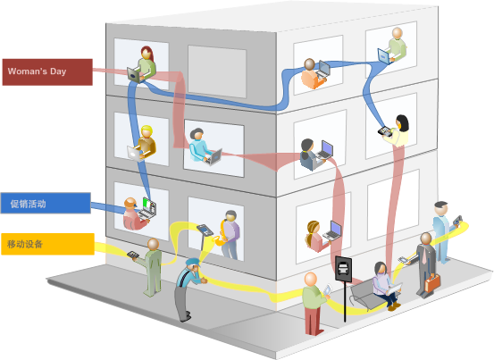

区段可以基于以下值：

* 基于属性的访客 - 浏览器类型、设备、访问次数、国家/地区、性别。
* 基于交互的访客 - 促销活动、关键字搜索、搜索引擎。
* 基于退出和登录的访客 — 来自 Facebook、定义的登录页面、反向链接域名的访客。
* 基于自定义变量的访客 - 表单字段、定义的类别、客户 ID。

当您在区段生成器中生成受众区段时，可通过在容器之间使用 [!UICONTROL AND] 和 [!UICONTROL OR] 运算符来定义条件。

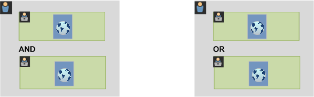

此类型的区段根据使用 [!UICONTROL AND] 和 [!UICONTROL OR] 运算符联接的特性过滤数据集。

## 顺序区段 {#section_EE5B14287FC44E0B96E77679A2438948}

通过使用顺序区段，您可以根据站点中的导航和页面查看识别访客，为定义的操作和交互提供了一个区段。顺序区段可帮助您识别访客喜欢和避开的内容。生成顺序区段时，使用 [!UICONTROL THEN] 运算符来定义和排序访客导航。


| 访问一 | 访问二 | 访问三 |
|---|---|---|
| 在第一次访问中，访客转到主登录页面 (A)，排除促销活动页面 (B)，然后查看产品页面 (C)。 | 在第二次访问中，访客再次转到主登录页面 (A)，排除促销活动页面 (B)，再次转到产品页面 (C)，然后转到新页面 (D)。 | 在第三次访问中，访客进入并按照第一和第二次访问中的相同路线操作，然后排除页面 F，直接转到目标产品页面 (G)。 |

顺序区段可基于以下点击值：

* 基于页面点击顺序的访客 — 单次访问中的页面查看、跨各单独访问的页面查看、排除页面查看的访问。
* 基于页面查看之间和之后时间的访客 — 时间限制之后、两次点击之间、事件之后。


顺序区段根据使用 [!UICONTROL THEN] 运算符联接的用户操作过滤数据集。

## 关于区段容器 {#concept_A38E7000056547399E346559D85E2551}

区段根据访客的属性或与您站点的交互来设置条件以过滤访客。要在区段内设置条件，可根据访客的特征和/或导航特性来设置规则以过滤访客。要进一步划分访客数据，可以根据每个访客的特定访问和/或页面查看点击来进行过滤。区段生成器提供了一个简单的架构来生成这些子集并将规则应用为嵌套的分层“访客”&gt;“访问”&gt;“点击”容器。

<!-- 

seg_container_overview.xml

 -->

## 操作方法视频 {#section_89D6184890AF4086A8056BFBB0B68C29}

这个 YouTube 视频简要概述了区段容器及其使用方法。

| 视频名称 | 视频链接 |
|---|---|
| 区段容器 | [Adobe Analytics 中的区段容器](https://www.youtube.com/watch?v=A513j-ej0oc&index=2&list=PL2tCx83mn7GtHqZicFTa--aE6d02BvvTd) |

## 关于容器 {#section_AF2A28BE92474DB386AE85743C71B2D6}

区段生成器中使用的容器架构将“访客”**定义为最外部的容器，包含所有访问和页面查看中特定于该访客的一切数据。**&#x200B;通过嵌套的“访问”****&#x200B;容器可设置规则来根据访问对访客的数据进行划分，通过嵌套的“点击”**[!UICONTROL 容器可根据各个页面查看对访客信息进行划分。]**&#x200B;通过每个容器都可以跨访客的历史记录和按访问划分的交互进行报告，或者对各个点击进行划分。

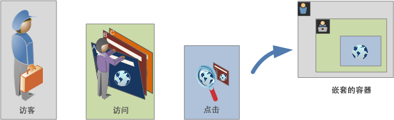

**访客容器**

访客容器包含指定时间段内访客的每次访问和页面查看。访客级别的区段会返回满足条件的页面，以及访客查看的所有其他页面（只受定义的日期范围的约束）。作为定义最为广泛的容器，访客容器级别生成的报表将返回跨所有访问的页面查看并允许您生成多访问分析。因此，根据定义的日期范围，访客容器是最容易更改的。

访客容器可以包含以访客总体历史记录为基础的值：

* 首次购买间隔天数
* 原始登录页面
* 原始反向链接域名

**访问容器**

通过访问容器可以确定页面交互、促销活动或针对特定 Web 会话的转化。访问容器是最常使用的容器，因为每当符合规则，访问容器便会立即捕获整个访问会话的行为，并允许您定义在生成和应用区段时要包含或排除的访问。访问容器可帮助您了解同一访问中有多少访客查看了“新闻和体育”部分。或者有多少页面归因于向销售的成功转化。

访问容器包含的值以每次访问的发生次数为基础：

* 访问量
* 登录页面
* 回访频度
* 参与量度
* 线性分配的量度

**点击容器**

点击容器定义要在区段中包含或排除的页面点击。点击容器是范围最窄的可用容器，允许您确定符合条件的特定点击和页面查看，让您能够查看单个跟踪代码，或者将行为隔离在站点的特定部分内。当出现某个行为时，您也可能需要准确查明某个特定值，比如下订单时的市场营销渠道。

点击容器包含的值以单个页面划分为基础：

* 产品
* 列表 Prop
* 列表 eVar
* 促销 eVar（在事件背景下）

   >[!NOTE]
   >
   >如果您在持久值(如evar)上使用此容器，它将拉取该值所在的每个点击。当跟踪代码在一周后过期时，该值可以在多次访问时保持不变。

**逻辑组容器**

通过使用逻辑组容器，您可以在区段规则中提供独立的容器，进而能够不按照层次结构过滤实体。例如，您可能想要提供一个嵌套于区段且按照访客进行过滤的容器。这一类型的逻辑要求您打破层次结构（因为您已经拥有一个顶级访客容器），从而只过滤选定的访客。这可以通过使用逻辑组容器来实现。请参阅[逻辑组容器示例](../../components/c-segmentation/c-segmentation-workflow/seg-sequential-build.md#concept_83AEC78CD25F442EBEE364856A889560)以了解其他信息。

## 嵌套容器 {#section_7FDF47B3C6A94C38AE40D3559AFFAF70}

在其他容器内创建区段容器时，实际上是在区段内创建区段。以下逻辑将用于嵌套的容器：

1. 确定使用最外部的容器包含哪些数据。不符合此外部规则的所有数据都将在分段报表中被放弃。
1. 将嵌套的规则应用到余下的数据。嵌套的规则不会应用于首个规则抛出的任何点击。
1. 重复操作，直到所有嵌套的容器规则都计算完后为止。随后，余下的数据会包含到结果报表中。

您可以在容器之间使用嵌套，也可以在容器内的规则之间使用嵌套。以下是每个容器中可以嵌套的内容：

| 容器名称 | 可在其中嵌套的内容 |
|---|---|
| 点击 | 仅事件 |
| 访问 | 点击容器、事件 |
| 访客 | 访问容器、点击容器、事件 |
| 逻辑组 | 访客容器、访问容器、点击容器 |

**在单个定义内包含多个容器**

在新的复合区段中包含多个区段可更进一步优化数据。过滤访客时将两个现有的区段一起拖动相当于“OR”语句。画布中的所有容器都将根据全部数据进行审查，所有符合这些容器中任何一个的数据都将包含在报表中。

例如，将“国家”=“美国”的访问容器和“订单”= True 的访问容器一起拖动

```
Country = United States + Order = True
```

可生成一个区段，此区段的行为顺序如下：

1. 此区段首先会查看您的全部数据并确定美国国内的所有访客。
1. 然后，此区段会再次查看您的全部数据，搜索是否有访客下了订单。
1. 接着，这两个数据集都将应用到报表中。

## 顺序区段的容器 {#section_324AF503F51A4A62806151FE440F3B2E}

顺序区段采用同样的基本容器，包括分层嵌套的[!UICONTROL 访客]、[!UICONTROL 访问]和[!UICONTROL 点击]容器（包括页面查看或其他维度）。


[!UICONTROL 访客]构成顺序区段中的最高顺序容器，[!UICONTROL 访问]包含在[!UICONTROL 访客]容器中，而[!UICONTROL 点击]包含在[!UICONTROL 访客]或[!UICONTROL 访问]容器中。必须保持这种[容器层次结构](../../components/c-segmentation/seg-overview.md#section_7FDF47B3C6A94C38AE40D3559AFFAF70)以生成秩序井然的顺序区段。

**要生成顺序区段**，请嵌套容器并使用 [!UICONTROL THEN] 运算符联接顺序逻辑，这要求每个容器都基于访客序列。


这种容器层次结构的唯一例外是在使用[逻辑组容器](../../components/c-segmentation/c-segmentation-workflow/seg-sequential-build.md#concept_83AEC78CD25F442EBEE364856A889560)时。通过使用[!UICONTROL 逻辑组]容器，您可以按任意顺序将点击嵌套在容器中以捕获事件和维度，而不按照特定的顺序。


## 以容器数据为基础的报表 {#concept_BE822C12F87C4F07B7147D80BEFBAB87}

容器允许您在划分区段并应用到报表中时根据报表值以不同的方式过滤不同的数据。

<!-- 

seg_container_reports.xml

 -->

“访客”&gt;“访问”&gt;“点击”容器层次结构的每一级别中捕获的数据会影响您生成区段的方式。如果您将同一区段应用到使用相同数据集的同一报表，获得的值将根据生成报表的容器而有所不同。容器报表级别和跨点击的值的持续性等因素可能对报表的准确性产生较大影响。

## 容器数据基础 {#section_9576D970F912450191AFB5B83F7F1656}

例如，下面展示的访客在首次访问中访问了一个站点，登录了站点主页，然后访问了三个其他页面并将此次访问转化为销售。在另一次访问中，该访客这次登录了产品页，然后转到主页，接着回到产品页，在浏览过冬帽后结束会话。根据每个容器为该区段捕获的数据，报表中将显示不同的值。

下面的&#x200B;*页面 =“冬季外套”*&#x200B;区段将应用到&#x200B;**页面报表**&#x200B;中。

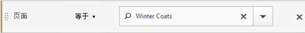

根据所选的容器，报表显示不同结果。

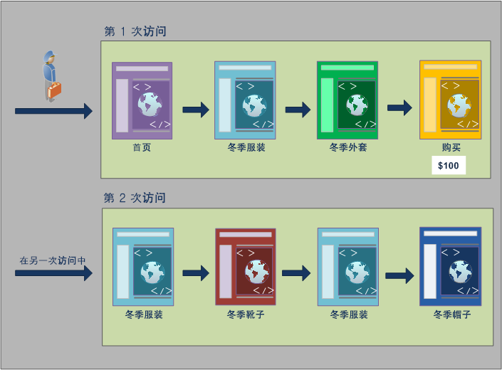

**从点击容器报告**

当此条件位于点击容器内时，报表将只列出&#x200B;*页面 =“冬季外套”*&#x200B;的页面。因为在只包含一个页面的容器中只有一个页面满足此条件，所以只显示“冬季外套”页面。

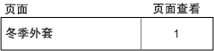

通过从点击容器报告可以看到从不同的容器报告会对总体报表值产生什么影响。通过查看区段报表可以注意到，页面查看数大致与访问数相同（约 2,000 名访客在一次访问中查看了重复页面，而此数量计入了页面查看总数中），独特访客数大致与访问数相同（约 2,000 名独特访客的访问次数超过一次）。

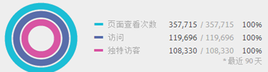

>[!IMPORTANT]
>
>无论您如何查看数据(从点击、访问或访客容器)，在此示例中，它们都具有相同数量的访客、63、541。不管您如何生成报表，初始的访客条件（即查看了“冬季外套”页面的访客数）始终不变。此为您在不同级别报告所使用的数据子集。

**从访问容器报告**

如果访问容器中存在同样的条件，则报表会列出访问中&#x200B;*页面 =“冬季外套”*&#x200B;的所有页面。系统将过滤出“冬季外套”页面，同时也会针对满足此条件的访问捕获所有其他页面。因为访客也在满足此条件的访问中访问了“主页”、“产品”和“购买”页面，所以使用访客容器数据报告时，其他这些页面也将在报表中列出。

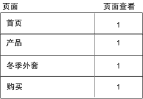

通过显示访问容器的区段值可以看到，页面查看数显著增加。这是因为从访问容器报告可以确定所有满足相应条件的页面，以及该访问中查看的所有其他页面（捕获每个访问容器中的所有页面查看）。


**从访客容器报告**

如果访客容器中存在同样的条件，则报表会列出查看了&#x200B;*页面 =“冬季外套”*&#x200B;的任何访客的所有页面。这意味着如果某个访客查看了“冬季外套”页面，那么该访客容器中所有的页面（包括其他访问中的页面查看）都会列出。因此，不满足条件的页面将在报表中列出，因为该访客在之前查看了这些页面。访客容器中的所有页面都会在报表中列出，即使它们之前出现但并未满足条件也不例外。

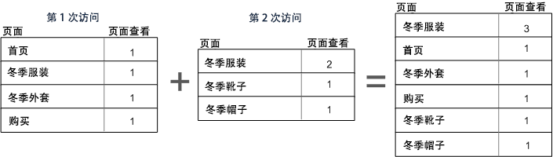

通过显示访客容器的区段可以看到，页面查看数和访问数都增加了。这是因为在访客级别中，如果访客只访问了一次“冬季外套”页面（使条件生效），那么将捕获该访客的所有其他页面查看和访问。


总之，了解区段针对不同数据划分的工作情况是解读其返回数据的关键。

## 以容器为基础报告 {#section_D0604748F2794327B8C668617A31EC18}

区段数据的每个划分都有一个应用范围。大多数报表划分基于页面查看，但是很多有用的区段是基于访问容器的，少量基于访客容器。所以，以容器范围为基础了解报表非常关键。

根据之前使用的&#x200B;*页面 =“冬季外套”*&#x200B;区段示例，下面列出的问题根据容器数据的应用方式，以及数据范围与区段类型的匹配方式定义了区段的其他方面。

**基于匹配区段规则的细分容器**

将区段容器应用到数据的自然范围可获得行项目与区段规则相匹配的期望结果。

* **页面 =“冬季外套”的点击容器**：查看使用此区段的页面报表将只返回等于“冬季外套”的值。所有其他页面将被排除在报表之外。
* **登录页面 =“冬季服装”的访问容器**：查看使用此区段的登录页面报表将只返回第二次访问，因为其登录页面与区段规则相匹配。
* **访问数 = 1 的访问容器**：报表中包含查看第一次访问中的“访问所有”页面查看，因为其与区段规则相匹配。

**访问容器级别中的页面查看**

许多区段规则会确定每次访问的页面查看。出现此情况时，只有当单个点击符合此规则时，才会应用整个访客容器。此区段报表非常有价值，因为基于访问的页面查看提供了以每次访问的页面查看为基础的分析。

* **页面 =“冬季外套”的访问容器**：在访客容器级别的页面报表中，显示包含“冬季外套”页面查看的访问的所有页面查看。如果某个页面匹配区段规则，那么与该访问关联的所有页面查看都会包含在报表中。
* **页面 =“主页”的访问容器**：在包含此区段的页面报表中，只显示首次访问的数据。这是因为在第二次访问中，访客没有查看“主页”。
* **页面 =“冬季服装”的访客容器**：在页面报表中，此区段检索两次访问的所有数据，因为访客在这两次访问中均查看了“冬季服装”页面。

**确定点击数少于页面查看数的区段容器**

对小于划分范围的容器使用区段将返回异常数据。使用较小的划分仍会加入该数据范围内的所有点击。

* **登录页面 =“产品”页面的点击容器**：每一页都与访问的登录页面关联，从而使其以访问为基础进行划分。使用此区段不仅将登录页面加为“产品”页面，还加入该访问中的所有点击。
* **列表变量包含值 A 的点击容器**：如果同一点击上有多个值被定义为列表变量，那么所有变量值都将包含在区段中。无法将同一页面查看中的值分开，因为点击容器是划分点击的最小区段容器。
* **页面 =“购买”的点击容器**：如果将页面查看用作量度，那么只显示“购买”页面（预期）。如果使用“收入参与”报表，那么首次访问中的所有页面都将收到 $100，因为参与量度是以访问为基础的。
* **页面 =“冬季外套”的点击容器**：如果将页面查看用作量度，那么只显示“冬季外套”页面（预期）。如果使用“收入参与”报表，那么没有页面会收到信用，因为此维度需要一个保持不变的维度。实际执行购买（“购买”页面）的页面查看不会包含在点击容器内，所以不会对任何项目提供收入参与。但是，从访问容器运行报表将包含该访问内所有的页面查看，也将为会话内查看的所有页面分配收入参与 ($100)。

## 跨容器持续性 {#concept_E579D72B1C644AE9A4C4EAF6B47A4DCB}

如果维度在一些页面上保持不变（例如促销活动 eVar 或反向链接维度），按这样的维度进行过滤会影响容器级别收集的数据，需要对此有深入了解来确保报表的准确性。

<!-- 

seg_container_persistence.xml

 -->

根据某个维度的持续性，或者所选页面中应用的变量，区段数据可能会有所变化。包括页面维度在内的某些维度会在页面级别提供唯一值，并根据点击容器的数据进行过滤。（请参阅[以容器数据为基础的报表](../../components/c-segmentation/seg-overview.md#concept_BE822C12F87C4F07B7147D80BEFBAB87)示例）。反向链接域名维度等其他维度在一次访问的多个页面上均保持不变。某些维度或应用的变量（如访问持续时间）会持续访客的整个历史记录。

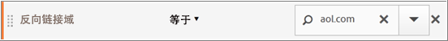

与页面维度不同，反向链接域名值会附加到此访问的每个页面。例如，下面的访客从一个反向链接站点到达主页。因此，该访问内的所有页面都会分配同一个反向链接域名值。

下面的&#x200B;*反向链接域名 = aol.com* 区段将应用到&#x200B;**页面报表**。

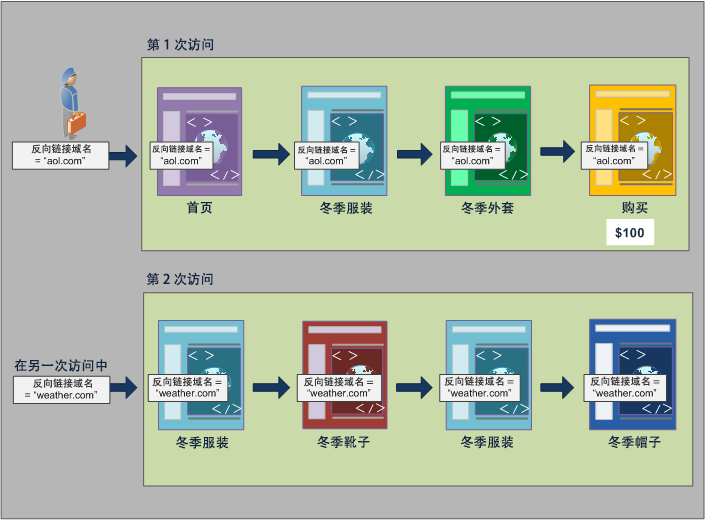

在新的访问中，访客从其他站点被引荐过来。因此，新访问中所有页面会针对每个页面查看分配新的反向链接域名值。

**从点击容器报告**

因为同一访问内的所有页面查看都分配了同样的反向链接域名值，所以点击容器级别中&#x200B;*反向链接域名 =“aol.com”*&#x200B;的报表会返回下表中列出的所有页面。


显示点击容器的数据，超过 32,000 位访客在超过 33,000 次访问期间查看了 92,000 次页面。平均来说，每次访问有 3 次页面查看，几乎每次的访问都是由一位独特访客完成。


**从访问容器报告**

如果在页面报表的访问容器中过滤同一条件，那么访问中所有&#x200B;*反向链接域名 =“aol.com”*&#x200B;的页面都满足。因为反向链接域名的值在访问级别设置，所以页面查看和访问级别的报表是一样的。


在此示例中，因为所有页面的反向链接域名值都是一样的，都以该访问为基础，所以访问容器级别的报表（几乎）与页面查看容器的报表一样（由于数据异常导致存在细微偏差，分别为 98,234 和 98,248）。


**从访客容器报告**

在访客容器中，页面报表会列出任何访客查看过的所有&#x200B;*反向链接域名 =“aol.com”*&#x200B;的页面。因此，如果某个访客在历史记录中的任意时刻（定义的时间段内）将&#x200B;*“aol.com”*&#x200B;作为反向链接域名，那么访客容器中的所有页面（包括其他访问中的页面查看）都将被列出。即使是不符合主要条件的页面也会在报表中列出，因为这些页面包含在访客容器中。访客容器中的所有页面都会在报表中列出，即使它们之前出现但并未满足条件也不例外。

在反向链接域名报表中，四个页面查看内&#x200B;*反向链接域名 =“aol.com”*，但是访客点击的其他页面中&#x200B;*反向链接域名 =“weather.com”*。在访客容器中，您会获取反向链接域名为“aol.com”的访客列表，但也提供了反向链接域名为“weather.com”的页面，而不是与您在区段中的初始请求相匹配的值。

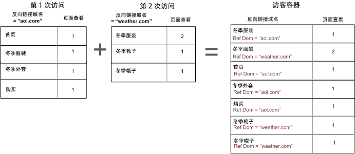

当您查看访客容器中的数据时，请注意页面查看数会显著增加（从 98,248 增加到 112,925）。这是因为访客的所有页面查看（包括在访客容器级别保存的其他反向链接域名值的页面查看）均已列出（还有该访客的其他访问，让访问数从 33,203 增加到 43,448）。

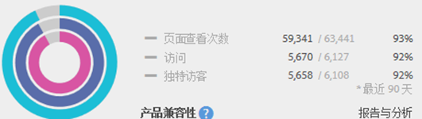

总体来说，

* 只要一次访问至少有一个页面满足条件，访问容器会返回该访问查看的所有页面。所以，如果某个页面只在第 1 天的第 1 次访问时查看，那么整个访问期间查看的所有页面都会包含在该数据内。
* 当您分段的条件是针对 eVar 或其他类型的持续变量时，请谨慎小心。例如，您可能使用条件“促销活动包含电子邮件”，该条件在 7 天后过期。因此，如果此促销活动在首次访问时设置，那么将再持续 7 天时间。即使促销活动只在首次访问中设置，也会将每个访问包含进来。其他访问也将包含进来（只要在报表的日期范围内）。如果您希望将持续值排除出去，请使用事件“实例”，或者使用等效的 Prop 变量（可用时）。

