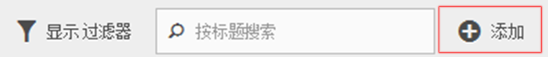
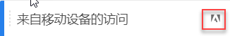
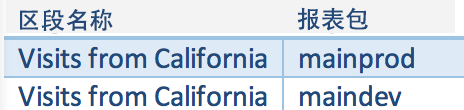

# 常见问题解答

回答有关细分功能、访问、权限、最佳实践和管理传统区段的常见问题解答。

## 功能 {#section_BD58629D1A9346BF879E229FA6BEC7A2}

* Analysis Workspace 中的分段：

   * 您可以[比较区段](https://marketing.adobe.com/resources/help/en_US/analytics/analysis-workspace/segment-comparison.html)。
   * 在比较中使用[区段作为维度](https://marketing.adobe.com/resources/help/en_US/analytics/analysis-workspace/segments_as_dimensions.html)。
   * 在[流失分析](https://marketing.adobe.com/resources/help/en_US/analytics/analysis-workspace/graphics/compare-segments-fallout.html)中使用区段。

* 您可以[将多个区段应用于一个报表或项目](../../components/c-segmentation/c-segmentation-workflow/seg-workflow.md#task_13E69C7D428A43EF9CCCA7F1104F1E8F)。
* 区段对于所有报表包都是通用的。
* [Segment Builder](../../components/c-segmentation/c-segmentation-workflow/seg-workflow.md#concept_643F2DF74C544796B58F4656ABC5F726) 简化了细分创建。
* 您可以通过[区段管理器](../../components/c-segmentation/c-segmentation-workflow/seg-workflow.md#concept_7A2E019317864065B7C641DC3315928F)中的区段共享、标记、验证和批准功能，来设置[工作流程](../../components/c-segmentation/c-segmentation-workflow/seg-workflow.md#concept_6D2E1A72A3AD4EBBB9135094F2D9DEDF)。

* 您可以[标记区段](../../components/c-segmentation/c-segmentation-workflow/seg-workflow.md#concept_CD892CEB326C4986A1B67487052DBA50)，以便稍后进行组织和搜索，而无需使用文件夹。Previously, you used folders (in [!DNL Ad Hoc Analysis]) to organize your segments.

* 您可以在 Ad Hoc Analysis 之外创建[连续区段](/help/components/c-segmentation/c-segmentation-workflow/seg-sequential-build.md)。
* 页面查看容器已重命名为“点击”容器，以表示该容器可分段所有类型的数据，而不仅仅是页面查看。例如，点击容器完全包含或排除链接跟踪调用和移动 SDK 中的 trackAction 调用。请注意，此容器的运行方式并没有发生任何更改，只是进行了重命名。

请参阅 Digital Marketing Blog（数字营销博客）上的帖子“[Improving Segmentation in Adobe Analytics](https://blogs.adobe.com/digitalmarketing/analytics/improving-segmentation-adobe-analytics/)”（改善 Adobe Analytics 中的分段），了解更多详细信息。

## Access the Segmentation Tools {#section_088AD0E4E21943DFA8CF7206AEC485DD}

**如何访问区段生成器？**

您可以通过以下方法访问区段生成器：

* 显示一个现有报表，然后单击左侧导航中的“区段”图标 In the segment rail that displays, then click **[!UICONTROL Add]**, or

* At the top of the Segment Manager, clicking **[!UICONTROL + Add]**.  

   或

* 在区段管理器中单击现有区段标题，以在区段生成器中编辑该区段。

**如何访问区段管理器？**

访问区段管理器的方法如下：:

* Going to  **[!UICONTROL Analytics]** &gt; **[!UICONTROL Components]** in the top navigation. Then click **[!UICONTROL Segments]**, or

* 显示一个现有报表，然后单击左侧导航中的“区段”图标 Then click **[!UICONTROL Manage]**, or

* 在界面的任意位置按斜杠键“/”，并搜索区段管理器。

**原有的区段下拉菜单转到了何处？**

Reports &amp; Analytics 中的区段下拉菜单已被功能更加丰富的[区段生成器](../../components/c-segmentation/c-segmentation-workflow/seg-workflow.md#concept_643F2DF74C544796B58F4656ABC5F726)界面取代，通过使用该界面，您可以创建在报表包中和 Adobe Analytics 解决方案中“通用”的区段。To view a list of existing segments, click the Segments icon  

并显示区段边栏显示。

**原有的报表包下拉菜单转到了何处？**

报表包下拉菜单已移动到每个报表或功能板右上角的日期选择器旁。

## 权限 {#section_648DFA3A882146C485A84ED014EEC707}

**需要哪些权限才能使用、创建和管理区段？**

默认情况下，所有用户都可以创建和编辑个人区段。但是，管理员可以决定哪些用户应拥有[创建区段的权限](https://marketing.adobe.com/resources/help/en_US/reference/groups.html)，然后将这些用户分配到特定的组。这些区段可以直接与任何其他 Analytics 用户共享。

管理员可以编辑任何区段，并且可以与组织中的组和每个人共享区段。[更多信息...](../../components/c-segmentation/seg-reference/seg-rights.md)

**我可以看到公司的所有区段吗？**

Yes, Admins can see all segments within the [!DNL Analysis Workspace] and [!DNL Reports & Analytics] user interfaces.

“Ad Hoc Analyics”和“Report Builder”可以显示您拥有的区段以及与您共享的区段。

**我可以在区段管理器中管理所有 Analytics 区段吗？**

可以，所有区段均可在 Analysis Workspace、Reports &amp; Analytics 以及 Ad Hoc Analysis 的区段管理器中进行管理。区段管理器显示对所有者（创建区段的用户）、共享用户和管理员用户可见的区段。区段选择器显示用户拥有的区段及与其共享的区段。

管理员可以在 Analysis Workspace 和 [!DNL Reports & Analytics] 用户界面中看到所有区段。

“Ad Hoc Analyics”和“Report Builder”只显示由您生成的区段或专门与您共享的区段。

**为什么无法删除此区段？**

如果区段已[发布到 Experience Cloud](../../components/c-segmentation/c-segmentation-workflow/seg-workflow.md#concept_1E9FC92437D748C392546542B6511D01)，则无法删除或编辑该区段。但是，您可以复制该区段，然后编辑其复制版本。

## 最佳实践 {#section_E2C3A1B4B4274D1B86CAA9C0359D049C}

**我应该怎样处理具有相同名称，但可能有不同定义的重复区段？**&#x200B;由于区段在多个报表包中使用，您可能会发现有多个区段具有相同的名称。我们建议您

* 重命名名称相同但定义不同的区段，或者
* 删除不再需要的区段。

**Adobe 针对区段清理方面有何建议？**

* 使用原有标记对所有区段添加标记。
* 审查您拥有的区段。
* 将区段添加到区段库（如果适用）。
* 批准符合规范的区段。
* 根据[最佳实践](../../components/c-segmentation/c-segmentation-workflow/seg-workflow.md#concept_CD892CEB326C4986A1B67487052DBA50)标记区段。

## 管理原有区段 {#section_76CF47142D1A4FB6A0718AD9073049FE}

**我的现有区段有什么变化？**

您的现有区段将继续和以前一样使用。已应用了这些区段的任何报表将仍可正常使用。[更多...](../../components/c-segmentation/seg-transition.md#section_83ACAB256F394DCD8B424D8920BDD853)

以前的大多数预定义包区段将作为区段模板迁移到区段生成器中。使用区段模板可以快速生成适合一般受众的自定义区段。区段模板无法直接应用于报表，但可以轻松保存到自定义区段。

在区段生成器中，区段模板使用特殊的图标进行标记：

**我的现有区段文件夹有什么变化？**

区段管理器不再使用（Ad Hoc Analysis）文件夹，而是使用标记。您的文件夹名称会自动转换为标记，而且这些标记会应用于各自的区段。

**已经应用区段的计划报表有什么变化？**

计划报表会继续以您所定义的区段正常运行。

删除区段后，应用该区段的计划报表和功能板可继续正常使用，即区段或功能板继续使用删除的区段。

编辑具有相同名称的区段时，计划报表不会更新。例如，假定您在不同报表包中有 2 个使用相同名称的区段：

您的书签引用 mainprod 报表包的区段。然后，由于重复您删除该区段。书签将继续运行，仍引用已删除区段的定义。如果更改 maindev 区段的区段定义以包括卡特琳娜岛和墨西哥的提华纳，则应用于书签的区段将不会发生更改。仍将使用旧定义。要修复此问题，请更新书签以引用新定义。如果不确定书签、功能板或计划报表是否在使用删除的区段，可以更改剩余区段的名称，这样可以更加明确书签是否在使用剩余的区段。

**Data Warehouse 区段有何变化？**

所有现有 Data Warehouse 区段仍可以在数据仓库中使用。大多数数据仓库细分还将在其他组件(如Analysis Workspace、Ad Hoc Analysis和Reports&amp; Analytics)中工作。

您可以在区段生成器/管理器中创建或编辑新的 Data Warehouse 区段。区段生成器中的产品兼容性机制会自动确定区段是否与 Data Warehouse 兼容。

**收藏区段（Ad Hoc Analysis）有何变化？**

在 Adobe Analytics 中，这些 Ad Hoc Analysis 区段显示为常规区段。

请不要将这些区段与区段管理器中可用于将区段标记为收藏的“收藏夹”功能混淆。

**预配置区段有何变化？**

* **单页面访问量**
* **来自移动设备的访问量**
* **来自免费搜索的访问量**
* **来自付费搜索的访问量**
* **使用访客 ID Cookie 的访问量**

这些区段将作为区段模板迁移到区段生成器中。

已应用这些区段的现有报表将仍可正常使用。

** Experience Cloud(套件)区段发生了什么情况：****

* 非顾客
* 顾客
* 首次访问量
* 社交网站访问量
* 访问时间超过 10 分钟的访问量*
* 之前访问次数超过 5 次的访问量*
* Facebook 访问量*

其中大多数区段（使用星号 * 标记的区段除外）将作为区段模板迁移到区段生成器中。此外，还添加了多个新区段模板。

已应用这些区段的现有报表将仍可正常使用。

**管理员区段（又称为“全局”区段）有何变化？**

**管理员**&#x200B;区段将迁移到新的区段界面中，并将显示为与每个人共享的区段。

这些区段的所有者被设置为使用登录公司管理员用户列表中最旧帐户的管理员，但所有管理员都可以删除、编辑和共享这些区段。

管理控制台中管理员创建和管理这些全局区段的区段管理界面不再可用。管理员应使用新的区段生成器创建区段，并将其与相应组、个人或每个人共享。

<!-- 

seg_definition.xml

 -->

对于现有区段，如果使用的逻辑已发生更改（如本文档中所述），它们仍可正常使用，但必须更新之后才能再次保存。例如，如果您的现有区段中美国包含“纽约”，则该区段仍可正常使用，但在下一次编辑该区段时，将需要更新该区段才能在等式条件中使用枚举类型。

**迁移提示**

以下提示将可帮助您迁移一些常用维度：

* 地理城市/地区/国家/地区-搜索并选择特定城市、地区或国家，而不是使用部分匹配。
* 浏览器-使用浏览器类型维度获取类型中的所有浏览器，例如Google Chrome
* 操作系统-使用OS类型尺寸以获取类型中的所有操作系统，例如Microsoft Windows。

* [新维度和重命名的维度](../../components/c-segmentation/seg-transition.md#section_73CF121B64A24DEF8E6499F3167BF742)
* [包含的更改](../../components/c-segmentation/seg-transition.md#section_1A9EDEE5CBC44B5AA6262560052ABE77)
* [更改小于和大于](../../components/c-segmentation/seg-transition.md#section_84A8AAD0344148AD9F9211D3EB271903)

## 新维度和重命名的维度 {#section_73CF121B64A24DEF8E6499F3167BF742}

下表包含区段生成器中重命名的维度列表。

<table id="table_1A8C1940FD0446FA8414C6A7DE66E44C"> 
 <thead> 
  <tr> 
   <th colname="col1" class="entry"> 新维度名称 </th> 
   <th colname="col2" class="entry"> 以前名称 </th> 
   <th colname="col3" class="entry"> 注释 </th> 
  </tr> 
 </thead>
 <tbody> 
  <tr> 
   <td colname="col1"> 操作系统类型 </td> 
   <td colname="col2"> 新 </td> 
   <td colname="col3"> 在 2015 年春季版中添加。 </td> 
  </tr> 
  <tr> 
   <td colname="col1"> 浏览器宽度 - 桶式 </td> 
   <td colname="col2"> 浏览器宽度 </td> 
   <td colname="col3"> 该维度与所有界面兼容，根据范围划分成枚举列表，而不是具体的整数值。如果需要分段具体的值，请在 Data Warehouse 区段中使用此维度的粒度版本。 </td> 
  </tr> 
  <tr> 
   <td colname="col1"> 浏览器高度 - 桶式 </td> 
   <td colname="col2"> 浏览器高度 </td> 
   <td colname="col3"> 该维度与所有界面兼容，根据范围划分成枚举列表，而不是具体的整数值。如果需要分段具体的值，请在 Data Warehouse 区段中使用此维度的粒度版本。 </td> 
  </tr> 
  <tr> 
   <td colname="col1"> 浏览器宽度 - 粒度 </td> 
   <td colname="col2"> 浏览器宽度 </td> 
   <td colname="col3"> 
该维度已重命名，现在仅与 Data Warehouse 兼容。在定义与所有界面兼容的区段时，使用枚举类型“浏览器宽度 - 桶式”。 
 </td> 
  </tr> 
  <tr> 
   <td colname="col1"> 浏览器高度 - 粒度 </td> 
   <td colname="col2"> 浏览器高度 </td> 
   <td colname="col3"> 
该维度已重命名，现在仅与 Data Warehouse 兼容。在定义与所有界面兼容的区段时，使用枚举类型“浏览器高度 - 桶式”。 
 </td> 
  </tr> 
  <tr> 
   <td colname="col1"> Cookie 支持 </td> 
   <td colname="col2"> Cookie </td> 
   <td colname="col3"> - </td> 
  </tr> 
  <tr> 
   <td colname="col1"> 颜色深度 </td> 
   <td colname="col2"> 显示器颜色深度 </td> 
   <td colname="col3"> - </td> 
  </tr> 
  <tr> 
   <td colname="col1"> - </td> 
   <td colname="col2"> "应用程序 - *" </td> 
   <td colname="col3"> 许多维度类型的“应用程序 -”前缀已经删除。由于移动应用程序数据通常是在不包含 Web 数据的报表包中捕获的，因此没有必要保留这些前缀。 </td> 
  </tr> 
  <tr> 
   <td colname="col1"> 原始登录页面 </td> 
   <td colname="col2"> 原始登录页面 </td> 
   <td colname="col3"> - </td> 
  </tr> 
  <tr> 
   <td colname="col1"> 启用 Java </td> 
   <td colname="col2"> Java </td> 
   <td colname="col3"> - </td> 
  </tr> 
  <tr> 
   <td colname="col1"> 移动设备浏览器 URL 最大长度 </td> 
   <td colname="col2"> 移动设备浏览器 URL 长度 </td> 
   <td colname="col3"> - </td> 
  </tr> 
  <tr> 
   <td colname="col1"> 移动设备邮件修饰 </td> 
   <td colname="col2"> 移动设备修饰邮件支持 </td> 
   <td colname="col3"> - </td> 
  </tr> 
  <tr> 
   <td colname="col1"> 移动设备 </td> 
   <td colname="col2"> 移动设备名称 </td> 
   <td colname="col3"> - </td> 
  </tr> 
  <tr> 
   <td colname="col1"> 移动设备书签最大长度 </td> 
   <td colname="col2"> 移动设备书签 URL 最大长度 </td> 
   <td colname="col3"> - </td> 
  </tr> 
  <tr> 
   <td colname="col1"> 移动设备电子邮件最大长度 </td> 
   <td colname="col2"> 移动设备邮件 URL 最大长度 </td> 
   <td colname="col3"> - </td> 
  </tr> 
  <tr> 
   <td colname="col1"> 移动设备操作系统（已弃用） </td> 
   <td colname="col2"> 移动设备操作系统 </td> 
   <td colname="col3"> 使用操作系统维度，但应用来自移动设备区段的访问量。 </td> 
  </tr> 
  <tr> 
   <td colname="col1"> 移动设备按键通话 </td> 
   <td colname="col2"> 移动设备 PTT </td> 
   <td colname="col3"> - </td> 
  </tr> 
  <tr> 
   <td colname="col1"> 调查查看 </td> 
   <td colname="col2"> 调查查看总次数 </td> 
   <td colname="col3"> - </td> 
  </tr> 
  <tr> 
   <td colname="col1"> 调查响应 </td> 
   <td colname="col2"> 调查响应总数 </td> 
   <td colname="col3"> - </td> 
  </tr> 
  <tr> 
   <td colname="col1"> 访问深度 </td> 
   <td colname="col2"> 路径长度 </td> 
   <td colname="col3"> - </td> 
  </tr> 
  <tr> 
   <td colname="col1"> 邮政编码 </td> 
   <td colname="col2"> ZIP/邮政编码 </td> 
   <td colname="col3"> - </td> 
  </tr> 
 </tbody> 
</table>

## 对具有已知值的字符串维度的更改 {#section_1A9EDEE5CBC44B5AA6262560052ABE77}

具有已知值集的字符串维度已更改为枚举类型。在使用这些维度创建区段时，将使用所有已知值预填充该列表，而支持的运算符只有等于。这让您可以在使用限制较少的匹配条件时，快速分段查找的确切值，而不会选择非预期的值。

以下维度已更改为枚举列表：

| 移动设备制造商 | 移动设备电子邮件长度 | 颜色深度 |
|---|---|---|
| 移动设备屏幕大小 | 移动设备数 | 显示器分辨率 |
| 移动设备屏幕高度 | 移动设备按键通话 | 插件 |
| 移动设备 Cookie 支持 | 移动设备邮件修饰 | 操作系统 |
| 移动设备图像支持 | 移动设备信息服务 | 反向链接类型 |
| 移动设备颜色深度 | 移动设备类型 | 搜索引擎 |
| 移动设备音频支持 | 浏览器类型 | 州/省 |
| 移动设备视频支持 | 浏览器 | 地域（国家/地区） |
| 移动设备 DRM | 连接类型 | 地理区域 |
| 移动设备网络协议 | 移动设备运营商 | 地域（市） |
| 移动设备操作系统 | Cookie | 地域 DMA |
| 移动设备 Java VM | 客户忠诚度 | 持久 Cookie |
| 移动设备书签长度 | 启用 Java | 付费搜索 |
| 移动设备 URL 长度 | 语言 |  |

## 对具有已知值的整数维度的更改 {#section_84A8AAD0344148AD9F9211D3EB271903}

具有已知值集的整数维度（如浏览器宽度）已被拆分为多个枚举范围，因此您可以快速定义特定范围的区段。这些枚举列表会在维度名称后附加“- 桶式”。以下屏幕演示了如何使用以前的区段生成器界面和新区段生成器界面来分段这些维度：

小于、大于和类似运算符现在只与“Data Warehouse”区段兼容。如果区段要与所有报表界面兼容，应使用量度的“桶式”版本以及等于运算符。
