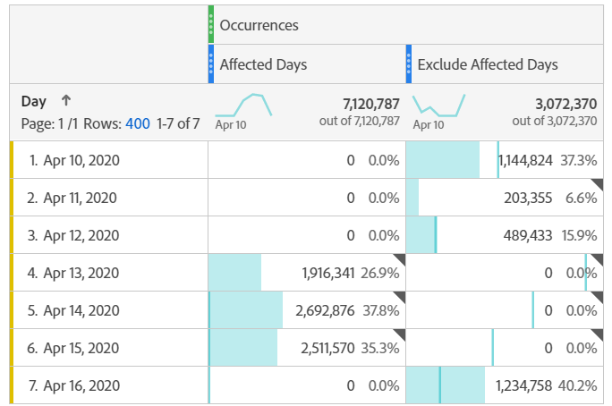

# 排除分析中的特定日期

如果数据受 [到事件影响](/help/technotes/event-impacted.md)，则可以使用区段排除不希望包含在报表中的任何日期范围。 细分受事件影响的日期有助于防止您的组织对部分数据做出决策。

## 隔离受影响的日期

创建一个区段，以隔离受影响的日期或日期范围。 如果您只想关注问题日期，以了解有关其影响的更多信息，则此区段非常有用。

1. 转到>，然后单击以打开区 **[!UICONTROL Components]** 段 **[!UICONTROL Segments]**&#x200B;生成器 **[!UICONTROL Add]**。
2. 将“天”维拖动到定义画布上，并将其设置为与要隔离的天相等。
3. 对要在报告中隔离的每天重复上述步骤。

Adobe建议使用橙色尺寸组件，而不是紫色日期范围组件。 如果您使用紫色日期范围组件，则它们会覆盖项目的日历范围：

## 排除受影响的天数

创建不包括受影响日期或日期范围的区段。 如果您希望排除遇到问题的天数，以将对整体报告的影响降至最低，则此细分很有用。

1. 转到>，然后单击以打开区 **[!UICONTROL Components]** 段 **[!UICONTROL Segments]**&#x200B;生成器 **[!UICONTROL Add]**。
2. 在区段定义画布的右上角，单击 **[!UICONTROL Options]** > **[!UICONTROL Exclude]**。
3. 将“天”维拖动到定义画布上，并将其设置为等于要删除的天。
4. 对于要在报表中删除的每一天，重复上述步骤。

## 在报告中使用这些区段

创建排除区段后，您可以像使用其他区段一样使用它。

### 比较趋势报表中的区段

您可以在报表中同时应用“受影响的天数”区段和“排除受影响的天数”区段，以并排比较它们。 将两个区段拖动到某个量度的上方或下方，以比较它们：

如果不想在表或可视化中显示零（导致低谷），请在列设置下 **[!UICONTROL Interpret zero as no value]** 启用。

### 将排除区段应用到项目

您可以将“排除受影响的天数”区段应用到Workspace项目。 将排除区段拖动到标有“将区段放在此 *处”的“工作区画布”部分*。

>[!TIP] 在面板说明中包含排除数据的附注，以帮助查看报告的用户。 右键单击面板的标题，然后单击 **[!UICONTROL Edit description]**。

### 在虚拟报告套件中使用排除区段

您可以在虚拟报告套件中使 [用区段](../../vrs/vrs-about.md) ，更方便地排除数据。 此选项的理想之处在于您不必记住为包含受影响日期范围的每个报表应用区段。 如果您已经使用虚拟报表包作为主要数据源，则可以将区段添加到现有VRS。

1. 导航到 **[!UICONTROL Components]** > **[!UICONTROL Virtual report suites]**。
2. 单击 **[!UICONTROL Add]**.
3. 输入虚拟报表包的所需名称和说明。
4. 将排除区段拖至标记的区域 **[!UICONTROL Add segment]**。
5. 单击 **[!UICONTROL Continue]** 右上角的，然后单击 **[!UICONTROL Save]**。

