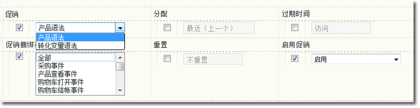

# 实施销售变量

描述如何启用和实施促销变量。

## 启用促销变量 {#section_331B41FF5AED42F2AEFE043DD60238C7}

Merchandising can be enabled for any custom eVar on the **[!UICONTROL Admin Tools]** &gt; **[!UICONTROL Report Suites]** &gt; **[!UICONTROL Conversion Variables]** page (you no longer need to call Adobe):



| 设置 | 描述 |
|--- |--- |
| 过期时间 | 确定促销值的持续时间。 |
| 促销 | 产品语法：该值在 s.products 内设置。转化变量语法：该值在指定的促销 s.eVar 中设置。 |
| 促销捆绑事件（仅转化变量语法） | 指示何时将产品与当前的促销类别绑定。通过按住 Ctrl 并单击列表中的多个项可选择多个事件。注意：选择“产品语法”后，便无法选择事件了（被禁用，而且不会灰显）。只有在选择了“转化变量语法”后才能选择事件。 |

## 使用产品语法实施 {#section_2774578D09CE40A093CB0D0A294DBF7C}

启用产品语法后，将直接在产品变量内部填充促销类别，因此无需选择和设置捆绑事件。推荐使用此方法，除非当发生成功事件时无法在 `s.products` 中设置此值。

* **语法**

```js
  s.products="category;product;quantity;price;event_incrementer; 
<codeph outputclass="syntax">
  eVarN=merch_category| 
 <codeph outputclass="syntax">
   eVarM=merch_category2" 
 </codeph outputclass="syntax"> 
</codeph outputclass="syntax">
```

* **示例**

```js
  s.events="prodView" 
  s.products=";Fernie Snow Goggles;;;; 
<codeph outputclass="syntax">
  eVar1=goggles" 
   In 
</codeph outputclass="syntax">
```

eVar1 的值“护目镜”被分配给产品“Fernie 雪地护目镜”。所有涉及此产品的后续成功事件（产品添加、结账、购买等）都将被归为“护目镜”。

## 使用转化变量语法实施 {#section_6AE10F69F4A14636AB050BEA89A34E4E}

在 `s.products` 中无法设置 eVar 值时应使用转化变量语法。这通常意味着您的页面没有促销渠道的任何上下文或查找方法。在这类情况下，必须先设置促销变量，然后再进入产品页，该值会持续到捆绑事件发生为止。

当在配置期间选择捆绑事件时，eVar 的这个持久值将与该产品关联。例如，如果 prodView 指定为捆绑事件，那么只有当该事件发生时，促销类别才会与当前产品列表绑定。只有后续捆绑事件才能更新已分配给产品的促销 eVar。

* **语法**&#x200B;在捆绑事件的同一页面或前一页面上：

   ```js
   s.eVar1="merchandising_category"
   ```

   在捆绑事件发生的页面上：

   ```js
   s.events="prodView" 
   s.products="category;product"
   ```

* **示例**&#x200B;访问的页面 1：

   ```js
   s.eVar1="Outdoors:Ski Goggles"
   ```

   访问的页面 2：

   ```js
   s.events="prodView" 
   s.products=";Fernie Snow Goggles"
   ```

   eVar1 的值“户外：滑雪镜”被分配给产品“Fernie 雪地护目镜”。所有涉及此产品的后续成功事件（产品添加、结账、购买等）都将被归为“护目镜”。

另外，促销变量的当前值将被绑定到所有后续产品，直到满足以下其中一个条件为止：

* eVar 过期（根据“过期时间”设置）
* 促销 eVar 被新值覆盖。

有关更多信息，请参阅 [ 中的](https://analyticsdemystified.com/adobe-analytics/advanced-conversion-syntax-merchandising/)高级转化语法促销[!DNL analyticsdemystified.com]。
