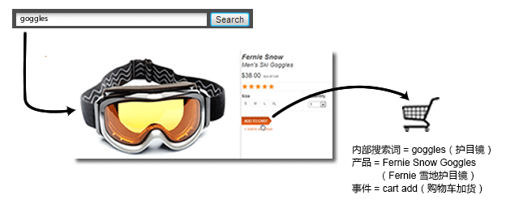
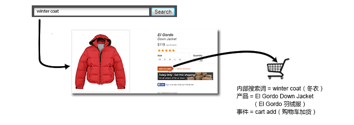

# 销售变量概述

测量外部促销活动或外部搜索术语的成功程度时，通常需要一个单独的值来对发生的所有成功事件接收信用。例如，如果某个客户单击电子邮件促销活动中的链接访问您的网站，那么该客户因此进行的所有购买都将计入此促销活动中。

但是，当客户查找多个项时，因内部搜索或按类别浏览所促成的事件又该如何呢？例如，某个客户在您的站点中搜索“护目镜”并将其加入购物车中：

在结帐之前，客户又搜索“冬衣”并将一件羽绒服加入购物车内：

完成此次购买后，假设“最近”的分配未发生变化，那么“冬衣”的内部搜索信用将包含购买护目镜的行为。虽然这样对“冬衣”关键字不错，但不利于做出营销决策：

| 内部搜索词 | 收入 |
|---|---|
| 冬衣 | $157 |

**促销变量如何解决此问题**

借助跨类别促销变量，或者叫做“促销 evar”，可在成功事件发生时将 eVar 的当前值分配给某个产品。此值将始终与该产品绑定，即使这个特定的 eVar 以后设置了一个或多个新的值也不例外。

如果前一示例中 eVar 启用了促销，则搜索术语“护目镜”将与“Fernie 雪地护目镜”绑定，而搜索术语“冬衣”将与“El Gordo 羽绒服”绑定。促销变量会在产品级别分配收入，所以每个术语都会收到与其关联产品的收入额信用。

| 内部搜索词 | 收入 |
|---|---|
| 冬衣 | $119 |
| 护目镜 | $38 |

