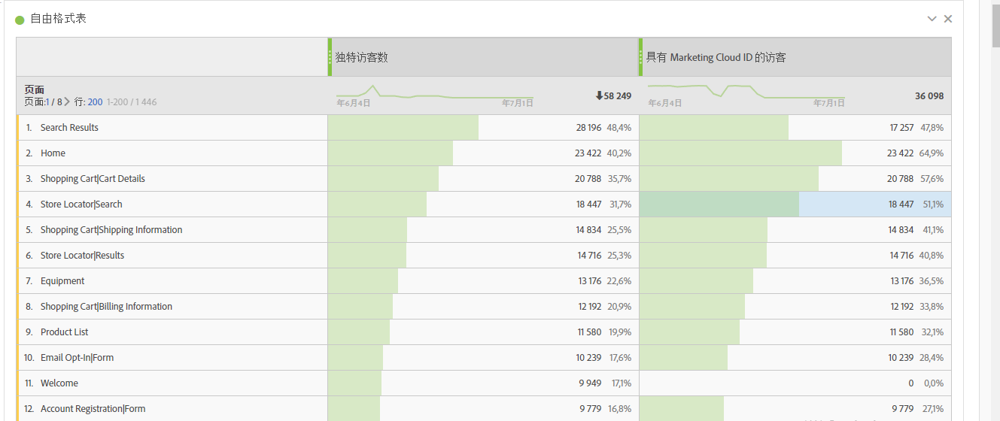
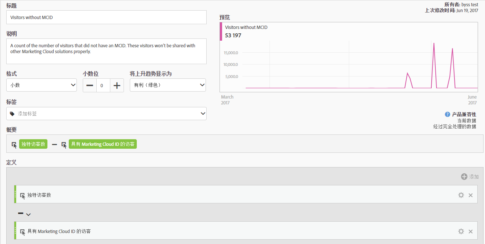
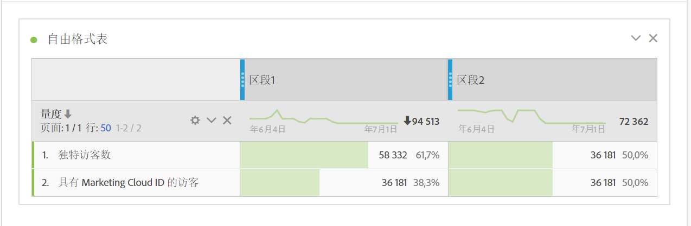

# 具有 Experience Cloud ID 的访客

适用于 Analysis Workspace 和区段生成器。

显示具有 Experience Cloud ID 的访客数量。您可以了解哪些页面已部署标识服务，您可以了解可与其他Experience Cloud解决方案共享多少访客。此外，您还可以在那些共享到 Experience Cloud 的区段中使用该量度。

>[!IMPORTANT]
>
>For this metric to appear, you have to have the [Identity Service](https://marketing.adobe.com/resources/help/en_US/mcvid/) running for the report suite.

## 调试您的 Experience Cloud ID 设置 {#section_679E62142A3E46548FF8FBDA46568005}

The [!UICONTROL Visitors with Experience Cloud ID] metric is a useful metric in Adobe Analytics intended to help you find and debug your [!UICONTROL Identity Service]setup. 该量度是已从Identity Service分配了Experience Cloud ID的报表包中访客数量的计数。该量度可用于诊断某些 Experience Cloud 集成为何没有被预期访客数共享，或用于识别您的网站上还没有部署 MCID 的区域。

要使用“具有 Experience Cloud ID 的访客”量度，只需将它拖到任何报表中作为一个量度，例如“[!UICONTROL 页面]”报表：

在该示例中，请注意每个页面的独特访客与具有 Experience Cloud ID 的访客数相同。但是，独特访客的总数大于具有 Experience Cloud ID 的访客总数。要查找没有为所有访客设置 MCID 的页面，请通过此定义[创建一个计算量度](https://marketing.adobe.com/resources/help/en_US/analytics/calcmetrics/cm_build_metrics.html)：

通过将计算量度添加到报表，您可以对页面报表进行排序，以便显现无 MCID 的访客数量最高的页面：

现在您可以快速看到“产品概览”页面未通过标识服务正确实现，应尽快更新。可围绕任意维度类型（如浏览器类型、网站区域或内容类型）构建一个类似的报表。

在识别了页面的访客没有 MCID 的情况后，您应当能够将其发还给您的实施团队，以便他们能够修复这些页面。

在某些情况下，您可能发现有少量的 MCID 没有对某些访客进行设置，即使 MCID 服务已在该页面上实施时也是如此。在这些情况下，此问题极有可能是因 Analytics JavaScript 或 DTM 的常见错误配置导致 AppMeasurement 函数在提供报表包之前被调用所致。要避免此问题，请确保正确地[插入核心 AppMeasurement 代码](https://marketing.adobe.com/resources/help/en_US/sc/implement/dtm/t_appmeasurement-code.html)。

请注意，您与 Experience Cloud 共享的任何基于“产品快速视图”页面的区段（如上所示），有可能与其他 Experience Cloud 解决方案并不匹配。要检查任何区段的 MCID 覆盖情况，您可以构建如下报表：

此表比较了独特访客数和具有 Experience Cloud ID 的访客数，很容易就可以看出“区段 1”没有 100% 覆盖 MCID，而“区段 2”则有。这意味着，如果我要与 Experience Cloud 共享区段 1，则在总共 3859 名访客中，只有 2186 名访客有共享资格。
