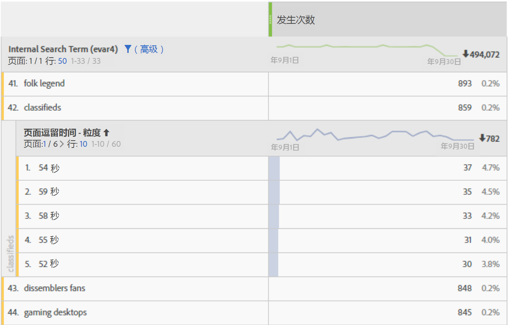
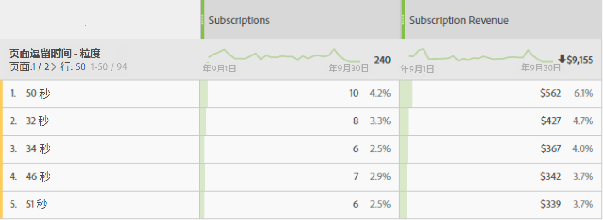

# 逗留时间

Adobe Analytics 提供了多种逗留时间量度和维度。了解它们的含义以及它们的计算方式。

* [逗留时间量度](../../../components/c-variables/c-metrics/metrics-time-spent.md#section_4F54D70300944748A62088F5870E4B6C)
* [逗留时间维度](../../../components/c-variables/c-metrics/metrics-time-spent.md#section_D51606544CB046FC902E2E317318892C)
* [逗留时间的计算方式](../../../components/c-variables/c-metrics/metrics-time-spent.md#section_90A3882638974969A4B8B674FFDB7624)
* [关于逗留时间的常见问题解答](../../../components/c-variables/c-metrics/metrics-time-spent.md#section_51C2735BACAB42CCBA1DD3CBF238E2F7)
* [计算示例](../../../components/c-variables/c-metrics/metrics-time-spent.md#section_3D63D6A601F34E42AD5366435CB610D5)

## 逗留时间量度 {#section_4F54D70300944748A62088F5870E4B6C}

此表格列出了各种逗留时间量度、这些量度的定义及其适用的 Adobe Analytics 功能领域。

<table id="table_7095406DF1614F3CAD5E437B919598D1"> 
 <thead> 
  <tr> 
   <th colname="col1" class="entry"> 量度 </th> 
   <th colname="col2" class="entry"> 定义 </th> 
   <th colname="col3" class="entry"> 适用的功能领域 </th> 
  </tr> 
 </thead>
 <tbody> 
  <tr> 
   <td colname="col1"> 
所用总秒数 
 </td> 
   <td colname="col2"> 
表示访客与特定维度项目交互所用的总时间。 
 
包括所有后续点击中的值和持久性的实例。对于 prop，也会在后续链接事件中统计逗留时间。 
 </td> 
   <td colname="col3"> 
Analysis Workspace 
 
Reports &amp; Analytics 
 
Report Builder（称为“总逗留时间”） 
 
Data Warehouse 
 </td> 
  </tr> 
  <tr> 
   <td colname="col1"> 
每次访问逗留时间（秒） 
 </td> 
   <td colname="col2"> 
<i>所用总秒数/（访问次数 - 跳出次数）</i> 
 
表示访客在每次访问期间与特定维度项目交互所用的平均时间。 
 </td> 
   <td colname="col3"> 
Analysis Workspace 
 
Reports &amp; Analytics 
 </td> 
  </tr> 
  <tr> 
   <td colname="col1"> 
每位访客逗留时间（秒） 
 </td> 
   <td colname="col2"> 
<i>所用总秒数/（独特访客数 - 跳出独特访客数）</i> 
 
表示在访客的存留期（访客 Cookie 的时长）内，访客与特定维度项目交互所用的平均时间。 
 </td> 
   <td colname="col3"> 
Analysis Workspace 
 
Reports &amp; Analytics 
 </td> 
  </tr> 
  <tr> 
   <td colname="col1"> 
网站平均逗留时间（秒） 
 </td> 
   <td colname="col2"> 
表示访客与特定维度项目交互所用的总时间，其中每个序列包含一个维度项目。它并非像其名称所暗示的那样仅限于“网站”平均值。有关序列的详细信息，请参阅“逗留时间的计算方式”部分。 
 
注意：由于计算中所用的分母不同，因此，此量度很可能会与维度项目级别的“每次访问逗留时间”有所不同。 
 </td> 
   <td colname="col3"> 
Analysis Workspace 
 
Reports &amp; Analytics（以分钟显示） 
 
Report Builder（以分钟显示） 
 </td> 
  </tr> 
  <tr> 
   <td colname="col1"> 
页面平均逗留时间 
 </td> 
   <td colname="col2"> 
<b>已弃用的量度。</b> 
 
如果需要维度项目的平均时间，我们建议您使用“网站平均逗留时间”。 
 </td> 
   <td colname="col3"> 
Report Builder（当请求中包含维度时） 
 </td> 
  </tr> 
  <tr> 
   <td colname="col1"> 
会话总时长 
 
（也称为：前一会话的长度） 
 </td> 
   <td colname="col2"> 
仅限移动设备应用程序 SDK。对于前一会话，在下次启动应用程序时进行确定。以秒为单位进行计算，此量度只有在应用程序处于使用状态时才会统计，在应用程序处于后台时则不会统计。这是一个会话级别的量度。 
 
例如：您安装了应用程序 ABC 并将其启动，在使用了 2 分钟后关闭了该应用程序。在此会话时间内不会发送任何相关数据。下次启动该应用程序时，将会发送会话总时长，其值为 120。 
 </td> 
   <td colname="col3"> 
Analysis Workspace 
 
Reports &amp; Analytics 
 
Report Builder 
 
Mobile Services UI 
 </td> 
  </tr> 
  <tr> 
   <td colname="col1"> 
平均会话时长（移动设备） 
 </td> 
   <td colname="col2"> 
会话总长度/(启动项-首次启动项) 
 
仅限移动设备应用程序 SDK。这是一个会话级别的量度。 
 </td> 
   <td colname="col3"> 
Report Builder 
 
Mobile Services UI 
 </td> 
  </tr> 
 </tbody> 
</table>

## 逗留时间维度 {#section_D51606544CB046FC902E2E317318892C}

此表格列出了各种逗留时间维度、这些维度的定义及其适用的 Adobe Analytics 功能领域。

<table id="table_BF1B7B8620714105BFB5C1AC37ABE02C"> 
 <thead> 
  <tr> 
   <th colname="col1" class="entry"> 维度 </th> 
   <th colname="col2" class="entry"> 定义 </th> 
   <th colname="col3" class="entry"> 适用的功能领域 </th> 
  </tr> 
 </thead>
 <tbody> 
  <tr> 
   <td colname="col1"> 
每次访问逗留时间 - 粒度 
 </td> 
   <td colname="col2"> 
访问期间的总逗留时间将精确至秒，且应用于访问中的每次点击。这是一个访问级别的维度。 
 </td> 
   <td colname="col3"> 
Analysis Workspace 
 </td> 
  </tr> 
  <tr> 
   <td colname="col1"> 
每次访问逗留时间 - 分段统计 
 </td> 
   <td colname="col2"> 
粒度维度分为 9 个不同的范围。这是一个访问级别的维度。这些范围包括： 
 
    <ul id="ul_BC909A2D22ED4D48A3F7CE6A666F26E5"> 
     <li id="li_0FB28A1F0D894B7C95724A8C6BD5B00B">少于 1 分钟 </li> 
     <li id="li_10223656420A475AAB3443981D49D10E">1-5 分钟 </li> 
     <li id="li_0DEE723B81C64EAFB5BD1125D48D3AD2">5-10 分钟 </li> 
     <li id="li_B736AC970E0049EB8844480702F345A6">10-30 分钟 </li> 
     <li id="li_21B8ECC3EE66497E8D870A004351B04B">30-60 分钟 </li> 
     <li id="li_79FB658128FD4F97AAE1A803F1687BD1">1-2 小时 </li> 
     <li id="li_CCC0746FEB954BECB9E670ECCDBF30F3">2-5 小时 </li> 
     <li id="li_BD7AFC524C814F9FAE423A4E301661D4">5-10 小时 </li> 
     <li id="li_C9B5F1A83F99437A98A61756EE286687">10-15 小时 </li> 
     <li id="li_8CC5A279D5804C5EA34C1B3589EF07BA">超过 15 小时 </li> 
    </ul> 
注意：如果不按顺序接收点击，则可能会出现超过 12 小时的访问。 
 </td> 
   <td colname="col3"> 
Analysis Workspace 
 
Reports &amp; Analytics 
 
Report Builder 
 </td> 
  </tr> 
  <tr> 
   <td colname="col1"> 
页面逗留时间 - 粒度 
 </td> 
   <td colname="col2"> 
每次点击的总逗留时间，精确至秒。这是一个点击级别的维度，包括页面查看次数和链接事件。它并非像其名称所暗示的那样仅限于“页面”维度。 
 </td> 
   <td colname="col3"> 
Analysis Workspace 
 </td> 
  </tr> 
  <tr> 
   <td colname="col1"> 
页面逗留时间 - 分段统计 
 </td> 
   <td colname="col2"> 
粒度维度分为 10 个不同的范围；但是，分段统计的维度只计算页面查看次数（不包括链接事件）。这是一个点击级别的维度。这些范围包括： 
 
    <ul id="ul_D5F067A2520646A99AA261F9A4625C03"> 
     <li id="li_82307DE66EC548F0AD79DB1505A21F0D">少于 15 秒 </li> 
     <li id="li_585965B82C4D43B6870978A5CE63B5B6">15-29 秒 </li> 
     <li id="li_5C20DC78E126472A838818EBA1D954D0">30-59 秒 </li> 
     <li id="li_2579C0B9279340ABA3AD4A527D758239">1-3 分钟 </li> 
     <li id="li_E0FD800E948049A48DB4329A3E7A2478">3-5 分钟 </li> 
     <li id="li_D9DBBFE6004F42BD80BB4F9268DF7DA7">5-10 分钟 </li> 
     <li id="li_20F146799679456E8D6434D79EE12C31">10-15 分钟 </li> 
     <li id="li_A38951A553A14AE7A0F23A904EEE35DE">15-20 分钟 </li> 
     <li id="li_D44D773A344E47BFAA771302A49D8BD4">20-30 分钟 </li> 
     <li id="li_8766683DB29147CD8470D2317F750E97">多于 30 分钟 </li> 
    </ul> </td> 
   <td colname="col3"> 
Analysis Workspace 
 
Reports &amp; Analytics 
 </td> 
  </tr> 
 </tbody> 
</table>

## 逗留时间的计算方式 {#section_90A3882638974969A4B8B674FFDB7624}

Adobe Analytics 使用显式值（包括链接事件和视频查看次数）来计算[!UICONTROL 逗留时间]。

>[!NOTE]
>
>Without link events like [!UICONTROL Video Views] or [!UICONTROL Exit Links], time spent on the last hit of a visit cannot be known. 此外，鉴于类似的原因，“[!UICONTROL 跳出访问]”（即只包含一次点击的[!UICONTROL 访问]）将没有相关的[!UICONTROL 逗留时间]。

在所有逗留时间的计算中，**分子**&#x200B;都是“所用总秒数”。

在 Analytics 中，**分母**&#x200B;不可作为单独的量度使用。对于点击级别的逗留时间量度，分母即是序列。一个序列是一组连续的点击，其中给定的变量包含相同的值（不论是设置、扩展还是保留的值）。“扩展”是指为了计算逗留时间，而在页面查看事件之间（即在后续链接事件中）持续保留 prop。

* 例如，对于“[!UICONTROL 页面名称]”或点击级别的其他维度，分母主要为“[!UICONTROL 实例数]”或“[!UICONTROL 页面查看次数]”，但是，重新载入次数和未设置的值（例如，链接事件）将被计为单次交互（一个序列）。

* 由于逗留时间无从知晓，因此[!UICONTROL 跳出]和[!UICONTROL 退出]点击量也会从分母中删除。

## 关于逗留时间的常见问题解答 {#section_51C2735BACAB42CCBA1DD3CBF238E2F7}

<table id="table_D8BA825412B6420390CA78D77A5E57C2"> 
 <thead> 
  <tr> 
   <th colname="col1" class="entry"> 问题 </th> 
   <th colname="col2" class="entry"> 回答 </th> 
  </tr> 
 </thead>
 <tbody> 
  <tr> 
   <td colname="col1"> 
能否将所有逗留时间量度应用于任何维度？ 
 </td> 
   <td colname="col2"> 
以下逗留时间量度可应用于任何维度： 
 
    <ul id="ul_FC9513D0184B4A74BA1F4CCEA8BC1940"> 
     <li id="li_669156CC549040E08AB4977AF4B8AECB">所用总秒数 </li> 
     <li id="li_3CCD7E7D127448689228E98A5EE854CB">每次访问逗留时间（秒） </li> 
     <li id="li_1F61C157EC414C7F8702BC3F365AA2D7">每位访客逗留时间（秒） </li> 
     <li id="li_A3EF959A9BAB4872915F1A5C1A86D48E">网站平均逗留时间（秒） </li> 
    </ul> </td> 
  </tr> 
  <tr> 
   <td colname="col1"> 
哪个逗留时间维度最适合用于包含其他维度的划分？ 
 </td> 
   <td colname="col2"> 
“在页面上花费时间-粒度”维度是一个点击级别维度。按其他维度划分此维度将显示点击持续的秒数，其中也会显示划分维度。 
 
在下面的示例中，搜索词“分类”与 54 秒、59 秒等的点击时间相关联，这可能表示访客正在花时间阅读针对该搜索词返回的内容。 
 
 
 </td> 
  </tr> 
  <tr> 
   <td colname="col1"> 
什么指标适合“在页面上花费时间-粒度”的维度？ 
 </td> 
   <td colname="col2"> 
任意量度。此维度显示发生事件的具体点击的逗留时间。逗留时间越长意味着访客在发生事件的页面（点击）中停留的时间越长。 
 
 
 </td> 
  </tr> 
  <tr> 
   <td colname="col1"> “网站平均逗留时间”与“每次访问逗留时间”有何不同之处？ </td> 
   <td colname="col2"> 
这些量度的不同之处在于分母： 
 
    <ul id="ul_E9D7B4D3EDCC4691B2C724E0FE5480D2"> 
     <li id="li_CA34D84A3164473A8737D258425CA468"> “网站平均逗留时间”使用包含一个维度项目的序列作为分母。 </li> 
     <li id="li_2F2639480BE24927919732D00364EECA"> “每次访问逗留时间”使用访问计数作为分母。 </li> 
    </ul> 
因此，这些量度可能会在访问级别产生相似的结果，但在点击级别则将产生不同的结果。 
 </td> 
  </tr> 
 </tbody> 
</table>

## 计算示例 {#section_3D63D6A601F34E42AD5366435CB610D5}

假定下面一组服务器调用针对的是单次访问中的单个访客：

<table id="table_63CBB5097E5A46659877E2CA3C94D81C"> 
 <thead> 
  <tr> 
   <th colname="col1" class="entry"> 访问点击次数 </th> 
   <th colname="col2" class="entry"> 1 </th> 
   <th colname="col3" class="entry"> 2 </th> 
   <th colname="col4" class="entry"> 3 </th> 
   <th colname="col5" class="entry"> 4 </th> 
   <th colname="col6" class="entry"> 5 </th> 
   <th colname="col7" class="entry"> 6 </th> 
   <th colname="col8" class="entry"> 7 </th> 
  </tr> 
 </thead>
 <tbody> 
  <tr> 
   <td colname="col1"> <b>访问经过的时间（秒）</b> </td> 
   <td colname="col2"> 0 </td> 
   <td colname="col3"> 30 </td> 
   <td colname="col4"> 80 </td> 
   <td colname="col5"> 180 </td> 
   <td colname="col6"> 190 </td> 
   <td colname="col7"> 230 </td> 
   <td colname="col8"> 290 </td> 
  </tr> 
  <tr> 
   <td colname="col1"> <b>所用秒数</b> </td> 
   <td colname="col2"> 30 </td> 
   <td colname="col3"> 50 </td> 
   <td colname="col4"> 100 </td> 
   <td colname="col5"> 10 </td> 
   <td colname="col6"> 40 </td> 
   <td colname="col7"> 60 </td> 
   <td colname="col8"> - </td> 
  </tr> 
  <tr> 
   <td colname="col1"> <b>点击类型</b> </td> 
   <td colname="col2"> 页面 </td> 
   <td colname="col3"> 链接 </td> 
   <td colname="col4"> 页面 </td> 
   <td colname="col5"> 页面 </td> 
   <td colname="col6"> 页面 </td> 
   <td colname="col7"> 页面 </td> 
   <td colname="col8"> 页面 </td> 
  </tr> 
  <tr> 
   <td colname="col1"> <b>页面名称</b> </td> 
   <td colname="col2"> 主页 </td> 
   <td colname="col3"> - </td> 
   <td colname="col4"> 产品 </td> 
   <td colname="col5"> 主页 </td> 
   <td colname="col6"> 主页 
（重新加载） 
 </td> 
   <td colname="col7"> 购物车 </td> 
   <td colname="col8"> 订单确认 </td> 
  </tr> 
 </tbody> 
</table>

### eVar示例

<table id="table_6D0CF0C53DC145D3A53C06EC3012BCC0">  
 <thead> 
  <tr> 
   <th colname="col1" class="entry"> 访问点击次数 </th> 
   <th colname="col2" class="entry"> 1 </th> 
   <th colname="col3" class="entry"> 2 </th> 
   <th colname="col4" class="entry"> 3 </th> 
   <th colname="col5" class="entry"> 4 </th> 
   <th colname="col6" class="entry"> 5 </th> 
   <th colname="col7" class="entry"> 6 </th> 
   <th colname="col8" class="entry"> 7 </th> 
  </tr> 
 </thead>
 <tbody> 
  <tr> 
   <td colname="col1"> <b>eVar1</b> </td> 
   <td colname="col2"> 红色 
（设置） 
 </td> 
   <td colname="col3"> 红色 
（保留） 
 </td> 
   <td colname="col4"> （过期） </td> 
   <td colname="col5"> 蓝色 
（设置） 
 </td> 
   <td colname="col6"> 蓝色 
（设置） 
 </td> 
   <td colname="col7"> 蓝色 
（保留） 
 </td> 
   <td colname="col8"> 红色 
（设置） 
 </td> 
  </tr> 
  <tr> 
   <td colname="col1"> <b>eVar 所用秒数</b> </td> 
   <td colname="col2"> 30 </td> 
   <td colname="col3"> 50 </td> 
   <td colname="col4"> - </td> 
   <td colname="col5"> 10 </td> 
   <td colname="col6"> 40 </td> 
   <td colname="col7"> 60 </td> 
   <td colname="col8"> - </td> 
  </tr> 
 </tbody> 
</table>

### Prop示例

<table id="table_1CB4D24A6CAA479C8E59A7C77FFB8226">  
 <thead> 
  <tr> 
   <th colname="col1" class="entry"> 访问点击次数 </th> 
   <th colname="col2" class="entry"> 1 </th> 
   <th colname="col3" class="entry"> 2 </th> 
   <th colname="col4" class="entry"> 3 </th> 
   <th colname="col5" class="entry"> 4 </th> 
   <th colname="col6" class="entry"> 5 </th> 
   <th colname="col7" class="entry"> 6 </th> 
   <th colname="col8" class="entry"> 7 </th> 
  </tr> 
 </thead>
 <tbody> 
  <tr> 
   <td colname="col1"> <b>prop1</b> </td> 
   <td colname="col2"> A 
（设置） 
 </td> 
   <td colname="col3"> A 
（扩展） 
 </td> 
   <td colname="col4"> （未设置） </td> 
   <td colname="col5"> B 
（设置） 
 </td> 
   <td colname="col6"> B 
（设置） 
 </td> 
   <td colname="col7"> A 
（设置） 
 </td> 
   <td colname="col8"> C 
（设置） 
 </td> 
  </tr> 
  <tr> 
   <td colname="col1"> <b>prop1 所用秒数</b> </td> 
   <td colname="col2"> 30 </td> 
   <td colname="col3"> 50 </td> 
   <td colname="col4"> - </td> 
   <td colname="col5"> 10 </td> 
   <td colname="col6"> 40 </td> 
   <td colname="col7"> 60 </td> 
   <td colname="col8"> - </td> 
  </tr> 
 </tbody> 
</table>

根据以上表格，逗留时间量度计算如下：

| prop1 | 所用总秒数 | 每次访问逗留时间 | 每位访客逗留时间 | 序列计数 | 网站平均逗留时间 |
|---|---|---|---|---|---|
| A | 30+50+60=140 | 140/1=140 | 140/1=140 | 2 | 140/2=70 |
| B | 10+40=50 | 50/1=50 | 50/1=50 | 1 | 50/1=50 |
| C | 0 | 0 | 0 | 0 | 0 |
| 未归类的时间 | 100 | - | - | - | - |

| eVar1 | 所用总秒数 | 每次访问逗留时间 | 每位访客逗留时间 | 序列计数 | 网站平均逗留时间 |
|---|---|---|---|---|---|
| 红色 | 30+50=80 | 80/1=80 | 80/1=80 | 1 | 80/1=80 |
| 蓝色 | 10+40+60=110 | 110/1=110 | 110/1=110 | 1 | 110/1=110 |
| 未归类的时间 | 100 | - | - | - | - |

对于逗留时间维度，以下行将显示在关联的报表中：

* 每次访问逗留时间（粒度）：290
* 页面逗留时间（粒度）：10、30、40、50、60、100

支持此示例的一些其他注释：

* 所有逗留时间计算都基于访问经过的时间，该时间在访问的首次点击时以零开始统计。
* “所用秒数”是当前点击的时间戳和下次点击的时间戳之间的差值。因此，访问的最后一次点击（和跳出）没有逗留时间。
* “序列”是指一组连续的点击，其中给定的变量包含相同的值（不论是设置、扩展还是保留的值）。例如，prop1“A”有两个序列：点击 1 &amp; 2 和点击 6。访问的最后一次点击的值不会开始一个新序列，因为最后一次点击没有逗留时间。网站平均逗留时间使用序列作为分母。

   * 仅出于计算逗留时间的目的，prop 会从页面点击“扩展”到后续链接点击，如上面点击 2 的 prop1 所示。这允许点击 1（“A”）中为 prop1 所设置的值累计点击 2 的逗留时间。
   * eVar 可累计任何设置或保留 eVar 的点击的逗留时间。eVar 持久性由 Analytics“管理员”中的 eVar 设置定义。
