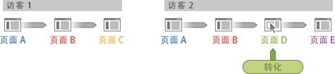

# 访客参与率 - Ad Hoc Analysis

访客参与率是一个量度系列，它让您可以查看营销渠道、促销活动、收入等访客会话的参与率。例如，购买和收入信用可以归属于达成订单的这次访问之前的其他营销接触点。Ad Hoc Analysis 提供多次访问的访客参与率。

**收入（参与率）**：在单次访问中导致转化的所有页面（直到转化页面）之间分配转化信用。

**收入（访客参与率）**：在指定时间段内，在所有页面和所有访问之间分配转化信用。

**示例 - 交叉访问收入参与率**

一位访客访问了您的网站两次。在第二次访问期间，在页面 D 上发生了转化事件，实现了 60 美元的收入：

在报表中，转化分配如下所示：

* **收入**：分配给该页面。
* **收入（参与率）**：分配给第二次访问。
* **收入（访客参与率）**：分配给这两次访问。

<table id="table_91A7244E77854838A8392B49366FB445"> 
 <thead> 
  <tr> 
   <th colname="col1" class="entry"> 页面 </th> 
   <th colname="col2" class="entry"> 收入 </th> 
   <th colname="col3" class="entry"> 收入（参与率） </th> 
   <th colname="col4" class="entry"> 收入（访客参与率） </th> 
  </tr> 
 </thead>
 <tbody> 
  <tr> 
   <td colname="col1"> 
A 
 </td> 
   <td colname="col2"> 
0 
 </td> 
   <td colname="col3"> 
60 美元 
 </td> 
   <td colname="col4"> 
60 美元 
 </td> 
  </tr> 
  <tr> 
   <td colname="col1"> 
B 
 </td> 
   <td colname="col2"> 
0 
 </td> 
   <td colname="col3"> 
60 美元 
 </td> 
   <td colname="col4"> 
60 美元 
 </td> 
  </tr> 
  <tr> 
   <td colname="col1"> 
C 
 </td> 
   <td colname="col2"> 
0 
 </td> 
   <td colname="col3"> 
0 
 </td> 
   <td colname="col4"> 
60 美元 
 </td> 
  </tr> 
  <tr> 
   <td colname="col1"> 
D 
 </td> 
   <td colname="col2"> 
60 美元 
 </td> 
   <td colname="col3"> 
60 美元 
 </td> 
   <td colname="col4"> 
60 美元 
 </td> 
  </tr> 
 </tbody> 
</table>

