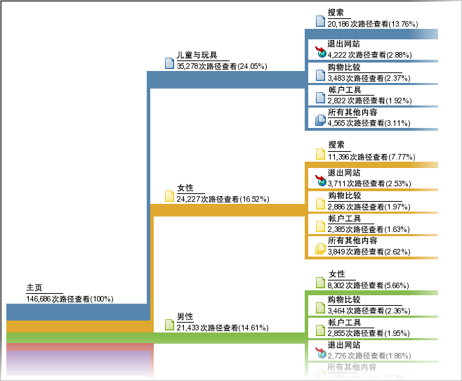

# 路径分析

一组基于路径分析的报表。从技术上说，路径分析意味着从一个页面名称进入另一个页面名称（从一个值到另一个值）。

请使用 [Analysis Workspace 流量](https://marketing.adobe.com/resources/help/en_US/analytics/analysis-workspace/flow.html)了解更灵活的路径选项。

>[!NOTE]
>
>To enable pathing, go to **[!UICONTROL Admin &gt; Report Suites &gt; Edit Settings &gt; Traffic &gt; Traffic Variables]**. 要在网站区域和服务器报表中启用路径分析，请联系客户关怀团队。

如果您要了解值收集的顺序，则需为搜集这些值的变量启用路径。页面默认启用路径。路径在默认情况下没有对任何 prop 启用，因为它仅适合特定情况。请与客户关怀联系以对 prop 启用路径。

>[!NOTE]
>
>在临时分析中，当您在prop上启用分类时，路径指标会变得可用于为已启用prop设置的所有分类。

**示例 - 网站区域路径**

对&#x200B;*`s.channel`*&#x200B;变量启用路径，使您可以对网站访客如何在网站区域之间移动（随着值的变化）进行跟踪。


之后，路径即可在多种路径报表中使用，例如显示访客是如何在页面群组或网站区域间移动的[!UICONTROL 下一网站区域流量]报表。



**示例 - 搜索路径**

从一个值移动到另一个值的概念同样也适用于其他流量变量，包括 *`s.props`*。For example, if you enable pathing for your Internal Search Term *`s.prop`*, you could see the path visitors take through search terms.

**示例 - 按登录状态分析路径**

您可能希望根据访客的登录状态来了解访客访问您网站的路径。若要查看此信息，您无需查看登录状态的路径分析报表，因为它们会向您显示访客是如何更改该报表中的值，或者访客是如何从登录状态更改为注销状态。相反，使用&#x200B;*`s.pageName`*&#x200B;变量关联分段值，然后对该结果变量进行路径分析。以下是按成员状态进行页面路径分析的示例代码：

```js
s.pageName=“Home Page”; 
s.prop18=“Gold”; // Member Status 
s.prop19=s.prop18 + “:” + s.pageName;
```

然后，对&#x200B;*`s.prop19`*&#x200B;启用路径，以了解成员访问页面的路径。

>[!NOTE]
>
>如果执行临时分析，则可以对页面路径进行分组，而无需连接区段值，并将任何区段应用到路径报告。

