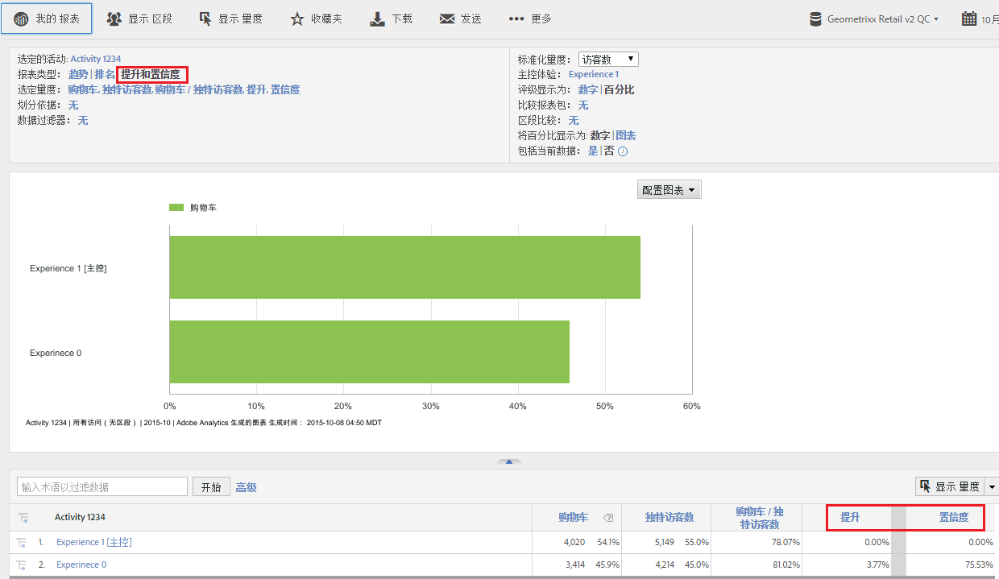

# Target 提升和置信度

允许您采用过去 [!DNL Target Classic] 中的相同方法，评估 Adobe Analytics 中的促销活动成功与否。

**[!UICONTROL Analytics]** > **[!UICONTROL 报表]** > **[!UICONTROL 查看所有报表]** > **[!UICONTROL Adobe Target]** > **[!UICONTROL 目标分析]** > **[!UICONTROL 目标活动]**。

Adobe Target 文档包含有关[提升](https://marketing.adobe.com/resources/help/zh_CN/target/target/c_estimating_lift_in_revenue.html)和[置信度](https://marketing.adobe.com/resources/help/zh_CN/rec/c_Confidence_Level_and_Confidence_Interval.html)的更多信息。

计算提升和置信度：

1. 在&#x200B;**[!UICONTROL 目标活动]**&#x200B;报表中，单击某项活动以显示其详细信息。
1. 在“报表类型”下方，选择&#x200B;**[!UICONTROL 提升和置信度]**。
1. 单击&#x200B;**[!UICONTROL 显示量度]**&#x200B;以添加一个量度。对于这种类型的报表，您无法添加多个量度，因为它是仅根据一个量度对测试进行评估的最佳实践。多个量度可能只会增加噪声干扰，从而降低测试的信号。
1. （可选）在&#x200B;**[!UICONTROL 标准化量度]**&#x200B;下方，选择以下任一项：“访客数”、“访问次数”或“展示次数”。通常，这将为默认设置，即“访客数”。

1. 报表将添加这些量度，其中包括量度与标准化量度之间的比率。

## 报表设置 {#section_3508439E09CA4E38B2EA309BA477C01D}

<table id="table_0FBB257C96454CDA82D487DC68459C13"> 
 <thead> 
  <tr> 
   <th colname="col1" class="entry"> 设置 </th> 
   <th colname="col2" class="entry"> 描述 </th> 
  </tr> 
 </thead>
 <tbody> 
  <tr> 
   <td colname="col1"> 选定的活动 </td> 
   <td colname="col2"> 您当前正在查看并计算提升和置信度的目标活动。 </td> 
  </tr> 
  <tr> 
   <td colname="col1"> 报表类型 </td> 
   <td colname="col2"> 您可以从中选择提升和置信度 - 它们将作为量度显示在下面的报表结果中。 </td> 
  </tr> 
  <tr> 
   <td colname="col1"> 选定量度 </td> 
   <td colname="col2"> 显示您选定的量度（在上面的示例中，量度为“收入”）、标准化量度（独特访客数）、这两个量度之间的比率，以及相比于主控体验而计算的提升和置信度。 </td> 
  </tr> 
  <tr> 
   <td colname="col1"> 划分依据 </td> 
   <td colname="col2"> 可以依据其他报表来进一步划分该报表。 </td> 
  </tr> 
  <tr> 
   <td colname="col1"> 数据过滤器 </td> 
   <td colname="col2"> 允许您对该报表应用特定的过滤器。 </td> 
  </tr> 
  <tr> 
   <td colname="col1"> 标准化量度 </td> 
   <td colname="col2"> 您可以使用“访问次数”、“访客数”或“展示次数”进行标准化。标准化量度会变成提升度计算中的分母。此外，它也会在应用置信度计算之前影响数据汇总的方式。 </td> 
  </tr> 
  <tr> 
   <td colname="col1"> 主控体验 </td> 
   <td colname="col2"> 您进行比较的 Target 体验，同时它也是您为之计算提升度的体验。 </td> 
  </tr> 
  <tr> 
   <td colname="col1"> 比较报表包 </td> 
   <td colname="col2"> 允许您选择要进行比较的其他报表包。 </td> 
  </tr> 
  <tr> 
   <td colname="col1"> 区段比较 </td> 
   <td colname="col2"> 允许您选择要进行比较的区段。 </td> 
  </tr> 
  <tr> 
   <td colname="col1"> 以数字/图表显示百分比 </td> 
   <td colname="col2"> 以数字或图表的方式显示“提升和置信度”百分比。 </td> 
  </tr> 
  <tr> 
   <td colname="col1"> 包括当前数据 </td> 
   <td colname="col2"> 
Reports &amp; Analytics 中的“包括当前数据”选项通常可让您在数据经过完全处理并完成前，查看最新的 Analytics 数据。“当前数据”会在数分钟内显示大部分量度，为快速制定决策提供可用数据。 
 </td> 
  </tr> 
 </tbody> 
</table>

