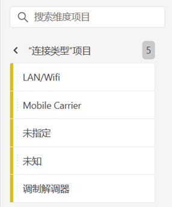
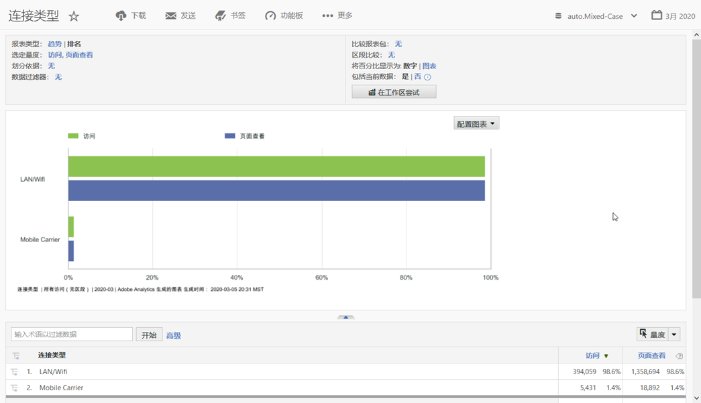

# 连接类型

显示Internet连接类型的度量，包括调制解调器、LAN/Wifi、移动运营商等。

## 示例

以下报告比较“访问”和“页面查看 [”量度](https://docs.adobe.com/content/help/en/analytics/components/variables/metrics/metrics-visit.html) 的连 [接类型](https://docs.adobe.com/content/help/en/analytics/components/variables/dimensions-reports/reports-page-views.html):

您可以通过查看移动运营商报告来找到有关移动运营商连接类型的 [**更多洞察&#x200B;**](https://docs.adobe.com/content/help/en/analytics/components/variables/dimensions-reports/reports-mobile-carrier.html)。
