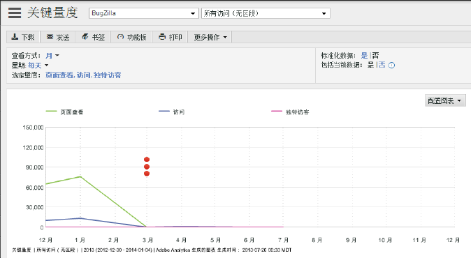

# 关键量度

使用“关键量度”报表可以比较各个量度以同时了解它们的趋势。例如，随着页面查看次数的增加，访客计数是否增加了？

<!-- 

 <b>Use Cases</b> 
 

Social Media: You can use the Key Metrics Report to examine social groups, such as Total Mentions or Audience Sentiment, and see how they are affecting revenue. How do you tie key metrics like Revenue to Social metrics? Look at the KM report by those groupings--total mentions, total audience, mapped to revenue. i.e. tv grouping, computing grouping, to see if it spikes or drives revenue. 

 -->

