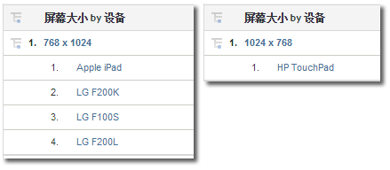

# 移动设备

显示有关通过移动设备访问网站的信息。移动设备报表收集有关用于查看网站的移动设备的数据，从而改进访客识别。移动设备报表可以确定设备的制造商和功能，如屏幕大小、视频、音频，Cookie 支持及其他量度等。移动设备报表可用于所有报表包。

## 移动设备 {#topic_D306EA4558194488AC47A45B9C570150}

显示有关通过移动设备访问网站的信息。移动设备报表收集有关用于查看网站的移动设备的数据，从而改进访客识别。移动设备报表可以确定设备的制造商和功能，如屏幕大小、视频、音频，Cookie 支持及其他量度等。移动设备报表可用于所有报表包。

>[!NOTE]
>
>移动报告仅显示移动Web流量。使用本地 iOS、Android 和其他 SDK 收集的移动设备应用程序数据显示在移动设备应用程序报表中，且仅在“管理工具”中启用时才会显示。

可使用以下移动设备报表：

<table id="table_900BB8F2F3A746B6B97DC629B39910DA"> 
 <thead> 
  <tr> 
   <th colname="col1" class="entry"> 报表 </th> 
   <th colname="col2" class="entry"> 描述 </th> 
  </tr> 
 </thead>
 <tbody> 
  <tr> 
   <td colname="col1"> 
设备 
 </td> 
   <td colname="col2"> 
显示使用移动设备（如运行 iOS 或 Android 的设备）访问网站的访客人数。通过使用该报表，您可以了解移动设备方案的效果，以便制定相应的计划。此报表的用途包括： 
 
 
     <ul id="ul_8CC40461C2944A63AED561E384275D24"> 
      <li id="li_4667815ED7384DE9824FB47F02040374"> 
制定针对移动设备用户的策略 
 </li> 
      <li id="li_12C1F430E5464FB4AC29C2D970165935"> 
确定访问者的喜好 
 </li> 
      <li id="li_BFECB3B1F5A345BA82FC22BF99E8E418"> 
跟踪无线和移动设备用户的情况 
 </li> 
     </ul> 
 </td> 
  </tr> 
  <tr> 
   <td colname="col1"> 制造商 </td> 
   <td colname="col2"> 按移动设备制造商对网站的移动设备点击量进行分组。此报表显示制造商类型、每个制造商对应的查看次数及相应的百分比。 </td> 
  </tr> 
  <tr> 
   <td colname="col1"> 屏幕大小 </td> 
   <td colname="col2"> 
 按移动设备的屏幕大小对网站的移动设备点击量进行分组。此报表显示各个屏幕大小、网站的访客人数（针对各个屏幕大小）及查看总次数中各个屏幕大小所占的百分比。与“屏幕高度”及“屏幕宽度”报表相比，“屏幕大小”报表可同时显示屏幕的高度和宽度。 
 
移动屏幕大小报表目前对于每个设备是静态的。无论采用何种屏幕方向，每个设备都在报表中有固定的屏幕分辨率。您可以通过按移动设备划分屏幕大小来查看此数据。 
 </td> 
  </tr> 
  <tr> 
   <td colname="col1"> 屏幕高度 </td> 
   <td colname="col2"> 
 显示不同移动设备的屏幕高度以及各个屏幕高度所对应的查看次数。您还可以查看屏幕大小报表以了解屏幕的高度和宽度。 
 </td> 
  </tr> 
  <tr> 
   <td colname="col1"> 屏幕宽度 </td> 
   <td colname="col2"> 
 显示不同移动设备的屏幕宽度以及各个屏幕宽度所对应的查看次数。您还可以查看屏幕大小报表以了解屏幕的高度和宽度。 
 </td> 
  </tr> 
  <tr> 
   <td colname="col1"> Cookie 支持 </td> 
   <td colname="col2"> 
按移动设备是否支持 Cookie 对移动设备点击量进行分类。访客分为支持 Cookie 组和不支持 Cookie 组。可通过用户代理字符串来确定移动设备类型。Adobe 维护着一份已知支持 Cookie 的移动设备列表。如果用户代理字符串中所列出的移动设备也列在 Adobe 的移动设备列表中，则“Cookie 支持”报表中 “Cookie支持” 报告中支持的行项目递增。Otherwise, the  Not Supported line item in the report is incremented. 
 </td> 
  </tr> 
  <tr> 
   <td colname="col1"> 图像支持 </td> 
   <td colname="col2"> 
 按设备支持的图像类型对移动设备进行分组。 
 
例如，如果访客的手机支持 .jpeg 图像，并访问网站，则“图像支持”报表至少递增 1。如果手机支持多种图像格式，则对网站的一次访问会产生多个递增量。换言之，若手机支持 .jpeg、.png 和 .gif 格式，则报表中的这些组都将递增。这样，群组总数可能大于报表底部显示的总数。 
 </td> 
  </tr> 
  <tr> 
   <td colname="col1"> 颜色深度 </td> 
   <td colname="col2"> 
 按支持的颜色数目对移动设备点击量进行分组。此报表显示经由移动设备访问网站的访客总人数，并按移动设备中配置的颜色数目对他们进行分组。 
 
例如，若访客的移动电话支持 24 色，则报表将增加与 24 色对应的行项目。 
 </td> 
  </tr> 
  <tr> 
   <td colname="col1"> 音频支持 </td> 
   <td colname="col2"> 
 按移动设备支持的音频格式类型对这些设备进行分类。 
 
例如，如果访客的电话支持 .mp3 格式，音频支持报表至少递增 1。如果移动电话支持多种音频格式，则访问网站时可能会使每个支持的音频类型相应递增。换言之，如果移动电话支持 .mp3、.aac 和 .amr 格式，报表中的这些组将递增。这样，群组总数可能大于报表底部显示的总数。 
 </td> 
  </tr> 
  <tr> 
   <td colname="col1"> 视频支持 </td> 
   <td colname="col2"> 
 按设备支持的视频格式类型对移动设备进行分组。 
 
例如，如果访客的移动设备支持 .mp4，那么在访问网站后，视频支持报表至少递增 1。如果移动电话支持多种视频格式（如 .mp4、.wmv），报表中的这些组将递增。这样，群组总数可能大于报表底部显示的总数。 
 </td> 
  </tr> 
  <tr> 
   <td colname="col1"> DRM </td> 
   <td colname="col2"> 
 按支持的数字版权管理 (DRM) 类型对移动设备进行分组。DRM 分组包括 转发锁定、  组合交付、  单独交付和  未知。 
 </td> 
  </tr> 
  <tr> 
   <td colname="col1"> 网络协议 </td> 
   <td colname="col2"> 
 按移动设备支持的网络协议（GPRS、CSD、EDGE、HSCSD 等）进行分组。对于未识别的网络协议，该报表还提供了“未知”组。 
 
当访客使用移动设备访问网站时，网络协议报表至少递增 1。如果移动电话支持多种网络协议，报表中的这些组将递增。这样，群组总数可能大于报表底部显示的总数。 
 </td> 
  </tr> 
  <tr> 
   <td colname="col1"> 操作系统（已弃用） </td> 
   <td colname="col2"> 
 按设备上运行的操作系统对移动设备进行分组。移动操作系统包括 Windows、RIM、iOS、Symbian 等。对于未识别的移动操作系统，该报表还提供了“未知”组。 
 
Note: This report was deprecated when the Technology &gt; <a href="../../../components/c-variables/dimensionslist/reports-operating-system.md#concept_3FADC871C6204533B4FCE73316B0B34F" format="dita" scope="local"> Operating Systems</a> report was updated to include all operating systems, including mobile. 您可以创建一个存在“移动设备”的区段，并将它应用于“技术”&gt;“操作系统”报表，以便仅查看移动操作系统。 
 </td> 
  </tr> 
  <tr> 
   <td colname="col1"> Java 版本 </td> 
   <td colname="col2"> 
 按移动设备支持的 Java 版本对移动设备进行分组。Java 版本报表通过设备支持的 Java Specification Request (JSR) 来识别 Java 版本。对于未识别的移动操作系统，该报表还提供了“未知”组。 
 
有关 JSR 的详细信息，请访问 <a href="https://jcp.org/en/jsr/overview" scope="external" format="html">Java Community Process</a> 网站。 
 </td> 
  </tr> 
  <tr> 
   <td colname="col1"> 书签 URL 长度 </td> 
   <td colname="col2"> 
 按书签 URL 支持的最大长度（字符数）对移动设备进行分组。 
 </td> 
  </tr> 
  <tr> 
   <td colname="col1"> 邮件 URL 长度 </td> 
   <td colname="col2"> 
 按电子邮件 URL 支持的最大长度（字符数）对移动设备进行分组。 
 </td> 
  </tr> 
  <tr> 
   <td colname="col1"> 浏览器 URL 长度 </td> 
   <td colname="col2"> 
 按 Web 浏览器 URL 支持的最大长度（字符数）对移动设备进行分组。 
 </td> 
  </tr> 
  <tr> 
   <td colname="col1"> 设备号传输（打开/关闭） </td> 
   <td colname="col2"> 
 按是否支持设备号传输对移动设备进行分组。对于不确定是否支持设备号传输的移动设备，该报表还提供了“未知”组。 
 </td> 
  </tr> 
  <tr> 
   <td colname="col1"> PTT </td> 
   <td colname="col2"> 
 按设备是否支持一键通 (Push To Talk, PTT) 对移动设备进行分组。对于不确定是否支持 PTT 的移动设备，该报表还提供了 无法确定PPTT支持的设备的未知 组。 
 </td> 
  </tr> 
  <tr> 
   <td colname="col1"> 修饰邮件支持 </td> 
   <td colname="col2"> 
 根据设备是否支持 DecoMail 对移动设备分组，该功能允许用户用图片和动画装饰邮件。对于不确定是否支持 PTT 的移动设备，该报表还提供了 无法确定装饰邮件支持的设备的未知 组。 
 </td> 
  </tr> 
  <tr> 
   <td colname="col1"> 信息服务 </td> 
   <td colname="col2"> 
 按支持的新闻服务（渠道 I/B、EZ 新闻 Flash、W+INFO 等）对移动设备进行分组。当访客使用支持新闻服务的移动设备访问网站时，信息服务报表至少递增 1。如果移动电话支持多种新闻服务，报表中的这些组将递增。这样，群组总数可能大于报表底部显示的总数。 
 </td> 
  </tr> 
 </tbody> 
</table>

