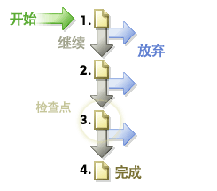

# 路径

显示有关访客访问网站页面的顺序的信息。您可以收集访客访问网站任何网页之前和之后的动向信息。

## 路径 {#topic_39F11BCBEDC3495EA1300149FC6D4F14}

显示有关访客访问网站页面的顺序的信息。您可以收集访客访问网站任何网页之前和之后的动向信息。

路径报表包括标准的深入分析报表和可选高级分析报表，这些报表能揭示已查看页面的点击流。您可以查明完整路径、最长路径和最受欢迎的路径；通过图表对页面流量、流失和中途退出情况进行说明；显示一段时间后模式的更新和更改；分析进入和退出路径。

**[!UICONTROL 下一页面流量]**&#x200B;或&#x200B;**[!UICONTROL 下一网站流量]**：显示访客在离开所选页面之后查看的选定页面（或区域、部门等）的两级深度分支图形。使用此报表可分析和确定访客在查看所选页面之后采用最频繁的步骤。您可以：

* 了解查看选定页面后使用频率最高的步骤。
* 优化网站路径设计，以便将访客流量引至预期的目标页面。
* 识别访客进入了除预期目标页面之外的哪些页面。

**[!UICONTROL 下一页面]**（或后续的类别）：通过显示访客在查看所选页面之后查看的网站页面，提供详细的网站路径分析。例如，如果选择并报告整个网站的相关数据，报表会显示最受欢迎的 10 个登录页面，并在各个登录页面下方列出 5 个最受欢迎的后续页面。此数据可帮助您了解哪些内容、功能和其他数据最常促使访客浏览网站内的其他页面。

**[!UICONTROL 上一页面流量]**（或其他以前的类别流量）：显示访客在进入选定页面之前查看的两层最受欢迎页面。此报表还将突出显示访客登入网站的时间。

**[!UICONTROL 上一页面]**（或其他以前的类别）：显示访客浏览网站上选定页面之前所查看的页面，以提供详细的网站路径分析。

**[!UICONTROL 流失]**：显示定义的各个检查点之间的访问流失情况及转化率。各级情况按自上向下的顺序排列，其中左边是原始数字和百分比，右边是转化和流失百分比。

请参阅[流失报表](../../../components/c-variables/dimensionslist/reports-fallout.md#concept_DE1F8040F1B741F087B78568B342EC41)创建顺序区段。

**[!UICONTROL PathFinder]**：可让您进一步将整个路径剖析为片段，从而生成有助于优化网站的精确模式。PathFinder 向导允许您指定用于生成报表的选择标准，以便您能够分析路径片段，查询以特定页面开头的片段，以特定页面结尾的片段，或以一个页面开头并以另一个页面结尾的片段。

**[!UICONTROL 路径长度]**：显示访客在网站上的浏览深度（以百分比和总计数衡量）。换言之，此报表指示访客退出网站前平均查看的页面数。

**[!UICONTROL 路径分析]**：包含可分析以下项目的报表子集：

* **[!UICONTROL 页面摘要/网站类别摘要]**：提供您需要了解的有关页面报表的所有信息。此报表可收集并整理单个页面的特定信息并在单个报表中显示该信息。
* **[!UICONTROL 重新载入]**：显示访客重新载入各页面的次数。
* **[!UICONTROL 页面逗留时间/网站类别]**：显示访客浏览网站各页面时逗留的时间。逗留时间可分为 10 类：少于 15 秒、15-30 秒、30-60 秒、1-3 分钟、3-5 分钟、5-10 分钟、10-15 分钟、15-20 分钟、20-30 分钟和超过 30 分钟。
* **[!UICONTROL 进入页面点击数]**：确定访客在来到您的网站各页面之前的点击次数。测量页面深度的方法是计算在该页面之前查看的页面数量。

**[!UICONTROL 登录和退出]**：登录页面报表按百分比和总访问量显示哪些是新访客首先会查看的页面。您可查看：

* **[!UICONTROL 登录页面]**（或区域）：按百分比和总访问量显示哪些是新访客首先会查看的页面。您可以使用此报表来确定哪些网页的登录次数最多，而且可优化网站上的主要登录点并提升关键消息的登录流量。
* **[!UICONTROL 原始登录页面]**：显示访客首次访问网站时查看的首页。每个用户仅计数一次，除非他们删除其 cookie 或没有通过 cookie 受到跟踪。
* **[!UICONTROL 单页面访问量]**：显示在访客浏览会话期间，通常同时为登录页面和退出页面的页面。
* **[!UICONTROL 退出页面]**：按照百分比或总访问量，显示访客在离开网站前最后查看的页面。

