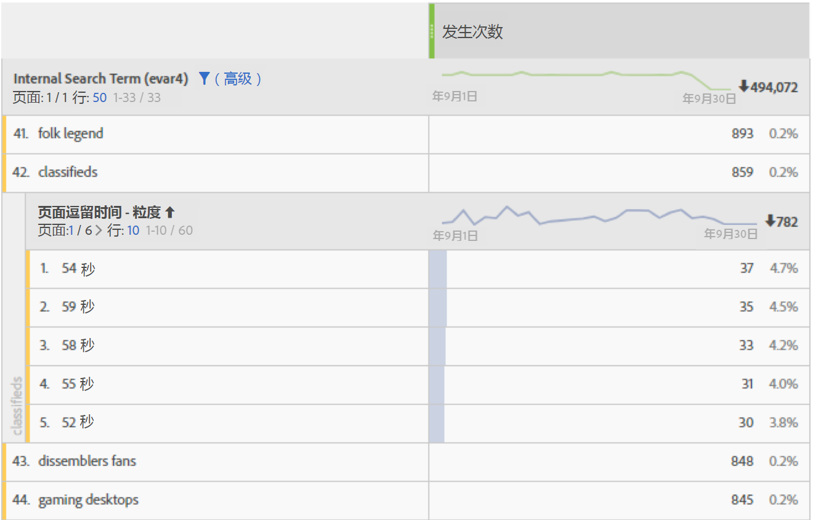

# Time spent on page

Adobe Analytics提供多种方法来确定Analytics报告中所花费的时间。 在大多数情况下，使用以下步骤计算所花费的时间：

1. 对于给定的点击，请查看时间戳和维值。
2. 将此点击与访问中下一次点击的时间戳进行比较。
3. 这两次点击之间经过的时间会导致该页面所花费的时间。

查看维度数据所花费的时间时，请牢记以下几点：

* 所花费的时间需要考虑分配和到期情况。
* 在计算花费的时间数据时，会考虑页面查看和链接跟踪点击类型。
* 在上次访问点击期间，不会测量所花费的时间，因为没有后续图像请求来测量已用时间。
* 弹回次数不能测量所花费的时间，因为访问包含一次点击。

页面停留时间衡量一次访问中点击之间的已用时间。 粒度和存储段之 **间存** 在单 **独的尺寸**。

* **** 粒度：每个维度值是两次点击之间停留的秒数不同。
* **** Buckered:每个维值都是预定义的存储段：
   * 不到15秒
   * 15-29 秒
   * 1-3 分钟
   * 3-5 分钟
   * 5-10 分钟
   * 10-15 分钟
   * 15-20 分钟
   * 20-30 分钟
   * 超过30分钟

此维度基于点击，如果用作细分，可提供更有意义的数据。 将此维度与每次 [访问所花费的时间进行比较](reports-time-spent-per-visit.md)，这是一个基于访问的维度。

