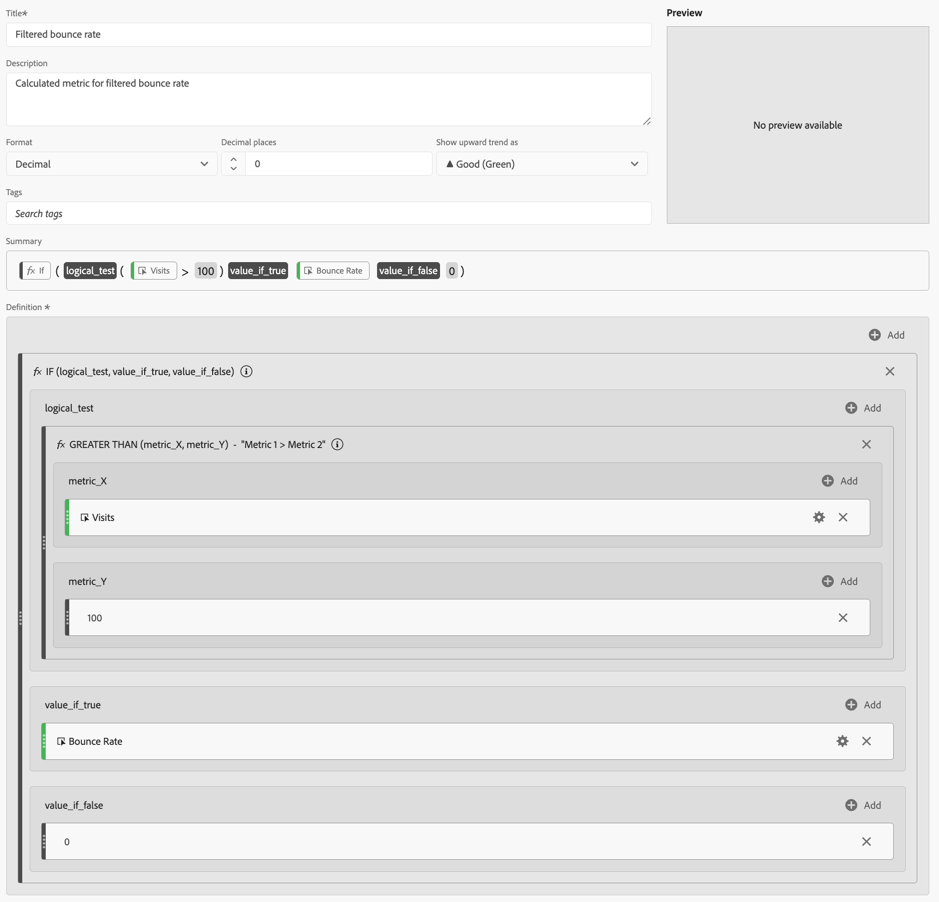
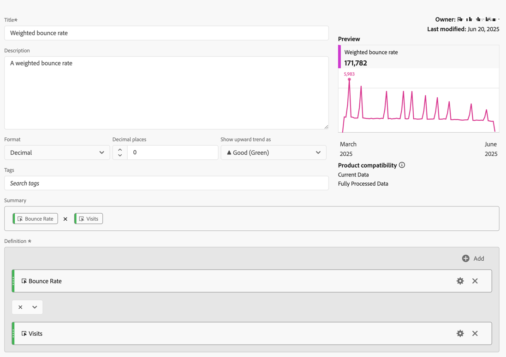

# 过滤和加权度量

本文显示了过滤和加权量度的示例。

## 过滤的跳出率

此简单的已过滤量度仅显示访问次数超过100次的页面的跳出率：

{zoomable="yes"}

请记住，此公式取决于一致的时间范围。 如果只运行一天报表，则任何超过20次访问的页面都值得查看。 如果将其运行一个月，则可能需要该过滤器包含更多访问。

## 带百分位数的过滤跳出率

此过滤器在按访问量排序时，显示排名前30%页面的跳出率。

{zoomable="yes"}）

## 加权跳出率

假设您通常希望按跳出率排序，但访问次数较高的页面在列表中应该排在较高的位置。 您可以创建与如下所示类似的加权跳出率：

