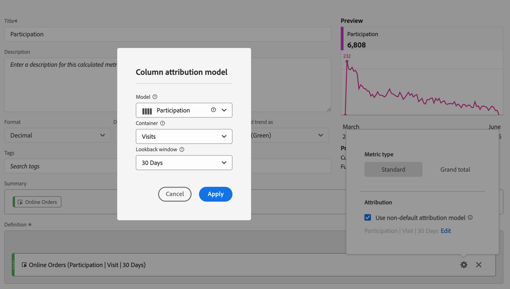

# 参与率量度

参与率量度用于量化某个维度的各个值（如页面查看次数）对包含特定量度（如订单数）的访问的贡献或参与程度。

以下步骤显示如何创建参与率量度。

1. [创建计算量度](../cm-workflow.md)，在[计算量度生成器](cm-build-metrics.md)中，将量度命名为`Orders (Visit Participation)`或类似名称。
1. 将包含成功事件的量度（例如[!DNL Online Orders]）拖入[!UICONTROL **[!UICONTROL 定义]**]区域。
1. 为量度选择。
1. 在出现的弹出窗口中，选择&#x200B;**[!UICONTROL 使用非默认归因模型]**&#x200B;将该事件的[归因模型](m-metric-type-alloc.md#attribution-models)定义为&#x200B;**[!UICONTROL 参与率]**，并为&#x200B;**[!UICONTROL 容器]**&#x200B;选择[!UICONTROL 访问次数]。 选择&#x200B;**[!UICONTROL 应用]**&#x200B;以确认。

   

   **（Partipation|Visits|30天）**&#x200B;已添加到量度组件名称。

1. 选择&#x200B;[!UICONTROL **保存**]&#x200B;以保存指标。
1. 在报表中使用计算量度。 例如，在报表中使用计算的[!DNL Orders (Session Participation)]量度来显示哪个客户层促成了（或参与了）包含订单的会话。

   

<!--

The following information explains how to create a metric that shows which pages contributed to (or participated in) visits that contained an order.

This type of information could be useful for any content owner.

>[!NOTE]
>
>You can enable participation metrics in the Admin Tools, but only for custom events 1 - 100.

1. Begin creating a calculated metric, as described in [Build metrics](/help/components/calculated-metrics/workflow/c-build-metrics/cm-build-metrics.md).

1. In the Calculated metrics builder, name the metric "Participation".

1. Drag the success event "Orders" into the Definition canvas.

1. Change the [attribution model](/help/components/calculated-metrics/workflow/c-build-metrics/m-metric-type-alloc.md) of that event to **[!UICONTROL Participation]** under the **[!UICONTROL Settings]** gear. Select **[!UICONTROL Visit]** lookback. The definition should look similar to this:

   

1. Select [!UICONTROL **Save**] to save the metric.

1. Use the calculated metric in a **[!UICONTROL Pages]** report.

    

1. (Optional) Share the metric with other users in your organization, as described in [Share calculated metrics](/help/components/calculated-metrics/workflow/cm-sharing.md).
-->