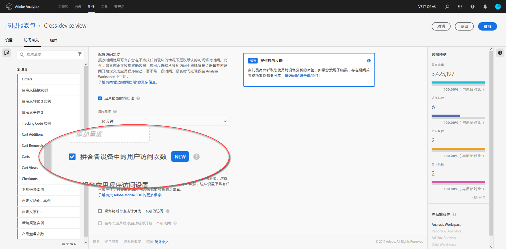

# 设置跨设备分析

> [!NOTE] 跨设备分析文档可能会随着进一步开发功能而发生变化。定期查阅更新。

满足所有前提条件后，请使用以下步骤启用跨设备分析。您必须属于产品配置管理员组或拥有Adobe Analytics中的管理员权限才能遵循这些步骤。

> [!IMPORTANT] 必须先满足所有先决条件，然后才能执行这些步骤。如果所有prerequi站点均未满足，则该功能不可用或无法使用。请参阅 [针对prerequi站点和限制的跨设备分析](cda-home.md) 。

## 选择将为CDA启用的跨设备报告套件

当您的组织设置为使用CDA时，请选择要使用的报表包。此选择可通过您的Adobe客户经理进行交流。然后，Adobe将启用您所选的用于CDA处理的报告套件。

## 创建跨设备虚拟报告套件以查看跨设备视图

具有创建虚拟报告套件的管理员可以按如下方式创建CDA虚拟报告套件：

1. 导航到 [experiencecloud.adobe.com](https://experiencecloud.adobe.com) 并使用您的AdobeID凭据登录。
2. 单击顶部的网格图标，然后单击“分析”。
3. 将鼠标悬停在顶部的组件上方，然后单击虚拟报告套件。
4. 单击添加。
5. 输入虚拟报告套件的名称，并确保已选中启用CDA的报表包。
6. 单击复选框“启用报告时间处理”，该复选框支持多个选项，包括跨设备分析。
7. 单击复选框“跨设备阻止用户访问次数”。
8. 单击继续，完成配置虚拟报告套件，然后单击保存。

## 跨设备虚拟报告套件的新增功能和更改

在虚拟报告套件上启用跨设备分析时，请注意以下更改：

* 虚拟报告套件名称旁会显示一个新的跨设备图标。此图标专用于跨设备虚拟报告套件。
* 有新的标记“人物”和“独特设备”的新指标。
* 量度“唯一访客”不可用，因为其替换为“人员和唯一设备”。
* 构建区段时，“访客”区段容器将替换为“人物”容器。

## 压缩计算指标

跨设备分析的跨设备分析能力取决于各种因素。利用名为压缩的计算指标，可以测量该功能的拼接数据的效率。有助于压缩的因素包括：

* 使用合作社图或私人图：一般而言，使用设备合作社的组织通常会看到比使用私人图的组织更好的压缩速率。
* 登录率：用户登录站点越多，Adobe可以跨设备识别和吸引访客。登录率低的站点也具有低压缩速率。
* Experience Cloud ID覆盖：只能拼接具有EID的访客。使用EID的站点访客百分比较低，与压缩速率相关。
* 多设备使用：如果站点访客不使用多个设备，您可以看到较低的压缩率。
* 报表粒度：按天压缩通常比按月或年压缩小。个人使用多个设备的机会在一天内变得更小。细分、过滤或使用细分尺寸也可以显示较低的压缩速率。

要查看您的组织在特定时间段内的压缩情况，请执行以下操作：

1. 单击顶部的“工作区”，然后单击“创建新项目”。
2. 从空白项目开始，然后单击创建。
3. 将唯一设备量度拖动到标记为“在此处放入量度”的画布区域。
4. 将“人员”指标拖到“唯一设备”量度标题右侧的画布上，以便两个指标并排。
5. 单击左侧可用指标旁边的“+”符号以打开“计算量度”生成器。
6. 为此计算得出的量度提供以下设置：
   * 名称：跨设备压缩
   * 格式：百分比
   * 小数位：2
   * 定义: `[Static Number: 1] minus [People] divided by [Unique Devices]`
      > [!NOTE] 单击定义区域右上角的“添加”以添加静态编号。从左侧可用指标列表中拖动人物和唯一设备。
7. 单击“保存”。
8. 将新计算的量度直接拖到“人物”指标标题右侧的画布上，因此所有三个指标都是并排的。
9. 可选：默认情况下，工作区加载“天”维度。如果需要不同的时间粒度，则拖动替代日期维度(如周或月)，以在“天”维度之上。
