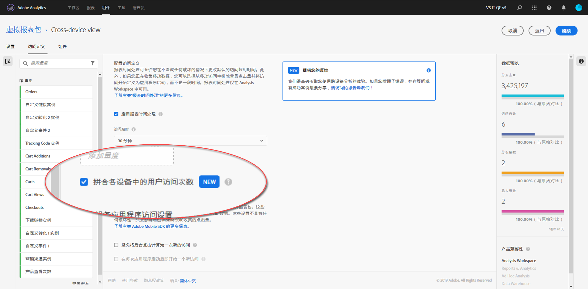

# 设置 Cross-Device Analytics

在满足所有先决条件后，请通过以下步骤启用 Cross-Device Analytics。您必须是产品配置文件管理员组的一员，或者拥有 Adobe Analytics 管理员权限，才能执行这些步骤。

>[!IMPORTANT]
>
>在执行这些步骤之前，必须满足所有先决条件。如果不满足所有先决条件，该功能将不可用或无法正常工作。请参阅[概述页面](overview.md)和所需的拼合方法（分别为[基于字段的拼合](field-based-stitching.md)或[设备图](device-graph.md)），了解先决条件和限制。

## 1.向客户关怀部门提交工单以在跨设备报表包上配置CDA

CDA 由 Adobe 工程团队在您的跨设备报表包上预配。要开始此过程，请联系客户关怀部门并准备提供以下信息：

* 您的 Adobe Experience Cloud 组织 ID（一个以 @AdobeOrg 结尾的字母数字字符串）
* 希望通过 CDA 启用的跨设备报表包的报表包 ID
* 要使用哪种CDA方法(基于字段的拼合或Adobe设备图)
* 如果要使用基于字段的拼合，请提供包含用户 ID 的 prop 或 eVar
* 您对于重放频率和回看时长的首选项。选项包括每周重放一次且回看时段为 7 天或每天重放一次且回看时段为 1 天。
默认为每周重放一次且回看时段为 7 天。在此情况下，上周内的数据可能会发生变化（因为它正在逐步拼合和更新）。

向客户关怀部门提供此信息后，他们将与 Adobe 工程团队合作，为您选择的报表包启用 CDA 处理。

## 2.创建跨设备虚拟报表包以查看跨设备视图

有权创建虚拟报表包的管理员可以按如下方式创建 CDA 虚拟报表包：

1. 导航到 [experiencecloud.adobe.com](https://experiencecloud.adobe.com) 并使用 Adobe ID 凭据登录。
2. 单击顶部的 9 宫格图标，然后单击“Analytics”。
3. 将鼠标悬停在顶部的&#x200B;**[!UICONTROL 组件]**&#x200B;上，然后单击&#x200B;**[!UICONTROL 虚拟报表包]**。
4. 单击“添加”。
5. 输入虚拟报表包的名称，并确保选定已启用 CDA 的报表包。
6. （可选）将区段应用到虚拟报表包。例如，您可以应用一个区段，以将虚拟报表包的日期限制为在 CDA 开启且拼合开始后的日期。此区段允许用户仅查看虚拟报表包中拼合的日期范围。
7. 单击“启用报表时间处理”复选框，此复选框可启用多个选项，包括 Cross-Device Analytics。
8. 单击“拼合跨设备用户访问”复选框。
9. 单击“继续”，完成虚拟报表包的配置，然后单击“保存”。

## 跨设备虚拟报表包的添加和更改项目

在虚拟报表包中启用 Cross-Device Analytics 后，请注意以下更改：

* 虚拟报表包名称旁边将显示一个新的跨设备图标。此图标仅适用于跨设备虚拟报表包。
* 标记为[识别的状态](../dimensions/identified-state.md)的新维度是可用的。
* 现有名为[“人员”](../metrics/people.md)、[“独特设备”](../metrics/unique-devices.md)、[“已识别的人员”](../metrics/identified-people.md)、[“未识别的人员”](../metrics/unidentified-people.md)和[“具有 Experience Cloud ID 的人员”](../metrics/people-with-exp-cloud-id.md)的新指标可用。
* [独特访客](../metrics/unique-visitors.md)指标将不可用，因为它已被替换为“人员”指标和“独特设备”指标。
* 构建区段后，“访客”区段容器将被替换为“人员”容器。
