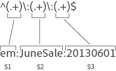

# 分类规则（旧版）

{{classification-rulebuilder-deprecation}}

分类规则会定期查找未分类的术语。如果找到匹配规则的术语，规则会自动将其添加到分类数据表。您还可以使用分类规则覆盖现有键值。

**[!UICONTROL Analytics]** > **[!UICONTROL 管理员]** > **[!UICONTROL 分类规则生成器]**

规则生成器可让您创建&#x200B;*分类规则集*，这是&#x200B;*分类规则*&#x200B;的列表。如果规则与您指定的条件相匹配，则执行相应的操作。

分类规则可提供以下便利性：

* **电子邮件**&#x200B;和&#x200B;**显示广告**：创建分类规则，将各显示广告营销活动分组，以便了解显示活动相对于电子邮件活动的执行情况。

* **跟踪代码**：创建分类规则可对由跟踪代码中的字符串派生的键值进行分类，并将其与您定义的特定条件进行匹配。
* **搜索词**：使用[正则表达式](/help/components/classifications/crb/classification-quickstart-rules.md)和通配符简化搜索词分类。 例如，如果搜索词包含 *`baseball`*，则可以将 *`Sports League`* 分类设置为 *`MLB`*。

例如，假设电子邮件促销活动 ID 的跟踪代码为：

`em:Summer:20XX:Sale`。

您可以在规则集中设置三条规则来识别字符串的各个部分，然后对值进行分类：

| 选择规则类型 | 输入匹配条件 | 设置分类 | 至 |
|---|---|---|---|
| 开头 | em: | 渠道 | 电子邮件 |
| 结束 | Sale | 类型 | Sale |
| 包含 | 20XX | 年 | 20XX |

## 如何处理规则 {#how-rules-are-processed}

有关如何处理分类规则的重要信息。

<!-- 

about_classification_rules.xml

 -->

* [有关规则的重要信息](/help/components/classifications/crb/classification-rule-builder.md)
* [规则何时不会对键值进行分类？](/help/components/classifications/crb/classification-rule-builder.md)
* [关于规则优先级](/help/components/classifications/crb/classification-quickstart-rules.md)

>[!NOTE]
>
>[!UICONTROL 规则生成器]不支持数值 2 分类。

## 有关规则的重要信息

* **正则表达式**：[分类规则中的正则表达式](/help/components/classifications/crb/classification-quickstart-rules.md)下提供了相关帮助。

* **报告包**：在至少选择一个报告包后，您才可以选取分类。在创建规则集并分配变量后，您才可以应用报告包。

  在测试规则集时，使用报告中的键值（经过分类的变量）可查看规则集将如何影响键值。（[键](/help/components/classifications/importer/c-saint-data-files.md)是要分类的变量，或者是分类上载表中的第一列。）

* **规则优先级**：如果一个键值匹配多条规则，这些规则设置了相同的分类（在“[!UICONTROL 设置分类]”列中），则将使用匹配分类的最后一条规则。请参阅[关于规则优先级](/help/components/classifications/crb/classification-quickstart-rules.md)。

* **规则数量的限制**：对于您可以创建的规则数量，不设定任何限制。但是，大量规则可能会影响浏览器性能。
* **处理**：根据分类相关的流量数目，定期处理规则。

  活动规则每四小时进行一次处理，通常每月检查一次返回的分类数据。规则会自动检查新值，并使用导入器上载分类。

* **覆盖现有分类**：请参阅[规则何时不会对键值进行分类？](/help/components/classifications/crb/classification-quickstart-rules.md)如有必要，您可以使用导入器删除或移除现有分类。

## 规则何时不会对键值进行分类？

在激活规则时，您可以覆盖现有分类。在以下情况下，分类规则不会对[键](/help/components/classifications/importer/c-saint-data-files.md)（变量）进行分类，如果：

* 已对键值进行分类，并且您未选择[覆盖分类](/help/components/classifications/crb/classification-rule-definitions.md)。

  在[添加和激活](/help/components/classifications/crb/classification-quickstart-rules.md)规则以及激活Data Connectors集成时，您可以覆盖分类。 （对于 Data Connectors，规则由开发中心的合作伙伴创建，并显示在“[!UICONTROL 分类规则生成器]”中。）

* 在覆盖键值时指定的时间范围后，甚至在启用[覆盖分类](/help/components/classifications/crb/classification-rule-definitions.md)后，已分类的键值都没有出现在数据中。
* 在大约一个月前时间范围开始后，没有对键值进行分类，并且键值从未传递到 [!DNL Adobe Analytics]。

  >[!NOTE]
  >
  >在报告中，当存在键值时，分类适用于指定的任何时间范围。报告的日期范围不会影响报告。


## 分类规则中的正则表达式 {#regex-in-classification-rules}

使用正则表达式将格式一致的字符串值与分类进行匹配。例如，您可以从跟踪代码中的特定字符创建分类。您可以匹配特定字符、词语或字符模式。

>[!NOTE]
>
>作为最佳实践，正则表达式最适合使用分隔符的跟踪代码。

## 正则表达式 - 跟踪代码示例 {#section_2EF7951398EB4C2F8E52CEFAB4032669}

>[!NOTE]
>
>如果跟踪代码采用URL编码，它将&#x200B;**不**&#x200B;由规则生成器分类。

在此示例中，假设您要对以下促销活动 ID 进行分类：

示例密钥： `em:JuneSale:20XX0601`

您要分类的跟踪代码包含以下部分：

* `em` = 电子邮件
* `JuneSale` = 促销活动名称
* `20XX0601` = 日期

正则表达式： `^(.+)\:(.+)\:(.+)$`

正则表达式与促销活动 ID 的关联方式：



匹配群组：显示正则表达式如何与促销活动ID字符相对应，以便您可以对促销活动ID中的位置进行分类。


此示例说明了促销活动日期 `20XX0601` 位于第三组 `(.+)` 且由 `$3` 标识的规则。

**[!UICONTROL 规则生成器]**

在[!UICONTROL 规则生成器]中，采用如下方式配置规则：

| 选择规则类型 | 输入匹配条件 | 设置分类 | 至 |
|---|---|---|---|
| 正则表达式 | &Hat;(.+)\:(.+)\:(.+)$ | 促销活动日期 | $3 |

**语法**

| 正则表达式 | 字符串或匹配结果 | 对应的匹配群组 |
|--- |--- |--- |
| `^(.+)\:(.+)\:(.+)$` | `em:JuneSale:20XX0601` | `$0`： `em:JuneSale:20XX0601` `$1`： em `$2`： JuneSale `$3`： 20XX0601 |
| 构建语法 | `^` = 开始此行  () = 将字符分组并让您提取括号中的匹配字符。`(.+)` = 捕获一个 ( . ) 字符，以及再捕获 ( + )  \ = 字符串的开头。`$` = 指示前面的字符（或字符组）位于行的最后。 |

有关正则表达式中字符含义的信息，请参阅[正则表达式 - 参考表](/help/components/classifications/crb/classification-quickstart-rules.md)。

## 正则表达式 - 对特定字符进行分类 {#section_5D300C03FA484BADACBFCA983E738ACF}

使用正则表达式的一种方式是对一串字符中的特定字符进行分类。例如，假设以下跟踪代码包含两个重要字符：

示例密钥： `4s3234`

* `4` = 品牌名称
* `s` = 标识搜索引擎，例如 Google


**[!UICONTROL 规则生成器]**

在[!UICONTROL 规则生成器]中，采用如下方式配置规则：

| 选择规则类型 | 输入匹配条件 | 设置分类 | 至 |
|--- |--- |--- |--- |
| 正则表达式 | `^.(s).*$` | 品牌和引擎 | `$0`（为品牌名称和搜索引擎捕获前两个字符。） |
| 正则表达式 | `^.(s).*$` | 搜索引擎 | `$1`（为 Google 捕获第二个字符。） |

## 正则表达式 - 匹配不同长度的跟踪代码 {#section_E86F5BF5C2F44ABC8FFCE3EA67EE3BB2}

此示例显示当跟踪代码具有不同的长度时，如何识别逗号分隔符之间的特定字符。Adobe 建议为每个跟踪代码使用一个正则表达式。

示例关键值：

* `a:b`
* `a:b:c`
* `a:b:c:d`

**语法**


**[!UICONTROL 规则生成器]**

在[!UICONTROL 规则生成器]中，采用如下方式配置规则：

| 选择规则类型 | 输入匹配条件 | 设置分类 | 至 |
|--- |--- |--- |--- |
| 匹配字符串`a:b`的正则表达式 | `^([^\:]+)\:([^\:]+)$` | a | `$1` |
| 匹配字符串`a:b`的正则表达式 | `^([^\:]+)\:([^\:]+)$` | b | `$2` |
| 匹配字符串`a:b:c`的正则表达式 | `^([^\:]+)\:([^\:]+)\:([^\:]+)$` | a | `$1` |
| 匹配字符串`a:b:c`的正则表达式 | `^([^\:]+)\:([^\:]+)\:([^\:]+)$` | b | `$2` |
| 匹配字符串`a:b:c`的正则表达式 | `^([^\:]+)\:([^\:]+)\:([^\:]+)$` | c | `$3` |
| 匹配字符串`a:b:c:d`的正则表达式 | `^([^\:]+)\:([^\:]+)\:([^\:]+)\:([^\:])$` | d | `$4` |

## 正则表达式 -“不包含”示例 {#section_FCA88A612A4E4B099458E3EF7B60B59C}

此示例提供的正则表达式匹配不包含特定字符（在此例中为 `13`）的任意字符串。

正则表达式：

`^(?!.*13.*).*$`

测试字符串：

```
a:b:
a:b:1313
c:d:xoxo
c:d:yoyo
```

匹配结果：

```
a:b:
c:d:xoxo
c:d:yoyo
```

在此结果中，`a:b:1313` 不表示匹配项。

## 正则表达式 - 参考表 {#section_0211DCB1760042099CCD3ED7A665D716}

| 表达式 | 描述 |
|---|---|
| `(?ms)` | 使整个正则表达式与一个多行输入匹配，这允许 . 通配符匹配任何新行字符 |
| (`?i`) | 使整个正则表达式区分大小写 |
| [`abc`] | 单个字符：a、b 或 c |
| [`^abc`] | 除以下字符外的任意单个字符：a、b 或 c |
| [`a-z`] | a 到 z 之间的任意单个字符 |
| [`a-zA-Z`] | a 到 z 或 A 到 Z 之间的任意单个字符 |
| `^` | 行的开始（匹配行的开始） |
| `$` | 匹配行的结尾（或在结尾新行的前面） |
| `\A` | 字符串的开始 |
| `\z` | 字符串的结尾 |
| `.` | 匹配任意字符（不包括新行） |
| `\s` | 任意空白字符 |
| `\S` | 任意非空白字符 |
| `\d` | 任意数字 |
| `\D` | 任意非数字 |
| `\w` | 任意单词字符（字母、数字、下划线） |
| `\W` | 任意非单词字符 |
| `\b` | 任意单词边界 |
| `(...)` | 捕获包含的任何内容 |
| `(a\b)` | a 或 b |
| `a?` | 零个或一个 a |
| `a*` | 零个或多个 a |
| `a+` | 一个或多个 a |
| `a{3}` | 恰好 3 个 a |
| `a{3,}` | 3 个或更多 a |
| `a{3,6}` | 3 到 6 个 a |

测试正则表达式有效性的一个有用资源是 [https://rubular.com/](https://rubular.com/)。

## 关于规则优先级

如果一个键值匹配多条规则，并且这些规则在“[!UICONTROL 设置分类]”列中设置了相同的分类列，则将使用最后一条规则。因此，您可能需要将最重要的规则排在规则集的最后。

<!-- 

rule_priority.xml

 -->

如果创建的多条规则不共享相同的分类，则处理顺序无关紧要。

以下是对运动员搜索类型进行分类的搜索词规则示例：

| 规则编号 | 规则类型 | 匹配 | 设置分类 | 至 |
|---|---|---|---|---|
| 1 | 包含 | Cowboys | 搜索类型 | Team |
| 2 | 包含 | Fantasy | 搜索类型 | Fantasy |
| 3 | 包含 | Romo | 搜索类型 | Player |

如果用户搜索&#x200B;*`Cowboys fantasy Tony Romo`*，则对术语&#x200B;*`Player`*&#x200B;进行分类，因为它与“设置分类”列中显示的最后一个给定分类相匹配。

同样，假设您在规则集中为以下搜索词设置了两条规则：

| 规则编号 | 规则类型 | 匹配 | 设置分类 | 至 |
|---|---|---|---|---|
| 1 | 包含 | Cowboys | 城市 | Dallas |
| 2 | 包含 | Broncos | 城市 | Denver |

用户搜索&#x200B;*`Cowboys vs. Broncos`*。 如果规则生成器发现规则匹配存在冲突，则第二条规则的分类 (Denver) 将应用到此搜索。

## 将分类规则添加到规则集 {#add-classification-to-rule-set}

<!-- 

t_classification_rule.xml

 -->

通过将条件与分类进行匹配并指定操作来添加规则。

>[!NOTE]
>
>在此过程中，必须将规则应用到一个或多个报告包。即使没有限制，我们也建议每个规则集的规则数量在 500 到 1000 之间。如果您有超过100条规则，请考虑使用[子分类](/help/components/classifications/importer/subclassifications.md)来简化规则集。

添加或编辑分类规则：

1. [创建分类规则集](/help/components/classifications/crb/classification-rule-set.md)。
1. 在规则集页面上，单击&#x200B;**[!UICONTROL 添加规则]**。

   

1. 单击&#x200B;**[!UICONTROL 报告包]**&#x200B;旁边的&#x200B;**[!UICONTROL 添加报告包]**，以指定要分配到此规则集的一个或多个报告包。

   此时会显示&#x200B;**[!UICONTROL 选择报告包]**&#x200B;页面。

   >[!NOTE]
   >
   >*仅*&#x200B;当满足以下条件时，才会在此页面上显示报告包：
   >
   >* 报告包在[!UICONTROL 管理工具]中针对该变量至少定义了一个分类。
   >
   >   （有关先决条件的说明，请参阅&#x200B;*分类规则集*&#x200B;中的[变量](/help/components/classifications/crb/classification-rule-set.md)。）
   >
   >* 您在单击&#x200B;**[!UICONTROL 添加规则集]**&#x200B;以创建规则集后显示的[可用报告包](/help/components/classifications/crb/classification-rule-set.md)页面上选择了报告包。

1. 指定是否覆盖现有的值：

   | **规则会覆盖任何现有的值** | （默认设置）始终覆盖现有的分类键值，包括通过导入器上载的分类 (SAINT)。 |
   |---|---|
   | **规则仅会覆盖未设置的值** | 仅填写空白（未设置）的单元格。不会更改现有分类。 |

1. [定义一条或多条规则](/help/components/classifications/crb/classification-rule-definitions.md#section_4A5BF384EEEE4994B6DC888339833529)。

   

   有关构建规则的示例，请参阅[分类规则生成器](/help/components/classifications/crb/classification-rule-builder.md)和[分类规则中的正则表达式](/help/components/classifications/crb/classification-quickstart-rules.md)。

   >[!NOTE]
   >
   >如果一个键值匹配多条规则，而这些规则设置了相同的分类（在“设置分类”列中），则将使用匹配分类的最后一条规则。请参阅上述&#x200B;**关于规则优先级**，以了解有关对规则进行排序的详细信息。

1. [测试规则集](/help/components/classifications/crb/classification-quickstart-rules.md)。
1. 测试后，单击&#x200B;**[!UICONTROL 活动]**&#x200B;以验证并激活规则。

   激活规则会自动构建文件并进行上载。

   字段定义：请参阅[分类规则生成器](/help/components/classifications/crb/classification-rule-definitions.md)，以了解此页面上界面选项的完整定义。

## 测试分类规则集

<!-- 

t_classifications_test_rule.xml

 -->

您可以测试分类规则或规则集。 运行测试会检查规则集中的所有规则。

测试“分类规则集”：

1. [创建分类规则集](/help/components/classifications/crb/classification-rule-set.md)。
1. 在“[!UICONTROL 分类规则生成器]”中，单击规则集名称。
1. 确保该规则集已与报告包相关联。
1. 在规则编辑器中，单击&#x200B;**[!UICONTROL 测试规则集]**。

   

1. 在“[!UICONTROL 示例关键值]”字段中键入或粘贴测试键值。

   示例关键值包括：

   * 跟踪代码
   * 搜索关键词或短语

   有关测试正则表达式的信息，请参阅分类规则中的[正则表达式](/help/components/classifications/crb/classification-quickstart-rules.md)。
1. 单击&#x200B;**[!UICONTROL 运行测试]**。

   匹配的规则将显示在“[!UICONTROL 结果]”表中。
1. （可选）单击&#x200B;**[!UICONTROL 激活]**&#x200B;以激活规则并覆盖现有分类。

   请参阅有关使用规则覆盖现有分类的详细信息。

## 验证和激活分类规则

<!-- 

t_validate_rules.xml

 -->

验证和激活分类规则：

1. [创建分类规则集](/help/components/classifications/crb/classification-rule-set.md)，然后向规则集中[添加分类规则](/help/components/classifications/crb/classification-quickstart-rules.md)。
1. 在规则编辑器中，单击&#x200B;**[!UICONTROL 激活]**。

   

1. （可选）要覆盖分类，请启用&#x200B;**[!UICONTROL 覆盖]** *&lt;选项> 的分类*。

   使用此选项可以覆盖受影响键值的现有分类。

   关于此选项的定义请参考[规则页面](/help/components/classifications/crb/classification-rule-definitions.md#section_4A5BF384EEEE4994B6DC888339833529)。
